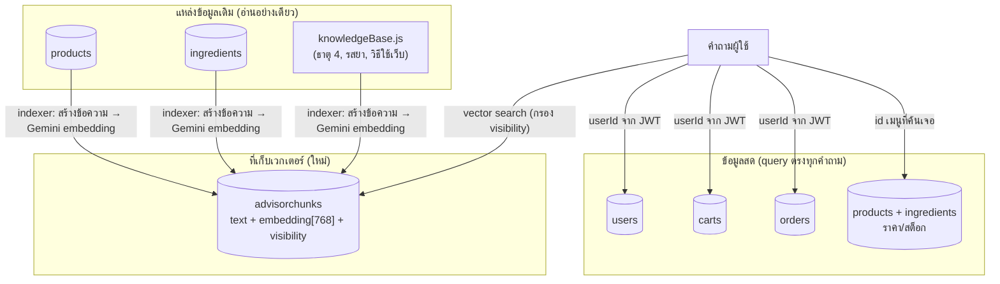
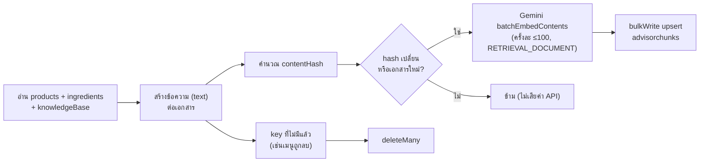

# 🍃 RAG AI × MongoDB — คู่มือฝั่งฐานข้อมูลของ That-Tae Advisor

> เอกสารนี้เจาะลึกว่า RAG AI ใช้ MongoDB อย่างไร: collection ไหนถูกอ่าน, เวกเตอร์ถูกเก็บที่ไหน, ค้นหาอย่างไร, และวิธีเปิดใช้ **Atlas Vector Search**
>
> ภาพรวมทั้งระบบ (หลักการ, role, การกันใช้งานผิด, การติดตั้ง): **[RAG_AI_ADVISOR.md](RAG_AI_ADVISOR.md)**
>
> โมเดลที่ใช้: **Google Gemini 3.5 Flash Lite API** (`gemini-3.5-flash-lite`) สำหรับตอบคำถาม และ `gemini-embedding-001` สำหรับสร้างเวกเตอร์

---

## 📌 สารบัญ

1. [ภาพรวม: MongoDB ทำหน้าที่อะไรใน RAG](#1-ภาพรวม-mongodb-ทำหน้าที่อะไรใน-rag)
2. [Collection `advisorchunks`](#2-collection-advisorchunks)
3. [การสร้างและซิงก์ index (Indexer)](#3-การสร้างและซิงก์-index-indexer)
4. [การค้นหาเวกเตอร์ 2 โหมด](#4-การค้นหาเวกเตอร์-2-โหมด)
5. [Atlas Vector Search (ไม่บังคับ)](#5-atlas-vector-search-ไม่บังคับ)
6. [Query ข้อมูลสดตาม role](#6-query-ข้อมูลสดตาม-role)
7. [เทียบกับแนวทาง "ฝังเวกเตอร์ในเอกสารต้นทาง"](#7-เทียบกับแนวทาง-ฝังเวกเตอร์ในเอกสารต้นทาง)
8. [คำสั่งตรวจสอบใน Mongo Shell / Compass](#8-คำสั่งตรวจสอบใน-mongo-shell--compass)
9. [แก้ปัญหาฝั่ง MongoDB](#9-แก้ปัญหาฝั่ง-mongodb)

---

## 1. ภาพรวม: MongoDB ทำหน้าที่อะไรใน RAG

MongoDB เป็นทั้ง **แหล่งความรู้** และ **ที่เก็บเวกเตอร์** ของระบบ



| Collection | บทบาทใน RAG | อ่าน/เขียน |
|---|---|---|
| `products` | แหล่งความรู้เมนู + ราคา/สต็อกสด | อ่านอย่างเดียว |
| `ingredients` | แหล่งความรู้วัตถุดิบ + สต็อกสำหรับแอดมิน | อ่านอย่างเดียว |
| `users` | โปรไฟล์ของผู้ถาม (customer) | อ่านอย่างเดียว เฉพาะ `_id = userId จาก token` |
| `carts` | ตะกร้าของผู้ถาม | อ่านอย่างเดียว เฉพาะ `userId` ของตัวเอง |
| `orders` | คำสั่งซื้อของผู้ถาม / สถิติสรุปสำหรับแอดมิน | อ่านอย่างเดียว |
| **`advisorchunks`** (ใหม่) | เอกสาร + เวกเตอร์สำหรับค้นหา | indexer เขียน, retriever อ่าน |

> ✅ **RAG ไม่แก้ไขข้อมูลร้านเลย** — collection เดียวที่ถูกเขียนคือ `advisorchunks`

---

## 2. Collection `advisorchunks`

Model: [`server/src/models/AdvisorChunk.model.js`](server/src/models/AdvisorChunk.model.js) · database: `thattae` (ตาม `dbName` ใน `config/db.js`)

### 2.1 Schema

| ฟิลด์ | ชนิด | ความหมาย |
|---|---|---|
| `key` | String (unique) | รหัสเอกสาร เช่น `product:<id>`, `ingredient:<id>`, `element:ไฟ`, `site-order` |
| `sourceType` | `product` \| `ingredient` \| `element` \| `site` | มาจากแหล่งไหน |
| `sourceId` | String | id ของเอกสารต้นทาง (ใช้ดึงข้อมูลสดต่อ) |
| `visibility` | `public` \| `admin` | **role ไหนค้นเจอได้** — ใช้เป็น filter ใน vector search |
| `title` | String | ชื่อสั้น (ส่งให้ embedding API เป็น title ด้วย) |
| `text` | String | ข้อความที่ถูกฝังเวกเตอร์ |
| `contentHash` | String | SHA-1 ของ (โมเดล + ขนาด + visibility + title + text) ใช้ตรวจว่าต้องฝังใหม่ไหม |
| `embeddingModel` | String | โมเดลที่ใช้ฝัง |
| `embedding` | [Number] ยาว 768 | เวกเตอร์ |
| `createdAt` / `updatedAt` | Date | timestamps |

Index ปกติที่ Mongoose สร้างให้อัตโนมัติ: `key` (unique), `sourceType`, `visibility`

### 2.2 ตัวอย่างเอกสาร

```json
{
  "key": "product:66a1f0c2e4b0a1b2c3d4e5f6",
  "sourceType": "product",
  "sourceId": "66a1f0c2e4b0a1b2c3d4e5f6",
  "visibility": "public",
  "title": "ขนมถ้วยไข่หวาน",
  "text": "เมนู: ขนมถ้วยไข่หวาน (Sweet egg cup dessert)\nภูมิภาค: ไทยฟิวชั่น\nธาตุหลัก: ธาตุดิน | เหมาะกับธาตุ: ดิน, ลม, ไฟ\nเหมาะกับข้อจำกัด: ไม่ใส่อาหารทะเล, ...\nวัตถุดิบ: แป้งเท้ายายม่อม, น้ำตาลมะพร้าว, ...\nรายละเอียด: ...",
  "contentHash": "3f2a...",
  "embeddingModel": "gemini-embedding-001",
  "embedding": [0.0123, -0.0456, "... 768 ค่า"]
}
```

### 2.3 อะไรถูกฝัง / อะไรไม่ถูกฝัง

| ฝังเป็นเวกเตอร์ ✅ | ไม่ฝัง ❌ (query สดแทน) |
|---|---|
| ชื่อเมนู, ภาค, ธาตุ, ข้อจำกัดอาหาร, วัตถุดิบ + รสยา, คำอธิบาย, ประวัติ | **ราคา, สต็อก, จำนวนชุดที่ทำได้** (เปลี่ยนบ่อย) |
| ชื่อวัตถุดิบ, หมวด, รสยา, ธาตุ, สารอาหาร/100 g | สต็อกรายภาค, ราคาต่อหน่วย |
| ความรู้ธาตุ 4 และรสยา | — |
| วิธีสั่งซื้อ ค่าส่ง แพ็กเกจ แต้ม (สร้างจากค่าคงที่ในโค้ด) | — |
| — | **users / carts / orders ทั้งหมด** (ข้อมูลส่วนตัว) |

### 2.4 กฎ `visibility`

| เงื่อนไข | visibility |
|---|---|
| เมนู/วัตถุดิบ `isActive !== false` | `public` |
| เมนู/วัตถุดิบ `isActive === false` (ปิดขาย) | `admin` |
| ความรู้ธาตุ, เอกสารเว็บ | `public` |

Guest/Customer ค้นได้เฉพาะ `public` · Admin ค้นได้ `public` + `admin`

ขนาดข้อมูลโดยประมาณ: 768 ค่า × 8 byte ≈ 6 KB ต่อเอกสาร → 1,000 เอกสาร ≈ 6 MB (Atlas M0 มี 512 MB)

---

## 3. การสร้างและซิงก์ index (Indexer)

ไฟล์: [`server/src/services/advisor/indexer.js`](server/src/services/advisor/indexer.js)



ถูกเรียก 3 ทาง

| วิธี | เมื่อไร |
|---|---|
| `npm run advisor:index` | ครั้งแรก / หลัง seed ข้อมูลใหม่ |
| `npm run advisor:index -- --force` | เปลี่ยน embedding model หรือ `ADVISOR_EMBEDDING_DIM` (ฝังใหม่ทั้งหมด) |
| อัตโนมัติ (`ensureIndexFresh`) | ทุกคำถาม ถ้าผ่านไปเกิน `ADVISOR_SYNC_MINUTES` (ค่าเริ่มต้น 10 นาที) → ซิงก์เบื้องหลัง; ถ้า collection ว่าง → รอซิงก์ให้เสร็จก่อนตอบ |
| `POST /api/v2/advisor/reindex` (Admin) | สั่งทันทีผ่าน API |

> แอดมินแก้เมนูในหน้าแอดมิน → ภายใน 10 นาที AI จะรู้ข้อมูลใหม่ (หรือเรียก reindex ทันที) ส่วนราคา/สต็อก AI เห็นทันทีเพราะ query สด

---

## 4. การค้นหาเวกเตอร์ 2 โหมด

ไฟล์: [`server/src/services/advisor/retriever.js`](server/src/services/advisor/retriever.js) → `searchChunks()`

ขั้นแรกเหมือนกันทั้งสองโหมด: ฝังคำถามด้วย `embedContent` (taskType `RETRIEVAL_QUERY`) — ถ้ารู้ธาตุของผู้ใช้จะต่อท้ายคำถาม เช่น `(ผู้ถามมีธาตุเจ้าเรือน: ธาตุไฟ)` เพื่อให้คำถามกว้าง ๆ อย่าง "ควรกินอะไรดี" ค้นเจอเมนูที่ตรงธาตุ

### โหมด A: In-memory (ค่าเริ่มต้น — `ADVISOR_VECTOR_INDEX` ว่าง)

```
advisorchunks ทั้งหมด (cache 60 วินาที)
  → กรอง visibility ∈ สิทธิ์ของ role
  → cosine similarity กับเวกเตอร์คำถาม
  → ตัดที่ score < ADVISOR_MIN_SCORE (0.45)
  → เรียงมาก→น้อย เอา ADVISOR_TOP_K (8) อันดับแรก
```

- ✅ ไม่ต้องตั้งค่าอะไรใน Atlas, ใช้ได้กับ MongoDB ทุกแบบ (รวม local)
- ✅ เหมาะกับข้อมูลหลักร้อย–หลักพันเอกสาร (ร้านเราตอนนี้ ~80 เอกสาร)
- ❌ ข้อมูลหลักหมื่นขึ้นไปจะกินหน่วยความจำ server และช้าลง

### โหมด B: Atlas Vector Search (`ADVISOR_VECTOR_INDEX=<ชื่อ index>`)

```js
AdvisorChunk.aggregate([
  {
    $vectorSearch: {
      index: "advisor_vector_index",
      path: "embedding",
      queryVector,                                   // เวกเตอร์ของคำถาม
      numCandidates: 80,                             // topK × 10
      limit: 8,                                      // topK
      filter: { visibility: { $in: ["public"] } },   // สิทธิ์ตาม role (pre-filter)
    },
  },
  { $project: { sourceType: 1, sourceId: 1, title: 1, text: 1, score: { $meta: "vectorSearchScore" } } },
]);
```

- ✅ MongoDB ค้นเองด้วย ANN (HNSW) เร็วแม้ข้อมูลหลักล้าน
- ✅ `filter` ทำงาน **ก่อน** จัดอันดับ → เอกสาร `admin` ไม่มีทางหลุดไปถึง guest/customer
- ℹ️ `vectorSearchScore` ของ cosine อยู่ในช่วง 0..1 = `(1 + cos) / 2` โค้ดแปลงกลับเป็น cos ก่อนเทียบกับ `ADVISOR_MIN_SCORE` เพื่อให้เกณฑ์เท่ากันทั้งสองโหมด

---

## 5. Atlas Vector Search (ไม่บังคับ)

### 5.1 ขั้นตอนสร้าง index

1. รัน `cd server && npm run advisor:index` ก่อน เพื่อให้มี collection และเวกเตอร์อยู่แล้ว
2. Atlas → Cluster ที่แอปเชื่อมอยู่ → **Search & Vector Search** → **Create Search Index**
3. เลือก **Vector Search** → **JSON Editor**
4. ตั้งค่า

   | ช่อง | ค่า |
   |---|---|
   | Index Name | `advisor_vector_index` |
   | Database and Collection | `thattae` → `advisorchunks` |

5. วาง definition

   ```json
   {
     "fields": [
       { "type": "vector", "path": "embedding", "numDimensions": 768, "similarity": "cosine" },
       { "type": "filter", "path": "visibility" }
     ]
   }
   ```

6. หน้า Review ต้องขึ้นว่า **"advisor_vector_index" for thattae.advisorchunks** → กด **Create Vector Search Index**
7. รอสถานะ **READY**
8. ตั้ง `ADVISOR_VECTOR_INDEX=advisor_vector_index` ใน `server/.env` และ Render → restart
9. ตรวจ: `GET /api/v2/advisor/status` (token แอดมิน) ต้องได้ `"vectorSearch": "atlas:advisor_vector_index"`

### 5.2 ข้อควรระวัง

| ❌ ผิด | ✅ ถูก | เหตุผล |
|---|---|---|
| database `test` | `thattae` | แอปบังคับ `dbName: "thattae"` |
| collection `users` | `advisorchunks` | ห้ามฝังเวกเตอร์ข้อมูลผู้ใช้ (ข้อมูลส่วนตัว / ผิดขอบเขต role) |
| filter `embedding.status` | filter `visibility` | schema ของเราเก็บ `embedding` เป็น array ตรง ๆ และใช้ `visibility` คุมสิทธิ์ |
| `numDimensions` ≠ `ADVISOR_EMBEDDING_DIM` | ต้องเท่ากัน (768) | ไม่เท่ากัน `$vectorSearch` จะ error |
| ใช้ Auto Embedding ของ Atlas | ไม่ต้องใช้ | เราสร้าง embedding เองด้วย Gemini |

- Atlas M0 (ฟรี) สร้าง Search/Vector index ได้สูงสุด **3 ตัว** — อย่าสร้าง index ทิ้งไว้โดยไม่ใช้
- ถ้าไม่เห็น `thattae` ในลิสต์ → ยังไม่ได้รัน `advisor:index` หรือเปิดผิด project/cluster (เทียบ host ใน connection string)
- ถ้าเปลี่ยน `ADVISOR_EMBEDDING_DIM` → แก้ `numDimensions` ใน index + `npm run advisor:index -- --force`

---

## 6. Query ข้อมูลสดตาม role

ทุก query เป็น **read-only** และเลือกฟิลด์แบบ whitelist (`.select(...)`) — ไม่ดึง `password` เลย

### 6.1 Customer — `loadPersonalContext(userId)`

```js
User.findById(userId).select("firstName lastName email birthDate gender bloodType element bodyElement restrictions points membership.tier addresses.label addresses.district addresses.province addresses.isDefault")
Cart.findOne({ userId })
Order.find({ userId }).sort({ createdAt: -1 }).limit(5)
Order.find({ userId, orderId: { $in: ["ORD-..."] } })   // เลขที่ผู้ใช้พิมพ์ถาม — มี userId เสมอ
Order.countDocuments({ userId })
```

`userId` มาจาก JWT ที่ server ตรวจแล้วเท่านั้น → ถามเลขคำสั่งซื้อของคนอื่นจะไม่พบ

### 6.2 เมนูที่ค้นเจอ — `loadProductCards(ids)`

```js
Product.find({ _id: { $in: ids }, isActive: true })   // admin ไม่กรอง isActive
  → withAvailability()                                // คำนวณชุดที่ทำได้จากสต็อกวัตถุดิบในภาค (ตัวเดียวกับหน้าเมนู)
```

### 6.3 Admin — `loadAdminInsights()` (สรุปเท่านั้น ไม่มีข้อมูลลูกค้ารายบุคคล)

```js
Ingredient.find({ isActive: { $ne: false }, $expr: { $lte: ["$currentStockGrams", "$lowStockThresholdGrams"] } })
Order.aggregate([{ $group: { _id: "$orderStatus", count: { $sum: 1 } } }])
Order.aggregate([{ $match: { createdAt: { $gte: <30 วัน>, paymentStatus: "PAID" } } }, { $group: { revenue, orders } }])
Order.aggregate([... $unwind: "$items", $group: ขายดี 5 อันดับ ...])
Product.find({ isActive: true }) → withAvailability() → เมนูที่สินค้าหมด
```

### 6.4 Actions (จัดเซต / สุ่มเมนู)

```js
Product.find({ isActive: true, foodRestrictions: { $all: userRestrictions } })
  → withAvailability() → เฉพาะที่มีของ → เรียงตามธาตุ + กระจายภาค
```

---

## 7. เทียบกับแนวทาง "ฝังเวกเตอร์ในเอกสารต้นทาง"

แนวทางที่มักสอนในตัวอย่าง: เก็บ `embedding` ไว้ในเอกสารต้นทาง (เช่น `products.embedding`) แล้วสร้าง vector index บน collection นั้นเลย — **แนวคิดถูกต้อง** เราใช้หลักการเดียวกัน (vector index + filter) แต่เลือกแยก collection

| | ฝังในเอกสารต้นทาง | collection แยก (`advisorchunks`) — ที่เราใช้ |
|---|---|---|
| ความเรียบง่าย | ✅ ไม่มี collection เพิ่ม | ต้องมี indexer ซิงก์ |
| ค้นหลายแหล่งพร้อมกัน (เมนู + วัตถุดิบ + ความรู้ + วิธีใช้เว็บ) | ❌ ต้องหลาย index / หลาย query | ✅ index เดียว query เดียว |
| คุมสิทธิ์ตาม role | ต้องออกแบบ filter เอง | ✅ `visibility` ต่อเอกสาร |
| กระทบ API เดิม | ❌ `products` มี array 768 ค่าติดไปทุก query | ✅ ไม่แตะ schema/API เดิม |
| อัปเดตเมื่อข้อมูลเปลี่ยน | ต้องเพิ่ม hook ทุก route ที่แก้เมนู | ✅ hash ตรวจเอง ฝังเฉพาะที่เปลี่ยน |
| filter สถานะการฝัง (`embedding.status`) | ใช้กัน pipeline async | เราเช็ก `embedding.0` มีค่า (in-memory) / เอกสารถูกเขียนพร้อมเวกเตอร์เสมอ |

สรุปสำหรับนำเสนอ: *"ใช้ Atlas Vector Search แนวคิดเดียวกับที่เรียน แต่แยก collection เพื่อรวมหลายแหล่งความรู้ไว้ใน index เดียว และใช้ filter `visibility` คุมสิทธิ์ตาม role ส่วนข้อมูลส่วนตัวไม่ฝังเวกเตอร์ แต่ query ตรงด้วย userId จาก token"*

---

## 8. คำสั่งตรวจสอบใน Mongo Shell / Compass

```js
use thattae

// จำนวนเอกสารแยกตามชนิดและสิทธิ์
db.advisorchunks.aggregate([{ $group: { _id: { t: "$sourceType", v: "$visibility" }, n: { $sum: 1 } } }])

// ดูข้อความที่ถูกฝัง (ไม่แสดงเวกเตอร์)
db.advisorchunks.find({ sourceType: "product" }, { embedding: 0 }).limit(3)

// ตรวจขนาดเวกเตอร์
db.advisorchunks.aggregate([{ $project: { key: 1, dim: { $size: "$embedding" } } }, { $limit: 5 }])

// เอกสารที่ยังไม่มีเวกเตอร์ (ควรเป็น 0)
db.advisorchunks.countDocuments({ "embedding.0": { $exists: false } })

// ล้าง index ทั้งหมด (จะสร้างใหม่ในคำถามถัดไป / advisor:index)
db.advisorchunks.deleteMany({})
```

---

## 9. แก้ปัญหาฝั่ง MongoDB

| อาการ | สาเหตุ / วิธีแก้ |
|---|---|
| ไม่เห็น `thattae.advisorchunks` ใน Atlas | ยังไม่ได้รัน `npm run advisor:index` / เปิดผิด project หรือ cluster |
| `$vectorSearch` error: index not found | `ADVISOR_VECTOR_INDEX` ไม่ตรงชื่อ index หรือ index ยังไม่ READY |
| `$vectorSearch` error เรื่อง dimensions | `numDimensions` ใน index ≠ `ADVISOR_EMBEDDING_DIM` |
| `$vectorSearch` error เรื่อง filter | ไม่ได้ประกาศ `{ "type": "filter", "path": "visibility" }` ใน index |
| ค้นไม่เจอเมนูที่เพิ่งเพิ่ม | รอรอบซิงก์ (10 นาที) หรือ `POST /api/v2/advisor/reindex` |
| เมนูที่ปิดขายโผล่ให้ลูกค้า | ไม่ควรเกิด — ตรวจ `visibility` ของเอกสารนั้น และ `loadProductCards` กรอง `isActive: true` ซ้ำอีกชั้น |
| index ว่างหลังเปลี่ยน DB | `advisorchunks` อยู่คนละ database → รัน `advisor:index` ใหม่กับ DB ปัจจุบัน |
| local MongoDB (ไม่ใช่ Atlas) | ใช้โหมด in-memory ได้เลย (เว้น `ADVISOR_VECTOR_INDEX` ว่าง) — `$vectorSearch` ใช้ได้เฉพาะ Atlas |
