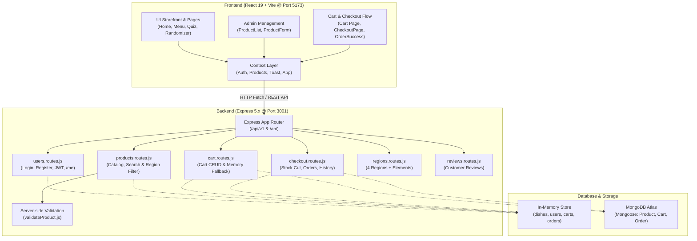

# 🛒 Cooking Kit E-Commerce — "ธาตุแท้" (That Tae)
### JSD13 Group 4 — Sprint 2 Central Documentation & Project Hub

ระบบ E-Commerce สำหรับสั่งซื้อ **Cooking Kit (ชุดวัตถุดิบพร้อมปรุง)** ที่คัดสรรตามภูมิภาคและธาตุเจ้าเรือน เน้นโภชนาการเฉพาะบุคคล ภายใต้ธีมเอิร์ธโทน-ใบลาน พัฒนาด้วยสถาปัตยกรรม **MERN Stack (Monorepo)**

---

## 📌 สารบัญ (Table of Contents)
1. [ภาพรวมสถาปัตยกรรมระบบ (Architecture & Flow)](#-ภาพรวมสถาปัตยกรรมระบบ-architecture--flow)
2. [มาตรฐาน Port & Base URL (Network Standards)](#-มาตรฐาน-port--base-url-network-standards)
3. [โครงสร้างไดเรกทอรี (Project Directory Structure)](#-โครงสร้างไดเรกทอรี-project-directory-structure)
4. [สรุปความรับผิดชอบและ Progress รายบุคคล (Roles & Current Progress)](#-สรุปความรับผิดชอบและ-progress-รายบุคคล-roles--current-progress)
5. [สรุปการแก้ไขและเชื่อมต่อระบบ v1 (Backend v1 Completion & Gap Analysis)](#-สรุปการแก้ไขและเชื่อมต่อระบบ-v1-backend-v1-completion--gap-analysis)
6. [สารบัญ API กลางฉบับสมบูรณ์ (Complete API Endpoints Reference)](#-สารบัญ-api-กลางฉบับสมบูรณ์-complete-api-endpoints-reference)
7. [คู่มือการทดสอบระบบด้วย Master Test Suite (testv1.rest)](#-คู่มือการทดสอบระบบด้วย-master-test-suite-testv1rest)
8. [ขั้นตอนการติดตั้งและเริ่มรันโปรเจกต์ (Quick Start Guide)](#-ขั้นตอนการติดตั้งและเริ่มรันโปรเจกต์-quick-start-guide)
9. [คู่มือการทำงานต่ออย่างราบรื่นสำหรับสมาชิกในทีม (Next Action Steps)](#-คู่มือการทำงานต่ออย่างราบรื่นสำหรับสมาชิกในทีม-next-action-steps)

---

## 🏗 ภาพรวมสถาปัตยกรรมระบบ (Architecture & Flow)

โปรเจกต์ถูกจัดแบบ **Monorepo** โดยแบ่งฝั่งหน้าบ้าน (`client`) และหลังบ้าน (`server`) ไว้อย่างชัดเจน:



---

## 🌐 มาตรฐาน Port & Base URL (Network Standards)

เพื่อไม่ให้เกิดความสับสนในการทดสอบและการเชื่อมต่อ API ระหว่างเครื่องของสมาชิกในทีม:

| Service | Port | Local URL | หน้าที่ |
| :--- | :--- | :--- | :--- |
| **Frontend (Client)** | `5173` | `http://localhost:5173` | เว็บไซต์ React + Vite |
| **Backend (Server)** | `3001` | `http://localhost:3001` | Node.js Express REST API |
| **API Base URL** | - | `http://localhost:3001/api/v1` | Prefix หลักของ Endpoint ทั้งหมด (รองรับ `/api` และ `/v1` ด้วย) |

---

## 📁 โครงสร้างไดเรกทอรี (Project Directory Structure)

```text
PJ-G4-SP2/
├── Docs/                           # เอกสารออกแบบระบบและฐานข้อมูล
│   ├── ER-Diagram-MongoDB.md       # แบบจำลอง Collections MongoDB ละเอียด
│   └── er-diagram-mongodb.excalidraw
├── client/                         # ส่วน Frontend (React 19 + Tailwind v4 + Vite)
│   ├── public/                     # Static assets (fonts, icons)
│   ├── src/
│   │   ├── assets/                 # รูปภาพโลโก้และกราฟิกของโปรเจกต์
│   │   ├── components/             # Reusable UI Components
│   │   │   ├── Cream/              # ตะกร้าสินค้า (Cart, CartItem)
│   │   │   ├── Menu/               # ส่วน Catalog (MenuCard, MenuFilters)
│   │   │   ├── checkout/           # ส่วนสั่งซื้อ (ShippingForm, PaymentMethodSelector)
│   │   │   ├── element-quiz/       # แบบทดสอบธาตุเจ้าเรือน
│   │   │   ├── home/               # Sections ต่างๆ ในหน้าแรก
│   │   │   ├── menu-randomizer/    # วงล้อสุ่มเมนูอาหารตามภาค
│   │   │   ├── Layout.jsx          # โครงร่างหน้าเว็บหลัก + Cart State กลาง
│   │   │   ├── Navbar.jsx          # Header นำทาง + โปรไฟล์ + ตะกร้า
│   │   │   └── Footer.jsx          # ส่วนท้ายเว็บ
│   │   ├── constants/              # ค่าคงที่ (Subscription Plans, Payment Methods)
│   │   ├── context/                # React Contexts (Auth, Products, Toast, App)
│   │   ├── hooks/                  # Custom Hooks (useToast, useHomeAnimations)
│   │   ├── pages/                  # หน้า Route หลักของแอปพลิเคชัน
│   │   │   ├── admin/              # Admin ProductList & Form
│   │   │   ├── CheckoutPage.jsx    # หน้าสั่งซื้อและชำระเงิน
│   │   │   ├── Home.jsx            # หน้าหลัก (Landing Page)
│   │   │   ├── Login.jsx           # หน้าเข้าสู่ระบบ
│   │   │   ├── MenuDetail.jsx      # หน้ารายละเอียดเมนู Cooking Kit
│   │   │   ├── MenuOverview.jsx    # หน้าร้านค้า / รายการเมนูทั้งหมด
│   │   │   ├── OrderSuccess.jsx    # หน้าคำสั่งซื้อสำเร็จ
│   │   │   └── Register.jsx        # หน้าลงทะเบียนผู้ใช้ใหม่
│   │   ├── utils/                  # ฟังก์ชันช่วยคำนวณราคาและแต้ม
│   │   ├── App.jsx                 # นิยาม React Router เส้นทางทั้งหมด
│   │   └── main.jsx                # จุดเริ่มรัน React App
│   └── package.json
└── server/                         # ส่วน Backend (Node.js + Express + Mongoose)
    ├── api.test.rest               # ไฟล์ทดสอบ API ระบบ Checkout เดิม
    ├── server.bak.js               # ไฟล์สำรองเซิร์ฟเวอร์แบบ Standalone
    ├── src/
    │   ├── config/
    │   │   └── db.js               # จัดการเชื่อมต่อ MongoDB Atlas พร้อม Auto Fallback เมื่อออฟไลน์
    │   ├── data/                   # Data Access Layer สำหรับ Products
    │   ├── mockDB/                 # ข้อมูลจำลองสำหรับทดสอบ (dishes, users, regions, reviews)
    │   ├── models/                 # Mongoose Data Models (Product, Cart, Order)
    │   ├── routes/
    │   │   ├── index.js            # Main Route Switcher
    │   │   └── v1/
    │   │       ├── index.js        # Mount รวมเส้นทางทั้งหมดของระบบ
    │   │       ├── users.routes.js # API สมาชิก, Login + JWT Token, GET /me
    │   │       ├── products.routes.js # API เมนูอาหาร + Query Search & Filters
    │   │       ├── cart.routes.js  # API ตะกร้าสินค้า CRUD ครบวงจร
    │   │       ├── checkout.routes.js # API สั่งซื้อ, ตัดสต็อก, ดูประวัติคำสั่งซื้อ
    │   │       ├── regions.routes.js  # API ข้อมูลภูมิภาคและธาตุเจ้าเรือน
    │   │       └── reviews.routes.js  # API รีวิวจากลูกค้า
    │   ├── testapi/
    │   │   └── testv1.rest         # Master API Test Suite รวมทดสอบ 20+ Endpoints
    │   └── server.js               # เซิร์ฟเวอร์หลัก Express + Error Middleware + Health Check
    ├── validation/
    │   └── validateProduct.js      # ฟังก์ชันตรวจสอบความถูกต้องของสินค้า
    └── package.json
```

---

## 👥 สรุปความรับผิดชอบและ Progress รายบุคคล (Roles & Current Progress)

### 📊 สรุปภาพรวมสถานะการส่งมอบ (Sprint Progress Matrix)

| สมาชิก | บทบาท / ขอบเขตงาน | สถานะ Frontend | สถานะ Backend (v1) | ความพร้อมรวมงาน |
| :--- | :--- | :---: | :---: | :---: |
| **Nut (นัท)** | 1. Admin Product & Validation | 🟢 เสร็จสมบูรณ์ | 🟢 เสร็จสมบูรณ์ (JWT + CRUD + Validation) | 🟡 รอต่อ Frontend เข้า API |
| **Delta (เดลต้า)** | 2. Storefront & Catalog | 🟢 สวยงามครบถ้วน | 🟢 เสร็จสมบูรณ์ (Search, Region, Tag Filter) | 🟡 รอต่อหน้าร้านเข้า API |
| **Cream (ครีม)** | 3. Cart Management & State | 🟢 ฟังก์ชันคำนวณครบ | 🟢 เสร็จสมบูรณ์ (Cart CRUD + Memory Fallback) | 🟢 API พร้อมต่อหน้าบ้านทันที |
| **Rin (ริน)** | 4. Checkout & Order Flow | 🟢 UI & Validation ครบ | 🟢 เสร็จสมบูรณ์ (Checkout + Order History) | 🟢 API พร้อมต่อหน้าบ้านทันที |
| **Nate (เน็ท)** | 5. Core Arch & Global Layout | 🟢 โครงสร้าง & ธีมพร้อม | 🟢 เสร็จสมบูรณ์ (DB Config + Health + Error Handlers) | 🟢 เซิร์ฟเวอร์พร้อมรัน 100% |

---

### รายละเอียดเจาะลึกแต่ละคน

#### 👤 Person 1: Nut — Admin Product Management & Form Validation
* **เป้าหมาย:** ทำระบบหลังบ้านให้ Admin จัดการเมนู Cooking Kit ตรวจสอบข้อมูล (Validation) และระบบสมัคร/ล็อกอิน
* **สิ่งที่ทำเสร็จแล้ว:**
  * ✅ `ProductForm.jsx`: ฟอร์มเพิ่ม/แก้ไข Cooking Kit พร้อม Inline Validation ครบทุกฟิลด์ (ชื่อ, รายละเอียด, ราคา, สต็อก, วันที่, แท็ก)
  * ✅ `AdminProductList.jsx`: หน้ารายการสินค้า แสดงตารางสินค้า พร้อมปุ่มแก้ไขและลบแบบ In-line Confirmation
  * ✅ `validateProduct.js`: Validation Rules ฝั่งเซิร์ฟเวอร์ที่สมบูรณ์และตรงกับหน้าบ้าน
  * ✅ `Login.jsx`: เชื่อมต่อเข้ากับ API `POST /api/v1/users/login` จริง พร้อมบันทึก Token/User ลงใน `AuthContext`
  * ✅ **Backend `users.routes.js` (สมบูรณ์ 100%):** ออก JWT Token, เซ็ต Cookie, มี `GET /users/me`, ซ่อน Password ในคำตอบ, และปรับรหัสผ่าน Mock เป็น `12345678` ให้พร้อมทดสอบ
  * ✅ **Backend `products.routes.js` (สมบูรณ์ 100%):** รองรับ GET, POST, PUT, DELETE พร้อม Server-side Validation
* **สิ่งที่ต้องทำต่อ (Next Actions):**
  * 🔄 เปลี่ยน `ProductsProvider.jsx` ในหน้าบ้านให้ยิง `fetch('/api/v1/products')` แทนการแก้ไข State ในหน่วยความจำ
  * 🔄 ปรับ `Register.jsx` ให้ส่งคำขอไปยัง `POST /api/v1/users` ของเซิร์ฟเวอร์จริง

---

#### 👤 Person 2: Delta — Product Catalog & Storefront
* **เป้าหมาย:** หน้าร้านสำหรับลูกค้า ดึงรายการ Cooking Kit มาแสดง พร้อมระบบค้นหา กรองเมนู และแสดงข้อมูลโภชนาการ
* **สิ่งที่ทำเสร็จแล้ว:**
  * ✅ `MenuOverview.jsx`: หน้ารวมเมนูอาหาร รองรับการค้นหาตามชื่อ และกรองตามภูมิภาค
  * ✅ `MenuCard.jsx`: การ์ดสินค้าธีมเอิร์ธโทน แสดงรูปภาพ ราคา ป้ายภูมิภาค และปุ่มเพิ่มลงตะกร้า
  * ✅ `MenuDetail.jsx`: หน้ารายละเอียดเชิงลึก แสดงรูปสลับได้ ข้อมูลโภชนาการ และแท็กภูมิภาค
  * ✅ ฟีเจอร์เสริมที่ยอดเยี่ยม: `ElementQuizPage.jsx` (คำนวณธาตุเจ้าเรือน) และ `MenuRandomizerPage.jsx` (วงล้อสุ่มเมนู)
  * ✅ **Backend `products.routes.js` (สมบูรณ์ 100%):** รองรับ Query Parameters ครบครัน: `?region=`, `?search=`, `?tag=`, `?sort=`, และ Pagination `?limit=&page=`
  * ✅ **Backend `regions.routes.js` (สมบูรณ์ 100%):** ให้บริการข้อมูล 4 ภาค พร้อมธาตุเจ้าเรือน ดิน น้ำ ลม ไฟ
* **สิ่งที่ต้องทำต่อ (Next Actions):**
  * 🔄 เปลี่ยนการดึงข้อมูลใน `MenuOverview.jsx` จากการ `import dishes` ตรงๆ มาเป็นยิง API `GET /api/v1/products` พร้อมส่ง Query Params

---

#### 👤 Person 3: Cream — Cart Management & State Operations
* **เป้าหมาย:** จัดการระบบตะกร้าสินค้า ปรับเพิ่ม-ลดจำนวน คำนวณราคาสินค้า และแจ้งเตือนแต้มสะสม
* **สิ่งที่ทำเสร็จแล้ว:**
  * ✅ `Cart.jsx`: หน้าตะกร้าสินค้า สรุปยอดรวม (Subtotal), ค่าจัดส่ง และยอดสุทธิ (Total)
  * ✅ `CartItem.jsx`: การ์ดรายการสินค้าในตะกร้า รองรับการกด `+` / `-` และปุ่มลบสินค้า
  * ✅ Logic รางวัลแต้มสะสม: แจ้งเตือน Popup อัตโนมัติเมื่อยอดสั่งซื้อครบ 1,499 บาท
  * ✅ เชื่อมต่อไปยังหน้า Checkout ผ่านปุ่ม "ดำเนินการชำระเงิน"
  * ✅ **Backend `cart.routes.js` (สร้างใหม่ สมบูรณ์ 100%):**
    * `GET /api/v1/cart/:userId` — ดึงสินค้าและคำนวณยอดเงิน Subtotal และ Total Items
    * `POST /api/v1/cart/items` (หรือ `/selected`) — เพิ่มสินค้าเข้าตะกร้า (Auto +quantity)
    * `PUT /api/v1/cart/items/:itemId` — ปรับเพิ่ม/ลดจำนวนชิ้น
    * `DELETE /api/v1/cart/items/:itemId` — ลบสินค้าชิ้นเดียวออกจากตะกร้า
    * `DELETE /api/v1/cart/:userId/clear` — ล้างตะกร้าทั้งหมด
    * *พร้อม In-memory Cart Store อัตโนมัติ ไม่ต้องพึ่งพาเน็ตเพื่อต่อ MongoDB*
* **สิ่งที่ต้องทำต่อ (Next Actions):**
  * 🔄 เชื่อมโยงให้ `MenuCard.jsx` และ `Cart.jsx` เรียกใช้ API หรือ State ตะกร้าชุดเดียวกัน

---

#### 👤 Person 4: Rin — User Cart Sync & Checkout Flow
* **เป้าหมาย:** หน้าชำระเงิน เลือกแพ็กเกจ A La Carte หรือ Subscription รายสัปดาห์ ตรวจสอบที่อยู่ และตัดสต็อกสินค้า
* **สิ่งที่ทำเสร็จแล้ว:**
  * ✅ `CheckoutPage.jsx`: หน้าชำระเงินที่สมบูรณ์แบบ รองรับการเลือก Plan (S/M/L/XL), คำนวณแต้ม, ที่อยู่จัดส่ง และวิธีชำระเงิน (PromptPay พร้อม QR Code ไดนามิก, บัตรเครดิต, เก็บเงินปลายทาง)
  * ✅ `OrderSuccess.jsx`: หน้าแสดงใบเสร็จคำสั่งซื้อสำเร็จและแต้มที่ได้รับ
  * ✅ `Order.js` และ `Cart.js`: ออกแบบ Mongoose Schema รองรับการใช้งานจริง
  * ✅ **Backend `checkout.routes.js` (สมบูรณ์ 100%):**
    * `POST /api/v1/checkout` — บันทึก Order, ตัดสต็อกจริงในคลัง, และล้างตะกร้า
    * `GET /api/v1/orders/user/:userId` — **ดึงประวัติการสั่งซื้อของผู้ใช้** (รองรับปุ่มโปรไฟล์ *"รายการคำสั่งซื้อของฉัน"*)
    * `GET /api/v1/orders/:orderId` — ดูรายละเอียดใบเสร็จรายบิล
    * `PATCH /api/v1/orders/:orderId/status` — แอดมินปรับสถานะจัดส่ง
    * `GET /api/v1/orders` — ดูรายการคำสั่งซื้อทั้งหมดสำหรับแอดมิน
    * *รองรับทั้ง String ID (`dish_001`, `USR-001`) และ MongoDB ObjectId ป้องกัน CastError*
* **สิ่งที่ต้องทำต่อ (Next Actions):**
  * 🔄 เปลี่ยนจาก Mock User ID `"USR-001"` มาดึง `currentUser` จาก `useAuth()`
  * 🔄 ปลดล็อกโค้ด `fetch('/api/v1/checkout')` ในหน้า CheckoutPage เพื่อส่งคำสั่งซื้อเข้า API จริง

---

#### 👤 Person 5: Nate — Core Infrastructure, App Layout & DB Setup
* **เป้าหมาย:** วางโครงสร้างสถาปัตยกรรม Database, Routing, Global Layout และ Middleware ส่วนกลาง
* **สิ่งที่ทำเสร็จแล้ว:**
  * ✅ `Layout.jsx`, `Navbar.jsx`, `Footer.jsx`: ดีไซน์โมเดิร์นเอิร์ธโทน Responsive รองรับมือถือและเดสก์ท็อป พร้อมแอนิเมชัน GSAP และ Dropdown โปรไฟล์
  * ✅ Central Toast Notification: `ToastProvider.jsx` และ `useToast.js` สำหรับแสดง Alert แจ้งเตือนสีสวยงามทั่วแอป
  * ✅ `AuthProvider.jsx`: จัดการ State ผู้ใช้ที่ล็อกอิน และบันทึกลงใน `localStorage`
  * ✅ **Backend Infrastructure (สมบูรณ์ 100%):**
    * `server/src/config/db.js` — ระบบเชื่อมต่อ MongoDB Atlas พร้อม Graceful In-memory Fallback เมื่อออฟไลน์
    * `server.js` — Mount รวมทุก Route เข้า `/api/v1`, `/api`, `/` และเพิ่ม Health Check `GET /api/health`
    * `server/.env` — ลบ Git Merge Conflict markers และจัดระเบียบตัวแปรสภาพแวดล้อม
    * `mockDB/reviews.js` — แก้ไขบั๊ก Image Import ใน Node.js และสร้าง `reviews.routes.js`
    * `server/src/testapi/testv1.rest` — สร้าง **Master Test Suite** ครบ 20+ คำสั่งทดสอบ
* **สิ่งที่ต้องทำต่อ (Next Actions):**
  * 🔄 เชื่อมต่อ State ระหว่างหน้าร้าน (Delta) ตะกร้า (Cream) และชำระเงิน (Rin) ให้ไหลลื่นใน App Context

---

## 🛠 สรุปการแก้ไขและเชื่อมต่อระบบ v1 (Backend v1 Completion & Gap Analysis)

| ประเด็นความไม่ลงรอยเดิม | สถานะปัจจุบัน | การแก้ไขที่ทำไปแล้ว |
| :--- | :---: | :--- |
| 1. **Cart Backend APIs ขาดหาย** | 🟢 **แก้เสร็จสมบูรณ์** | สร้าง `cart.routes.js` รองรับ CRUD ครบ พร้อม In-memory fallback |
| 2. **Checkout Route ไม่ได้ Mount** | 🟢 **แก้เสร็จสมบูรณ์** | Mount `/checkout` และ `/orders` เข้าสู่ `routes/v1/index.js` เรียบร้อย |
| 3. **Database Crash เมื่อไม่ออนไลน์** | 🟢 **แก้เสร็จสมบูรณ์** | สร้าง `config/db.js` ตรวจสอบการเชื่อมต่ออัตโนมัติ ไม่ค้าง Timeout |
| 4. **Git Conflict ใน `.env`** | 🟢 **แก้เสร็จสมบูรณ์** | คลีนไฟล์ `.env` เรียบร้อย พร้อมใช้งานกับ Native `--env-file` |
| 5. **Product Filter ขาดหาย** | 🟢 **แก้เสร็จสมบูรณ์** | เพิ่ม Query String `?region=`, `?search=`, `?tag=`, `?sort=` ใน `products.routes.js` |
| 6. **JWT Auth & Test Login** | 🟢 **แก้เสร็จสมบูรณ์** | รองรับ JWT Token, เพิ่ม `GET /users/me`, อัปเดตรหัสผ่าน Mock เป็น `12345678` |
| 7. **Frontend Context Integration** | 🟡 **รอรวมโค้ดหน้าบ้าน** | เหลือเพียงนำฟังก์ชัน `addToCart` และ `fetch` ไปสลับแทน Mock ใน React |

---

## 📡 สารบัญ API กลางฉบับสมบูรณ์ (Complete API Endpoints Reference)

Base URL: `http://localhost:3001/api/v1` (หรือเรียกผ่าน `http://localhost:3001/api`)

### 👤 1. หมวดหมู่ผู้ใช้งานและการยืนยันตัวตน (Users & Authentication)
| Method | Endpoint | คำอธิบาย | ข้อมูลที่ต้องส่ง (Body / Headers) |
| :--- | :--- | :--- | :--- |
| `GET` | `/users` | ดึงรายชื่อผู้ใช้ทั้งหมด (ซ่อนรหัสผ่าน) | - |
| `GET` | `/users/me` | ดึงข้อมูลผู้ใช้ปัจจุบันจาก Token | Header: `Authorization: Bearer <token>` |
| `GET` | `/users/:id` | ดึงข้อมูลผู้ใช้ตาม ID (เช่น `USR-001`) | - |
| `POST` | `/users/login` | เข้าสู่ระบบ (รับ JWT Token + User Data) | `{ email, password }` |
| `POST` | `/users` | สมัครสมาชิกใหม่ (Hash รหัสผ่าน + รับ Token) | `{ firstName, lastName, email, password, phone, ... }` |
| `PUT` | `/users/:id` | อัปเดตข้อมูลผู้ใช้ / เงื่อนไขสุขภาพ | `{ firstName, phone, conditions, ... }` |
| `DELETE`| `/users/:id` | ลบบัญชีผู้ใช้ | - |

---

### 🍲 2. หมวดหมู่สินค้า Cooking Kit (Products & Catalog)
| Method | Endpoint | คำอธิบาย | Query Parameters / Body |
| :--- | :--- | :--- | :--- |
| `GET` | `/products` | ดึงรายการ Cooking Kit ทั้งหมด | `?search=...`, `?region=...`, `?tag=...`, `?sort=...`, `?limit=...` |
| `GET` | `/products/:id` | ดึงรายละเอียด Cooking Kit รายเมนู | - |
| `POST` | `/products` | เพิ่มเมนู Cooking Kit ใหม่ (ผ่านการตรวจ Validation) | `{ name, region, price, quantity, date, tags, ... }` |
| `PUT` | `/products/:id` | แก้ไขข้อมูล Cooking Kit | `{ name, price, quantity, description, ... }` |
| `DELETE`| `/products/:id` | ลบ Cooking Kit ออกจากคลัง | - |

---

### 🛒 3. หมวดหมู่ตะกร้าสินค้า (Cart Management)
| Method | Endpoint | คำอธิบาย | ข้อมูลที่ต้องส่ง (Body) |
| :--- | :--- | :--- | :--- |
| `GET` | `/cart/:userId` | ดึงสินค้าในตะกร้า (พร้อม Subtotal และ Total Items) | - |
| `POST` | `/cart/items` | เพิ่มสินค้าลงตะกร้า (เพิ่ม `quantity` ถ้ามีอยู่แล้ว) | `{ userId, productId, quantity }` |
| `PUT` | `/cart/items/:itemId` | ปรับจำนวนชุดสินค้าในตะกร้า | `{ userId, quantity }` หรือ `{ userId, delta }` |
| `DELETE`| `/cart/items/:itemId` | ลบสินค้า 1 รายการออกจากตะกร้า | `{ userId }` |
| `DELETE`| `/cart/:userId/clear` | ล้างตะกร้าสินค้าทั้งหมด | - |

---

### 💳 4. หมวดหมู่สั่งซื้อและคำสั่งซื้อ (Checkout & Orders)
| Method | Endpoint | คำอธิบาย | ข้อมูลที่ต้องส่ง (Body) |
| :--- | :--- | :--- | :--- |
| `POST` | `/checkout` | สร้างคำสั่งซื้อ ตัดสต็อกสินค้า และล้างตะกร้า | `{ userId, items, planType, shippingAddress, paymentMethod, ... }` |
| `GET` | `/orders/user/:userId`| **ดึงประวัติคำสั่งซื้อทั้งหมดของลูกค้า** (Order History) | - |
| `GET` | `/orders/:orderId` | ดูรายละเอียดคำสั่งซื้อรายบิล (ใบเสร็จ) | - |
| `PATCH`| `/orders/:orderId/status`| [Admin] อัปเดตสถานะคำสั่งซื้อ | `{ status: "PREPARING" \| "SHIPPED" \| ... }` |
| `GET` | `/orders` | [Admin] ดูคำสั่งซื้อทั้งหมดในระบบ | - |

---

### 🌏 5. หมวดหมู่ข้อมูลสนับสนุนเว็บไซต์ (Regions, Reviews & Health)
| Method | Endpoint | คำอธิบาย |
| :--- | :--- | :--- |
| `GET` | `/regions` | ดึงข้อมูล 4 ภูมิภาค ธาตุเจ้าเรือน และรสชาติอาหาร |
| `GET` | `/regions/:id` | ดึงข้อมูลภูมิภาคเดี่ยว (เช่น `north`, `central`) |
| `GET` | `/reviews` | ดึงรายการรีวิวจากลูกค้าทั้งหมด |
| `GET` | `/api/health` | ตรวจสอบสถานะการทำงานและความพร้อมของเซิร์ฟเวอร์ |

---

## 🧪 คู่มือการทดสอบระบบด้วย Master Test Suite (`testv1.rest`)

ไฟล์ [server/src/testapi/testv1.rest](file:///e:/PJ-G4-SP2/server/src/testapi/testv1.rest) คือชุดทดสอบรวมที่ออกแบบมาให้คลิกส่ง Request ผ่านส่วนขยาย **REST Client** ใน VS Code ได้ทันที โดยประกอบด้วย:

1. **บัญชีทดสอบที่ล็อกอินได้ทันที (รหัสผ่านคือ `12345678` ทุกบัญชี):**
   * แอดมิน: `test@example.com` / `12345678` หรือ `admin@example.com` / `12345678`
   * ลูกค้า: `kan@example.com` / `12345678` หรือ `chonthicha@example.com` / `12345678`
2. **ระบบดึง Token อัตโนมัติ:** เมื่อกด Send Request ที่ `1.3 Login` ตัวแปร `@authToken` จะถูกนำไปใช้ใน `1.4 GET /users/me` ต่อให้อัตโนมัติ
3. **ระบบดึง Order ID อัตโนมัติ:** เมื่อกด Send Request ที่ `4.1 POST /checkout` รหัส Order ใหม่จะถูกนำไปใช้ทดสอบใน `4.2 ดูรายละเอียดบิล` และ `4.4 อัปเดตสถานะ` ทันที

---

## 🚀 ขั้นตอนการติดตั้งและเริ่มรันโปรเจกต์ (Quick Start Guide)

### 📋 สิ่งที่ต้องมีในเครื่อง (Prerequisites)
* **Node.js** เวอร์ชัน 20.x ขึ้นไป (เนื่องจากเซิร์ฟเวอร์ใช้ Native Flag `--env-file` และ `--watch`)
* **Git** สำหรับการจัดการ Branch

---

### 1. ติดตั้งและรันฝั่ง Backend (Server)
เปิด Terminal ที่ 1:
```bash
# 1. เข้าไปที่โฟลเดอร์ server
cd server

# 2. ติดตั้ง Dependencies
npm install

# 3. รันเซิร์ฟเวอร์สำหรับ Development (Port 3001)
npm run dev
```
> เซิร์ฟเวอร์จะเริ่มทำงานที่: `http://localhost:3001` (มีข้อความยืนยัน Base URL: `http://localhost:3001/api/v1`)

---

### 2. ติดตั้งและรันฝั่ง Frontend (Client)
เปิด Terminal ที่ 2:
```bash
# 1. เข้าไปที่โฟลเดอร์ client
cd client

# 2. ติดตั้ง Dependencies
npm install

# 3. รันเซิร์ฟเวอร์หน้าบ้านด้วย Vite (Port 5173)
npm run dev
```
> เปิด Browser ไปที่: `http://localhost:5173`

---

## 🎯 คู่มือการทำงานต่ออย่างราบรื่นสำหรับสมาชิกในทีม (Next Action Steps)

สำหรับสมาชิกในกลุ่มที่จะหยิบงานไปทำต่อ ให้ทำตาม Check-list นี้ทีละขั้น:

### 🧩 Step 1: รวมระบบ Cart เข้าสู่ Context กลาง (Priority: สูงสุด)
1. ใน `client/src/context/`: ปรับปรุง `AppContext.jsx` ให้บรรจุ State `cartItems` พร้อมฟังก์ชัน `addToCart`, `updateQuantity`, `removeItem`
2. นำฟังก์ชัน `addToCart` ไปผูกกับปุ่มใน `MenuCard.jsx` และ `MenuDetail.jsx`
3. ใน `Cart.jsx`: ดึงข้อมูลจาก Context นี้มาแสดงผลและคำนวณยอดเงิน

### 🧩 Step 2: เชื่อมต่อหน้า Checkout เข้ากับระบบจริง
1. ใน `client/src/pages/CheckoutPage.jsx`:
   * แทนที่ `currentUserId` ที่ Mock ไว้ ด้วย `currentUser` จาก `useAuth()`
   * นำรายการสินค้าใน `cartItems` จาก Cart Context มาแสดงแทน Mock 4 รายการ
   * ปลดล็อกบล็อกโค้ด `fetch('/api/v1/checkout')` เพื่อส่งข้อมูลไปบันทึกบนเซิร์ฟเวอร์จริง

### 🧩 Step 3: สลับการทำงานของ Products และ Register เป็น API จริง
1. ปรับปรุง `client/src/context/ProductsProvider.jsx` ให้ทำ HTTP GET ไปยัง `/api/v1/products`
2. ปรับปรุง `client/src/pages/Register.jsx` ให้ส่ง HTTP POST ไปยัง `/api/v1/users`

---

## 🤝 ข้อตกลงในการร่วมพัฒนา (Team Git Workflow)

1. **Branch Naming**:
   * แตก Branch จาก `main` เสมอ เช่น:
     * `feature/nut-admin-api`
     * `feature/delta-storefront-api`
     * `feature/cream-cart-context`
     * `feature/rin-checkout-integration`
     * `feature/nate-db-config`
2. **Pull Request Rules**:
   * ทดสอบรันทั้ง `npm run dev` ฝั่ง Client และ Server ในเครื่องตัวเองก่อนเปิด PR
   * ตรวจสอบว่าไม่มีไฟล์ `.env` ที่มีข้อมูลลับหลุดขึ้น Git
   * ขออนุมัติ (Review) จากเพื่อนร่วมทีมอย่างน้อย 1 คนก่อน Merge เข้า `main`

---

**พัฒนาด้วยความมุ่งมั่นโดย ทีมงาน JSD13 Group 4 (Sprint 2)** 🌿🍲✨
