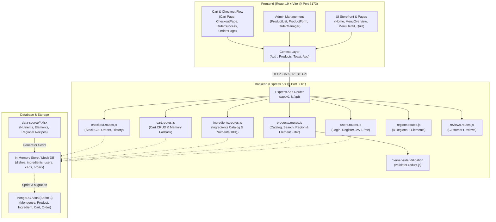

# 🛒 Cooking Kit E-Commerce — "ธาตุแท้" (That Tae)
### JSD13 Group 4 — Sprint 2 Central Documentation & Project Hub

ระบบ E-Commerce สำหรับสั่งซื้อ **Cooking Kit (ชุดวัตถุดิบพร้อมปรุง)** ที่คัดสรรตามภูมิภาคและธาตุเจ้าเรือน เน้นโภชนาการเฉพาะบุคคล ภายใต้ธีมเอิร์ธโทน-ใบลาน พัฒนาด้วยสถาปัตยกรรม **MERN Stack (Monorepo)**

---

## 📌 สารบัญ (Table of Contents)
1. [ภาพรวมสถาปัตยกรรมระบบ (Architecture & Flow)](#-ภาพรวมสถาปัตยกรรมระบบ-architecture--flow)
2. [มาตรฐาน Port & Base URL (Network Standards)](#-มาตรฐาน-port--base-url-network-standards)
3. [โครงสร้างไดเรกทอรี (Project Directory Structure)](#-โครงสร้างไดเรกทอรี-project-directory-structure)
4. [ระบบ Mock Database ฉบับสมบูรณ์จากฐานข้อมูลจริง (MockDB & Excel Integration Guide)](#-ระบบ-mock-database-ฉบับสมบูรณ์จากฐานข้อมูลจริง-mockdb--excel-integration-guide)
   * [4.1 แค็ตตาล็อกวัตถุดิบหลัก (Master Ingredients 217 รายการ)](#41-แค็ตตาล็อกวัตถุดิบหลัก-master-ingredients-217-รายการ)
   * [4.2 เมนู Cooking Kit และสูตรแยกย่อย (Dishes 30 เมนู 6 หมวด)](#42-เมนู-cooking-kit-และสูตรแยกย่อย-dishes-30-เมนู-6-หมวด)
   * [4.3 วิธีการ Import และเรียกใช้งาน Mock Data ในระบบ](#43-วิธีการ-import-และเรียกใช้งาน-mock-data-ในระบบ)
5. [สรุปความรับผิดชอบและหน้าที่ที่เหลือของแต่ละคน (Roles & Remaining Tasks for v1)](#-สรุปความรับผิดชอบและหน้าที่ที่เหลือของแต่ละคน-roles--remaining-tasks-for-v1)
   * [Nate & Nut: สานต่อ Admin Dashboard & Back-office ให้เต็มรูปแบบ](#-nate--nut-admin-dashboard--back-office-management)
   * [Delta: Storefront, Element Filter & Quiz Integration](#-delta-storefront-element-filter--quiz-integration)
   * [Cream: Cart Page & Refactored Cart Module](#-cream-cart-page--refactored-cart-module)
   * [Rin: Checkout, Order History & Profile](#-rin-checkout-order-history--profile)
6. [แผนงานและการเตรียมตัวสู่ Sprint 3 (Sprint 3 Roadmap: From Mock Local to MongoDB)](#-แผนงานและการเตรียมตัวสู่-sprint-3-sprint-3-roadmap-from-mock-local-to-mongodb)
   * [ทำไมต้องทดสอบกับ v1 Mock Local ให้สมบูรณ์ก่อน?](#ทำไมต้องทดสอบกับ-v1-mock-local-ให้สมบูรณ์ก่อน)
   * [Checklist สำหรับการเชื่อมต่อ MongoDB ใน Sprint 3](#checklist-สำหรับการเชื่อมต่อ-mongodb-ใน-sprint-3)
7. [สารบัญ API กลางฉบับสมบูรณ์ (Complete API Endpoints Reference)](#-สารบัญ-api-กลางฉบับสมบูรณ์-complete-api-endpoints-reference)
8. [คู่มือการทดสอบระบบด้วย Master Test Suite (testv1.rest)](#-คู่มือการทดสอบระบบด้วย-master-test-suite-testv1rest)
9. [ขั้นตอนการติดตั้งและเริ่มรันโปรเจกต์ (Quick Start Guide)](#-ขั้นตอนการติดตั้งและเริ่มรันโปรเจกต์-quick-start-guide)
10. [ข้อตกลงในการร่วมพัฒนา (Team Git Workflow)](#-ข้อตกลงในการร่วมพัฒนา-team-git-workflow)

---

## 🏗 ภาพรวมสถาปัตยกรรมระบบ (Architecture & Flow)

โปรเจกต์ถูกจัดแบบ **Monorepo** โดยแบ่งฝั่งหน้าบ้าน (`client`) และหลังบ้าน (`server`) ไว้อย่างชัดเจน:



---

## 🌐 มาตรฐาน Port & Base URL (Network Standards)

เพื่อไม่ให้เกิดความสับสนในการทดสอบและการเชื่อมต่อ API ระหว่างเครื่องของสมาชิกในทีม:

| Service | Port | Local URL | หน้าที่ |
| :--- | :--- | :--- | :--- |
| **Frontend (Client)** | `5173` | `http://localhost:5173` | เว็บไซต์ React + Vite |
| **Backend (Server)** | `3001` | `http://localhost:3001` | Node.js Express REST API |
| **API Base URL** | - | `http://localhost:3001/api/v1` | Prefix หลักของ Endpoint ทั้งหมด (รองรับ `/api` และ `/v1` ด้วย) |

---

## 📁 โครงสร้างไดเรกทอรี (Project Directory Structure)

```text
PJ-G4-SP2/
├── Docs/                           # เอกสารออกแบบระบบและฐานข้อมูล (ER Diagrams)
│   ├── ER-Diagram-MongoDB.md       # แบบจำลอง Collections MongoDB ตามมาตรฐาน
│   └── er-diagram-mongodb.excalidraw
├── data-source/                    # ฐานข้อมูล Excel ดั้งเดิม (Nutrients, Elements, Recipes)
│   ├── northern.xlsx               # ภาคเหนือ + ธาตุ (น้ำพริกอ่อง, ข้าวซอย, ลาบเหนือ, แกงฮังเล, แกงขนุน)
│   ├── isan.xlsx                   # ภาคอีสาน + ธาตุ (ส้มตำไทย, แกงอ่อม, แกงหน่อไม้, ต้มแซ่บ, ข้าวปุ้นซาว)
│   ├── central.xlsx                # ภาคกลาง + ธาตุ (แกงรัญจวน, แกงเทโพ, มัสมั่นไก่, แกงโสฬส, หมูชะมวง)
│   ├── southern.xlsx               # ภาคใต้ + ธาตุ (หน่อไม้ต้มกะทิ, แกงระแวง, ผัดสะตอ, ยำไตปลา, ไก่กอแระ)
│   ├── fusion.xlsx                 # ไทยฟิวชั่น + ธาตุ (สปาเกตตี, เปาะเปี๊ยะชาร์โคล, มักกะโรนี, เกี๊ยวซ่า, ข้าวมันไก่)
│   ├── desserts.xlsx               # ขนมหวาน + ธาตุ (ข้าวแต๋น, ทับทิมกรอบ, ข้าวเหนียวมะม่วง, สาคูต้น, ขนมถ้วย)
│   └── nutrients_elements.xlsx     # รวมโภชนาการต่อ 100g, รสยา และธาตุของวัตถุดิบทั้งหมด
├── scripts/                        # สคริปต์ช่วยประมวลผลข้อมูล (Data Tooling)
│   └── generate-mock-from-excel.js # แปลง Excel 8 ไฟล์เป็น Mock DB (dishes & ingredients)
├── client/                         # ส่วน Frontend (React 19 + Tailwind v4 + Vite)
│   ├── src/
│   │   ├── components/             # Reusable UI Components
│   │   │   ├── cart/               # ตะกร้าสินค้า (Cart, cartItems, CartItem) [Refactored]
│   │   │   ├── Menu/               # ส่วน Catalog (MenuCard, MenuFilters)
│   │   │   ├── checkout/           # ส่วนสั่งซื้อ (ShippingForm, PaymentMethodSelector)
│   │   │   ├── element-quiz/       # แบบทดสอบธาตุเจ้าเรือน
│   │   │   ├── home/               # Landing Page Sections
│   │   │   ├── Layout.jsx          # โครงร่างหน้าเว็บหลัก + Cart State กลาง
│   │   │   └── Navbar.jsx          # Header นำทาง + โปรไฟล์ + ตะกร้า (ใช้ SVG Icons)
│   │   ├── mock-data/              # Mock Data สำหรับหน้าบ้าน (dishes, ingredients, users, regions)
│   │   ├── pages/                  # หน้า Route หลักของแอปพลิเคชัน
│   │   │   ├── admin/              # Admin ProductList & Form
│   │   │   ├── CheckoutPage.jsx    # หน้าสั่งซื้อและชำระเงิน
│   │   │   ├── Home.jsx            # หน้าหลัก (Landing Page)
│   │   │   ├── MenuDetail.jsx      # หน้ารายละเอียดเมนู + ตารางวัตถุดิบ/รสยา/สารอาหาร 100g
│   │   │   ├── MenuOverview.jsx    # หน้าร้านค้า / แค็ตตาล็อกเมนู
│   │   │   └── OrdersPage.jsx      # หน้ารายการคำสั่งซื้อและสถานะจัดส่ง
├── server/                         # ส่วน Backend (Node.js + Express 5.x)
│   ├── src/
│   │   ├── config/db.js            # จัดการเชื่อมต่อ MongoDB พร้อม Auto Offline Fallback
│   │   ├── data/products.js        # Data Access Layer สำหรับ Products (เชื่อม recipe & nutrition)
│   │   ├── mockDB/                 # Master Mock Database (dishes, ingredients, users, regions, reviews)
│   │   ├── routes/v1/              # API Endpoints เวอร์ชัน 1 ครบทุกโมดูล
│   │   │   ├── users.routes.js
│   │   │   ├── products.routes.js
│   │   │   ├── ingredients.routes.js # [NEW] API แค็ตตาล็อกวัตถุดิบและโภชนาการ
│   │   │   ├── cart.routes.js
│   │   │   ├── checkout.routes.js
│   │   │   ├── regions.routes.js
│   │   │   └── reviews.routes.js
│   │   └── testapi/testv1.rest     # Master API Test Suite ทดสอบได้ในคลิกเดียว
```

---

## 📦 ระบบ Mock Database ฉบับสมบูรณ์จากฐานข้อมูลจริง (MockDB & Excel Integration Guide)

ระบบ Mock DB ของเราถูกสกัดและประมวลผลมาจากไฟล์ข้อมูลมาตรฐานของทีม (`data-source/*.xlsx`) เพื่อให้ข้อมูลมีความสมจริงและตรงตาม **ER Diagram (`Docs/ER-Diagram-MongoDB.md`)** ทุกประการ

### 4.1 แค็ตตาล็อกวัตถุดิบหลัก (Master Ingredients 217 รายการ)
เก็บอยู่ที่ `server/src/mockDB/ingredients.js` และ `client/src/mock-data/ingredients.js`
* **หน่วยมาตรฐาน:** บันทึกสารอาหารหลักที่ **100 กรัม (`basisWeightG: 100`)**
* **ข้อมูลในแต่ละ Record:**
  ```javascript
  {
    _id: "ing_021",
    nameTh: "หมูสดบด",
    category: "meat",                    // meat, poultry, seafood, vegetable, herb_spice, carb, coconut, seasoning, dessert
    categoryTh: "เนื้อสัตว์ & โปรตีน",
    medicinalTaste: "รสมัน",             // รสยาแพทย์แผนไทย: รสมัน, รสเปรี้ยว, รสเผ็ดร้อน, รสเค็ม, รสขม, รสหวาน, รสฝาด
    elements: ["ดิน"],                   // ธาตุเจ้าเรือนที่เหมาะแก่การกิน: ดิน, น้ำ, ลม, ไฟ
    basisWeightG: 100,
    nutrientsPer100g: {
      calories: 330,                     // kcal
      protein: 16.0,                     // กรัม
      carbs: 0.0,                        // กรัม
      sugar: 0.0,                        // กรัม
      fat: 30.0,                         // กรัม
      fiber: 0.0,                        // กรัม
      sodium: 50                         // มิลลิกรัม
    },
    isActive: true
  }
  ```

### 4.2 เมนู Cooking Kit และสูตรแยกย่อย (Dishes 30 เมนู 6 หมวด)
เก็บอยู่ที่ `server/src/mockDB/dishes.js` และ `client/src/mock-data/dishes.js`
* ครอบคลุม **30 เมนู** จาก 6 กลุ่มภูมิภาคและขนมหวาน (กลุ่มละ 5 เมนู):
  * **ภาคเหนือ:** น้ำพริกอ่อง, ข้าวซอย, ลาบเหนือ, แกงฮังเล, แกงขนุน
  * **ภาคอีสาน:** ข้าวปุ้นซาว, แกงอ่อม, แกงหน่อไม้ใบย่านาง, ส้มตำไทย, ต้มแซ่บกระดูกหมู
  * **ภาคกลาง:** แกงรัญจวน, แกงเทโพ, แกงมัสมั่นไก่, แกงโสฬส (แกงสิบหก), หมูชะมวง
  * **ภาคใต้:** หน่อไม้หวานต้มกะทิ, แกงระแวง, ผัดสะตอกับกะปิใส่กุ้ง, ยำไตปลา, ไก่กอแระ
  * **ไทยฟิวชั่น:** สปาเกตตีผัดหอยลายน้ำพริกเผา, เปาะเปี๊ยะสดผัดไทยเส้นชาร์โคล, มักกะโรนีต้มยำไข่ชีสทอดกรอบ, เกี๊ยวซ่าราดหน้า, ข้าวมันไก่
  * **ขนมหวาน:** ข้าวแต๋น, ทับทิมกรอบ, ข้าวเหนียวมะม่วง, สาคูน้ำกะทิ, ขนมถ้วยไข่หวาน
* **สูตรแยกย่อยในแต่ละชุด (`recipe`):**
  * ประกอบด้วย 8–19 วัตถุดิบจริงในชุด Cooking Kit พร้อมระบุปริมาณที่ต้องใช้สำหรับ 2 เสิร์ฟ (เช่น หมู 200g, กะทิ 200ml, พริกแกง 45g)
  * แต่ละวัตถุดิบมีค่าสารอาหารต่อ 100g, รสยา, และธาตุที่ควรกินผูกไว้ครบถ้วน
* **การคำนวณสารอาหารรวม (`nutritionCache`):**
  * มีการคำนวณรวมทั้งเซ็ต (`totals`) และค่าเฉลี่ยต่อเสิร์ฟ (`perServing`)
  * คำนวณธาตุหลักประจำเมนู (`dominantElement`) เช่น ธาตุดิน และระบุธาตุที่ได้ประโยชน์ (`elementSuitability`)

### 4.3 วิธีการ Import และเรียกใช้งาน Mock Data ในระบบ

#### ในฝั่ง Frontend (React):
```javascript
// 1. ดึงเมนูและวัตถุดิบโดยตรงจาก mock-data
import { dishes, ingredients } from '../mock-data/index.js';

// 2. ใช้งานผ่าน ProductsContext (แนะนำ: รองรับทั้ง API และ Mock Fallback)
import { useProducts } from '../context/ProductsContext.js';

const { products, getProductById } = useProducts();
const currentDish = getProductById("dish_001");
console.log(currentDish.recipe);        // วัตถุดิบแยกย่อย
console.log(currentDish.nutritionCache); // สรุปสารอาหาร
console.log(currentDish.dominantElement); // ธาตุเจ้าเรือนหลัก (ดิน/น้ำ/ลม/ไฟ)
```

#### ในฝั่ง Backend (Node.js Express):
```javascript
// 1. Import จาก mockDB
import dishes from '../mockDB/dishes.js';
import ingredients from '../mockDB/ingredients.js';

// 2. เรียกใช้ผ่าน API Endpoint
// GET /api/v1/ingredients       -> ดูวัตถุดิบทั้งหมด + สารอาหารต่อ 100g
// GET /api/v1/ingredients/:id   -> ดูวัตถุดิบรายตัว
// GET /api/v1/products          -> รายการสินค้าพร้อม recipe และ nutritionCache
```

---

## 👥 สรุปความรับผิดชอบและหน้าที่ที่เหลือของแต่ละคน (Roles & Remaining Tasks for v1)

เพื่อความต่อเนื่องในการทำงาน ขอแจกแจง Action Items ที่เหลือของสมาชิกแต่ละคนเพื่อปิด Sprint 2 ให้สมบูรณ์ 100%:

### 👑 Nate & Nut: Admin Dashboard & Back-office Management
**เน็ท และ นัท** รับผิดชอบส่วนแอดมินและการจัดการระบบหลังบ้าน:
* **เป้าหมาย:** ทำหน้า Dashboard สรุปภาพรวม และระบบจัดการสินค้า/ออเดอร์ให้สมบูรณ์
* **งานที่ต้องทำต่อ (Action Items):**
  1. **หน้า Overview Dashboard (`client/src/pages/admin/AdminDashboard.jsx`):**
     * การ์ดสรุปยอดขายรวม (Total Revenue), จำนวนออเดอร์ทั้งหมด, สินค้าที่ขายดีที่สุด 5 อันดับแรก
     * กราฟหรือสัดส่วนยอดขายแยกตามภูมิภาคและธาตุเจ้าเรือน (ดิน, น้ำ, ลม, ไฟ)
  2. **ระบบจัดการเมนู Cooking Kit (`client/src/pages/admin/AdminProductList.jsx` & `ProductForm.jsx`):**
     * เพิ่มการแสดงผลตารางสูตรวัตถุดิบแยกย่อย (`recipe`) และสารอาหารต่อ 100g ในหน้าดูรายละเอียดของแอดมิน
     * รองรับการเลือกธาตุเจ้าเรือน (`dominantElement`) ในฟอร์มเพิ่ม/แก้ไขเมนู
  3. **ระบบจัดการคำสั่งซื้อ (`client/src/pages/admin/AdminOrders.jsx`):**
     * ตารางดูคำสั่งซื้อทั้งหมดที่ส่งเข้ามาผ่าน `GET /api/v1/orders`
     * ปุ่มสำหรับ Admin อัปเดตสถานะออเดอร์ (เช่น `PENDING` -> `PREPARING` -> `SHIPPED` -> `COMPLETED`) ผ่าน `PATCH /api/v1/orders/:orderId/status`

---

### 🎨 Delta: Storefront, Element Filter & Quiz Integration
* **เป้าหมาย:** หน้าร้านค้าที่ค้นหาและกรองอาหารตามธาตุเจ้าเรือนได้สมบูรณ์
* **งานที่ต้องทำต่อ (Action Items):**
  1. **Element Filter ใน `MenuOverview.jsx`:**
     * เพิ่มตัวกรอง "ธาตุเจ้าเรือน" (ดิน, น้ำ, ลม, ไฟ) ข้างๆ ตัวกรองภูมิภาค โดยเชื่อมกับฟิลด์ `dominantElement` ของสินค้า
  2. **เชื่อม Quiz เข้ากับ Storefront:**
     * เมื่อลูกค้าทำแบบทดสอบธาตุใน `ElementQuizPage.jsx` จบและได้ผลลัพธ์ธาตุ ให้มีปุ่ม "ดูชุดเมนูที่เหมาะกับธาตุของคุณ" นำทางไปยัง `MenuOverview.jsx?element=ไฟ` พร้อมเปิดฟิลเตอร์ธาตุให้อัตโนมัติ

---

### 🛒 Cream: Cart Page & Refactored Cart Module
* **เป้าหมาย:** ตรวจสอบระบบตะกร้าสินค้าหลังปรับโครงสร้างโฟลเดอร์เป็น `components/cart/`
* **งานที่ต้องทำต่อ (Action Items):**
  1. **ตรวจสอบความถูกต้องของการ Import ในโปรเจกต์:**
     * ตรวจทานไฟล์ `components/cart/Cart.jsx`, `cartItems.jsx`, `CartItem.jsx` ว่าเชื่อมต่อกับ `useOutletContext()` ได้ราบรื่น
  2. **เพิ่มส่วนสรุปโภชนาการรวมในตะกร้า (Cart Nutrition Summary):**
     * คำนวณผลรวมแคลอรี (Total kcal) และโปรตีนของอาหารทั้งหมดที่อยู่ในตะกร้า เพื่อให้ลูกค้าเห็นก่อนกดสั่งซื้อ

---

### 💳 Rin: Checkout, Order History & Profile
* **เป้าหมาย:** กระบวนการสั่งซื้อ ชำระเงิน และการดูประวัติคำสั่งซื้อ
* **งานที่ต้องทำต่อ (Action Items):**
  1. **Checkout Flow Testing (`CheckoutPage.jsx`):**
     * ทดสอบขั้นตอนการสั่งซื้อเมื่อล็อกอินด้วยบัญชีจริง (เช่น `kan@example.com` / `12345678`)
     * ตรวจสอบว่า `POST /api/v1/checkout` บันทึกคำสั่งซื้อและตัดสต็อกสำเร็จ
  2. **หน้าประวัติคำสั่งซื้อ (`OrdersPage.jsx`):**
     * ดึงข้อมูลออเดอร์จาก `GET /api/v1/orders/user/:userId` มาแสดงรายละเอียดสินค้า ที่อยู่จัดส่ง และสถานะจัดส่ง

---

## 🚀 แผนงานและการเตรียมตัวสู่ Sprint 3 (Sprint 3 Roadmap: From Mock Local to MongoDB)

### ทำไมต้องทดสอบกับ v1 Mock Local ให้สมบูรณ์ก่อน?
1. **ลด Dependency ในการพัฒนา:** สมาชิกในทีมทุกคนสามารถรันโค้ดและพัฒนาฟีเจอร์หน้าบ้านของตัวเองได้ทันทีในเครื่อง โดยไม่ต้องกังวลเรื่องการเชื่อมต่ออินเทอร์เน็ต, MongoDB Atlas Timeout, หรือปัญหา IP Whitelist
2. **มั่นใจใน Business Logic:** เมื่อฟังก์ชันหน้าบ้านเชื่อมต่อกับ REST API v1 ในรูปแบบ In-Memory / Mock DB ได้อย่างไร้รอยต่อแล้ว การย้ายไปต่อ Database จริงจะทำเพียงแค่เปลี่ยน Data Access Layer (DAL) หลังบ้านเท่านั้น โค้ดหน้าบ้านจะไม่ต้องแก้อีกเลย!

### Checklist สำหรับการเชื่อมต่อ MongoDB ใน Sprint 3
เมื่อเพื่อนๆ ทดสอบ v1 Mock Local จนครบสมบูรณ์แล้ว ใน Sprint 3 เราจะดำเนินการดังนี้:
1. **Mongoose Schemas:** แปลงโครงสร้าง `ingredients` (217 รายการ) และ `dishes` (30 รายการ) เป็น Mongoose Models ตาม `Docs/ER-Diagram-MongoDB.md`
2. **Database Seed Command (`npm run seed`):**
   * จัดเตรียมสคริปต์ `server/src/scripts/seed.js` ที่ดึงข้อมูลจาก `data-source/*.xlsx` ยิงเข้าสู่ MongoDB Atlas คอลเลกชันจริงในคลิกเดียว
3. **Data Access Layer Refactor:**
   * ปรับแก้ `server/src/data/products.js` และ `server/src/routes/v1/*.routes.js` ให้เรียก `Product.find()`, `Ingredient.find()`, `Order.create()` จาก Mongoose แทน In-Memory Object
4. **JWT & Security Hardening:**
   * เข้ารหัสรหัสผ่านด้วย `bcryptjs` และจัดเก็บ Access Token ใน Secure Cookie
5. **Production Deployment:**
   * Frontend: Deploy สู่ **Vercel**
   * Backend: Deploy สู่ **Render / Railway** พร้อมต่อ MongoDB Atlas

---

## 📡 สารบัญ API กลางฉบับสมบูรณ์ (Complete API Endpoints Reference)

Base URL: `http://localhost:3001/api/v1` (หรือเรียกผ่าน `http://localhost:3001/api`)

### 👤 1. หมวดหมู่ผู้ใช้งานและการยืนยันตัวตน (Users & Authentication)
| Method | Endpoint | คำอธิบาย | ข้อมูลที่ต้องส่ง (Body / Headers) |
| :--- | :--- | :--- | :--- |
| `GET` | `/users` | ดึงรายชื่อผู้ใช้ทั้งหมด (ซ่อนรหัสผ่าน) | - |
| `GET` | `/users/me` | ดึงข้อมูลผู้ใช้ปัจจุบันจาก Token | Header: `Authorization: Bearer <token>` |
| `GET` | `/users/:id` | ดึงข้อมูลผู้ใช้ตาม ID (เช่น `USR-001`) | - |
| `POST` | `/users/login` | เข้าสู่ระบบ (รับ JWT Token + User Data) | `{ email, password }` |
| `POST` | `/users` | สมัครสมาชิกใหม่ (Hash รหัสผ่าน + รับ Token) | `{ firstName, lastName, email, password, phone, ... }` |
| `PUT` | `/users/:id` | อัปเดตข้อมูลผู้ใช้ / เงื่อนไขสุขภาพ | `{ firstName, phone, conditions, ... }` |
| `DELETE`| `/users/:id` | ลบบัญชีผู้ใช้ | - |

---

### 🍲 2. หมวดหมู่สินค้า Cooking Kit (Products & Catalog)
| Method | Endpoint | คำอธิบาย | Query Parameters / Body |
| :--- | :--- | :--- | :--- |
| `GET` | `/products` | ดึงรายการ Cooking Kit ทั้งหมด พร้อมสูตรและสารอาหาร | `?search=...`, `?region=...`, `?element=...`, `?tag=...`, `?sort=...` |
| `GET` | `/products/:id` | ดึงรายละเอียด Cooking Kit รายเมนู (มี recipe & nutritionCache) | - |
| `POST` | `/products` | เพิ่มเมนู Cooking Kit ใหม่ (ผ่านการตรวจ Validation) | `{ name, region, price, quantity, date, tags, ... }` |
| `PUT` | `/products/:id` | แก้ไขข้อมูล Cooking Kit | `{ name, price, quantity, description, ... }` |
| `DELETE`| `/products/:id` | ลบ Cooking Kit ออกจากคลัง | - |

---

### 🌿 3. หมวดหมู่วัตถุดิบและโภชนาการ (Ingredients & Nutrition)
| Method | Endpoint | คำอธิบาย | Query Parameters |
| :--- | :--- | :--- | :--- |
| `GET` | `/ingredients` | ดึงรายการวัตถุดิบทั้งหมด 217 รายการ พร้อมสารอาหารต่อ 100g, รสยา, และธาตุ | `?category=meat\|vegetable\|carb...` |
| `GET` | `/ingredients/:id`| ดึงข้อมูลวัตถุดิบเดี่ยวตาม ID (เช่น `ing_021`) | - |

---

### 🛒 4. หมวดหมู่ตะกร้าสินค้า (Cart Management)
| Method | Endpoint | คำอธิบาย | ข้อมูลที่ต้องส่ง (Body) |
| :--- | :--- | :--- | :--- |
| `GET` | `/cart/:userId` | ดึงสินค้าในตะกร้า (พร้อม Subtotal และ Total Items) | - |
| `POST` | `/cart/items` | เพิ่มสินค้าลงตะกร้า (เพิ่ม `quantity` ถ้ามีอยู่แล้ว) | `{ userId, productId, quantity }` |
| `PUT` | `/cart/items/:itemId` | ปรับจำนวนชุดสินค้าในตะกร้า | `{ userId, quantity }` หรือ `{ userId, delta }` |
| `DELETE`| `/cart/items/:itemId` | ลบสินค้า 1 รายการออกจากตะกร้า | `{ userId }` |
| `DELETE`| `/cart/:userId/clear` | ล้างตะกร้าสินค้าทั้งหมด | - |

---

### 💳 5. หมวดหมู่สั่งซื้อและคำสั่งซื้อ (Checkout & Orders)
| Method | Endpoint | คำอธิบาย | ข้อมูลที่ต้องส่ง (Body) |
| :--- | :--- | :--- | :--- |
| `POST` | `/checkout` | สร้างคำสั่งซื้อ ตัดสต็อกสินค้า และล้างตะกร้า | `{ userId, items, planType, shippingAddress, paymentMethod, ... }` |
| `GET` | `/orders/user/:userId`| **ดึงประวัติคำสั่งซื้อทั้งหมดของลูกค้า** (Order History) | - |
| `GET` | `/orders/:orderId` | ดูรายละเอียดคำสั่งซื้อรายบิล (ใบเสร็จ) | - |
| `PATCH`| `/orders/:orderId/status`| [Admin] อัปเดตสถานะคำสั่งซื้อ | `{ status: "PREPARING" \| "SHIPPED" \| ... }` |
| `GET` | `/orders` | [Admin] ดูคำสั่งซื้อทั้งหมดในระบบ | - |

---

### 🌏 6. หมวดหมู่ข้อมูลสนับสนุนเว็บไซต์ (Regions, Reviews & Health)
| Method | Endpoint | คำอธิบาย |
| :--- | :--- | :--- |
| `GET` | `/regions` | ดึงข้อมูล 4 ภูมิภาค ธาตุเจ้าเรือน และรสชาติอาหาร |
| `GET` | `/regions/:id` | ดึงข้อมูลภูมิภาคเดี่ยว (เช่น `north`, `central`) |
| `GET` | `/reviews` | ดึงรายการรีวิวจากลูกค้าทั้งหมด |
| `GET` | `/api/health` | ตรวจสอบสถานะการทำงานและความพร้อมของเซิร์ฟเวอร์ |

---

## 🧪 คู่มือการทดสอบระบบด้วย Master Test Suite (`testv1.rest`)

ไฟล์ [server/src/testapi/testv1.rest](file:///e:/PJ-G4-SP2/server/src/testapi/testv1.rest) คือชุดทดสอบรวมที่ออกแบบมาให้คลิกส่ง Request ผ่านส่วนขยาย **REST Client** ใน VS Code ได้ทันที โดยประกอบด้วย:

1. **บัญชีทดสอบที่ล็อกอินได้ทันที (รหัสผ่านคือ `12345678` ทุกบัญชี):**
   * แอดมิน: `test@example.com` / `12345678` หรือ `admin@example.com` / `12345678`
   * ลูกค้า: `kan@example.com` / `12345678` หรือ `chonthicha@example.com` / `12345678`
2. **ระบบดึง Token อัตโนมัติ:** เมื่อกด Send Request ที่ `1.3 Login` ตัวแปร `@authToken` จะถูกนำไปใช้ใน `1.4 GET /users/me` ต่อให้อัตโนมัติ
3. **ระบบดึง Order ID อัตโนมัติ:** เมื่อกด Send Request ที่ `4.1 POST /checkout` รหัส Order ใหม่จะถูกนำไปใช้ทดสอบใน `4.2 ดูรายละเอียดบิล` และ `4.4 อัปเดตสถานะ` ทันที

---

## 🚀 ขั้นตอนการติดตั้งและเริ่มรันโปรเจกต์ (Quick Start Guide)

### 📋 สิ่งที่ต้องมีในเครื่อง (Prerequisites)
* **Node.js** เวอร์ชัน 20.x ขึ้นไป
* **Git** สำหรับการจัดการ Branch

---

### 1. ติดตั้งและรันฝั่ง Backend (Server)
เปิด Terminal ที่ 1:
```bash
# 1. เข้าไปที่โฟลเดอร์ server
cd server

# 2. ติดตั้ง Dependencies
npm install

# 3. รันเซิร์ฟเวอร์สำหรับ Development (Port 3001)
npm run dev
```
> เซิร์ฟเวอร์จะเริ่มทำงานที่: `http://localhost:3001` (Base URL: `http://localhost:3001/api/v1`)

---

### 2. ติดตั้งและรันฝั่ง Frontend (Client)
เปิด Terminal ที่ 2:
```bash
# 1. เข้าไปที่โฟลเดอร์ client
cd client

# 2. ติดตั้ง Dependencies
npm install

# 3. รันเซิร์ฟเวอร์หน้าบ้านด้วย Vite (Port 5173)
npm run dev
```
> เปิด Browser ไปที่: `http://localhost:5173`

---

## 🤝 ข้อตกลงในการร่วมพัฒนา (Team Git Workflow)

1. **Branch Naming**:
   * แตก Branch จาก `main` เสมอ เช่น:
     * `feature/nate-admin-dashboard`
     * `feature/nut-admin-products`
     * `feature/delta-element-filters`
     * `feature/cream-cart-summary`
     * `feature/rin-checkout-orders`
2. **Pull Request Rules**:
   * ทดสอบรัน `npm run dev` หรือ `npm run build` ในเครื่องตัวเองก่อนเปิด PR
   * ตรวจสอบว่าไม่มีไฟล์ `.env` ที่มีข้อมูลลับหลุดขึ้น Git
   * ขออนุมัติ (Review) จากเพื่อนร่วมทีมอย่างน้อย 1 คนก่อน Merge เข้า `main`

---

**พัฒนาด้วยความมุ่งมั่นโดย ทีมงาน JSD13 Group 4 (Sprint 2)** 🌿🍲✨
