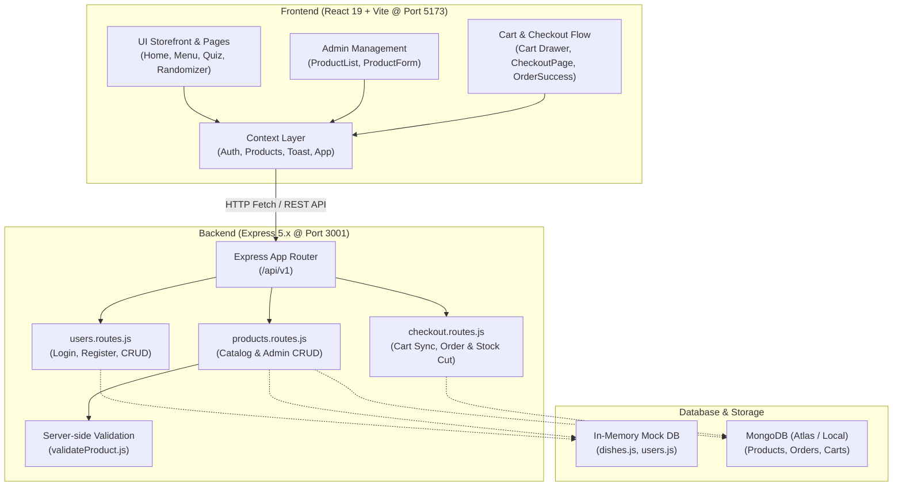

# 🛒 Cooking Kit E-Commerce — "ธาตุแท้" (That Tae)
### JSD13 Group 4 — Sprint 2 Central Documentation & Project Hub

ระบบ E-Commerce สำหรับสั่งซื้อ **Cooking Kit (ชุดวัตถุดิบพร้อมปรุง)** ที่คัดสรรตามภูมิภาคและธาตุเจ้าเรือน เน้นโภชนาการเฉพาะบุคคล ภายใต้ธีมเอิร์ธโทน-ใบลาน พัฒนาด้วยสถาปัตยกรรม **MERN Stack (Monorepo)**

---

## 📌 สารบัญ (Table of Contents)
1. [ภาพรวมสถาปัตยกรรมระบบ (Architecture & Flow)](#-ภาพรวมสถาปัตยกรรมระบบ-architecture--flow)
2. [มาตรฐาน Port & Base URL (Network Standards)](#-มาตรฐาน-port--base-url-network-standards)
3. [โครงสร้างไดเรกทอรี (Project Directory Structure)](#-โครงสร้างไดเรกทอรี-project-directory-structure)
4. [สรุปความรับผิดชอบและ Progress รายบุคคล (Roles & Current Progress)](#-สรุปความรับผิดชอบและ-progress-รายบุคคล-roles--current-progress)
5. [วิเคราะห์สิ่งที่ยังขาด (Gap Analysis & Integration Checklist)](#-วิเคราะห์สิ่งที่ยังขาด-gap-analysis--integration-checklist)
6. [สารบัญ API กลาง (API Endpoints Reference)](#-สารบัญ-api-กลาง-api-endpoints-reference)
7. [ขั้นตอนการติดตั้งและเริ่มรันโปรเจกต์ (Quick Start Guide)](#-ขั้นตอนการติดตั้งและเริ่มรันโปรเจกต์-quick-start-guide)
8. [คู่มือการทำงานต่ออย่างราบรื่นสำหรับสมาชิกในทีม (Next Action Steps)](#-คู่มือการทำงานต่ออย่างราบรื่นสำหรับสมาชิกในทีม-next-action-steps)

---

## 🏗 ภาพรวมสถาปัตยกรรมระบบ (Architecture & Flow)

โปรเจกต์ถูกจัดแบบ **Monorepo** โดยแบ่งฝั่งหน้าบ้าน (`client`) และหลังบ้าน (`server`) ไว้อย่างชัดเจน:



---

## 🌐 มาตรฐาน Port & Base URL (Network Standards)

เพื่อไม่ให้เกิดความสับสนในการทดสอบและการเชื่อมต่อ API ระหว่างเครื่องของสมาชิกในทีม:

| Service | Port | Local URL | หน้าที่ |
| :--- | :--- | :--- | :--- |
| **Frontend (Client)** | `5173` | `http://localhost:5173` | เว็บไซต์ React + Vite |
| **Backend (Server)** | `3001` | `http://localhost:3001` | Node.js Express REST API |
| **API Base URL** | - | `http://localhost:3001/api/v1` | Prefix หลักของ Endpoint ทั้งหมด |

> ⚠️ **ข้อควรระวัง:** ก่อนหน้านี้มีไฟล์ `.rest` และตัวอย่างโค้ดบางจุดอ้างอิง Port `4000` และ `5000` — **ขอให้ทุกฝ่ายยึด Port 3001 และ Prefix `/api/v1` เป็นมาตรฐานกลางเดียวกัน**

---

## 📁 โครงสร้างไดเรกทอรี (Project Directory Structure)

```text
PJ-G4-SP2/
├── Docs/                           # เอกสารออกแบบระบบและฐานข้อมูล
│   ├── ER-Diagram-MongoDB.md       # แบบจำลอง Collections MongoDB ละเอียด
│   └── er-diagram-mongodb.excalidraw
├── client/                         # ส่วน Frontend (React 19 + Tailwind v4 + Vite)
│   ├── public/                     # Static assets (fonts, icons)
│   ├── src/
│   │   ├── assets/                 # รูปภาพโลโก้และกราฟิกของโปรเจกต์
│   │   ├── components/             # Reusable UI Components
│   │   │   ├── Cream/              # ตะกร้าสินค้า (Cart, CartItem)
│   │   │   ├── Menu/               # ส่วน Catalog (MenuCard, MenuFilters)
│   │   │   ├── checkout/           # ส่วนสั่งซื้อ (ShippingForm, PaymentMethodSelector)
│   │   │   ├── element-quiz/       # แบบทดสอบธาตุเจ้าเรือน
│   │   │   ├── home/               # Sections ต่างๆ ในหน้าแรก
│   │   │   ├── menu-randomizer/    # วงล้อสุ่มเมนูอาหารตามภาค
│   │   │   ├── Layout.jsx          # โครงร่างหน้าเว็บหลัก + Cart State กลาง
│   │   │   ├── Navbar.jsx          # Header นำทาง + โปรไฟล์ + ตะกร้า
│   │   │   └── Footer.jsx          # ส่วนท้ายเว็บ
│   │   ├── constants/              # ค่าคงที่ (Subscription Plans, Payment Methods)
│   │   ├── context/                # React Contexts (Auth, Products, Toast, App)
│   │   ├── hooks/                  # Custom Hooks (useToast, useHomeAnimations)
│   │   ├── pages/                  # หน้า Route หลักของแอปพลิเคชัน
│   │   │   ├── admin/              # Admin ProductList & Form
│   │   │   ├── CheckoutPage.jsx    # หน้าสั่งซื้อและชำระเงิน
│   │   │   ├── Home.jsx            # หน้าหลัก (Landing Page)
│   │   │   ├── Login.jsx           # หน้าเข้าสู่ระบบ
│   │   │   ├── MenuDetail.jsx      # หน้ารายละเอียดเมนู Cooking Kit
│   │   │   ├── MenuOverview.jsx    # หน้าร้านค้า / รายการเมนูทั้งหมด
│   │   │   ├── OrderSuccess.jsx    # หน้าคำสั่งซื้อสำเร็จ
│   │   │   └── Register.jsx        # หน้าลงทะเบียนผู้ใช้ใหม่
│   │   ├── utils/                  # ฟังก์ชันช่วยคำนวณราคาและแต้ม
│   │   ├── App.jsx                 # นิยาม React Router เส้นทางทั้งหมด
│   │   └── main.jsx                # จุดเริ่มรัน React App
│   └── package.json
└── server/                         # ส่วน Backend (Node.js + Express + Mongoose)
    ├── api.test.rest               # ไฟล์ทดสอบ API ระบบ Checkout
    ├── server.bak.js               # ไฟล์สำรองเซิร์ฟเวอร์แบบ Standalone
    ├── src/
    │   ├── data/                   # Data Access Layer สำหรับ Products
    │   ├── mockDB/                 # ข้อมูลจำลองสำหรับทดสอบ (dishes, users, regions)
    │   ├── models/                 # Mongoose Data Models (Product, Cart, Order)
    │   ├── routes/
    │   │   ├── index.js            # Main Route Switcher
    │   │   └── v1/
    │   │       ├── index.js        # Mount เส้นทางย่อย (/users, /products)
    │   │       ├── users.routes.js # API สมาชิกและระบบล็อกอิน
    │   │       ├── products.routes.js # API รายการเมนูและแอดมิน CRUD
    │   │       └── checkout.routes.js # API ตะกร้าและตัดสต็อก
    │   ├── testapi/
    │   │   └── testv1.rest         # สคริปต์ทดสอบ API ผ่าน REST Client
    │   └── server.js               # เซิร์ฟเวอร์หลัก Express + Error Middleware
    ├── validation/
    │   └── validateProduct.js      # ฟังก์ชันตรวจสอบความถูกต้องของสินค้า
    └── package.json
```

---

## 👥 สรุปความรับผิดชอบและ Progress รายบุคคล (Roles & Current Progress)

### 📊 สรุปภาพรวมสถานะการส่งมอบ (Sprint Progress Matrix)

| สมาชิก | บทบาท / ขอบเขตงาน | สถานะ Frontend | สถานะ Backend | ความพร้อมรวมงาน |
| :--- | :--- | :---: | :---: | :---: |
| **Nut (นัท)** | 1. Admin Product & Validation | 🟢 เสร็จสมบูรณ์ | 🟢 เสร็จสมบูรณ์ | 🟡 รอต่อ Frontend เข้า API เซิร์ฟเวอร์ |
| **Delta (เดลต้า)** | 2. Storefront & Catalog | 🟢 สวยงามครบถ้วน | 🟡 ดึงข้อมูลได้ / ขาด Query Params | 🟡 รอต่อหน้าร้านเข้า API เซิร์ฟเวอร์ |
| **Cream (ครีม)** | 3. Cart Management & State | 🟢 ฟังก์ชันคำนวณครบ | 🔴 ยังไม่มี Route บนเซิร์ฟเวอร์ | 🟡 ตะกร้าทำงานได้บน Client-side |
| **Rin (ริน)** | 4. Checkout & Order Flow | 🟢 UI & Validation ครบ | 🟢 Route & Transaction พร้อม | 🟡 รอเชื่อมต่อ `checkout.routes` เข้า Router กลาง |
| **Nate (เน็ท)** | 5. Core Arch & Global Layout | 🟢 โครงสร้าง & ธีมพร้อม | 🟡 เซิร์ฟเวอร์รันได้ / รอต่อ MongoDB | 🟢 พร้อมเป็นแกนกลางในการรวมโค้ด |

---

### รายละเอียดเจาะลึกแต่ละคน

#### 👤 Person 1: Nut — Admin Product Management & Form Validation
* **เป้าหมาย:** ทำระบบหลังบ้านให้ Admin จัดการเมนู Cooking Kit ตรวจสอบข้อมูล (Validation) และระบบสมัคร/ล็อกอิน
* **สิ่งที่ทำเสร็จแล้ว:**
  * ✅ `ProductForm.jsx`: ฟอร์มเพิ่ม/แก้ไข Cooking Kit พร้อม Inline Validation ครบทุกฟิลด์ (ชื่อ, รายละเอียด, ราคา, สต็อก, วันที่, แท็ก)
  * ✅ `AdminProductList.jsx`: หน้ารายการสินค้า แสดงตารางสินค้า พร้อมปุ่มแก้ไขและลบแบบ In-line Confirmation
  * ✅ `validateProduct.js`: Validation Rules ฝั่งเซิร์ฟเวอร์ที่สมบูรณ์และตรงกับหน้าบ้าน
  * ✅ `Login.jsx`: เชื่อมต่อเข้ากับ API `POST /api/v1/users/login` จริง พร้อมบันทึก Token/User ลงใน `AuthContext`
  * ✅ Backend `products.routes.js`: รองรับ GET, POST, PUT, DELETE พร้อมเรียกใช้ `validateProduct`
* **สิ่งที่ต้องทำต่อ (Next Actions):**
  * 🔄 เปลี่ยน `ProductsProvider.jsx` ในหน้าบ้านให้ยิง `fetch('/api/v1/products')` แทนการแก้ไข State ในหน่วยความจำ
  * 🔄 ปรับ `Register.jsx` ให้ส่งคำขอไปยัง `POST /api/v1/users` ของเซิร์ฟเวอร์จริง

---

#### 👤 Person 2: Delta — Product Catalog & Storefront
* **เป้าหมาย:** หน้าร้านสำหรับลูกค้า ดึงรายการ Cooking Kit มาแสดง พร้อมระบบค้นหา กรองเมนู และแสดงข้อมูลโภชนาการ
* **สิ่งที่ทำเสร็จแล้ว:**
  * ✅ `MenuOverview.jsx`: หน้ารวมเมนูอาหาร รองรับการค้นหาตามชื่อ และกรองตามภูมิภาค
  * ✅ `MenuCard.jsx`: การ์ดสินค้าธีมเอิร์ธโทน แสดงรูปภาพ ราคา ป้ายภูมิภาค และปุ่มเพิ่มลงตะกร้า
  * ✅ `MenuDetail.jsx`: หน้ารายละเอียดเชิงลึก แสดงรูปสลับได้ ข้อมูลโภชนาการ และแท็กภูมิภาค
  * ✅ ฟีเจอร์เสริมที่ยอดเยี่ยม: `ElementQuizPage.jsx` (คำนวณธาตุเจ้าเรือน) และ `MenuRandomizerPage.jsx` (วงล้อสุ่มเมนู)
* **สิ่งที่ต้องทำต่อ (Next Actions):**
  * 🔄 เปลี่ยนการดึงข้อมูลใน `MenuOverview.jsx` จากการ `import dishes` ตรงๆ มาเป็นยิง API `GET /api/v1/products`
  * 🔄 เพิ่ม Server-side Filtering ใน `products.routes.js` ให้รองรับ Query Parameters เช่น `?region=northern` หรือ `?search=...`

---

#### 👤 Person 3: Cream — Cart Management & State Operations
* **เป้าหมาย:** จัดการระบบตะกร้าสินค้า ปรับเพิ่ม-ลดจำนวน คำนวณราคาสินค้า และแจ้งเตือนแต้มสะสม
* **สิ่งที่ทำเสร็จแล้ว:**
  * ✅ `Cart.jsx`: หน้าตะกร้าสินค้า สรุปยอดรวม (Subtotal), ค่าจัดส่ง และยอดสุทธิ (Total)
  * ✅ `CartItem.jsx`: การ์ดรายการสินค้าในตะกร้า รองรับการกด `+` / `-` และปุ่มลบสินค้า
  * ✅ Logic รางวัลแต้มสะสม: แจ้งเตือน Popup อัตโนมัติเมื่อยอดสั่งซื้อครบ 1,499 บาท
  * ✅ เชื่อมต่อไปยังหน้า Checkout ผ่านปุ่ม "ดำเนินการชำระเงิน"
* **สิ่งที่ต้องทำต่อ (Next Actions):**
  * 🔄 ย้าย State ของตะกร้าจาก `Layout.jsx` หรือเชื่อมโยงให้ `MenuCard.jsx` เรียกใช้ฟังก์ชัน `addToCart` ที่ส่งผลต่อตะกร้าจริง
  * 🔄 (หากต้องการ Sync กับ DB) พัฒนา Endpoint `POST /api/v1/cart/selected` เพื่อบันทึกตะกร้าลง MongoDB

---

#### 👤 Person 4: Rin — User Cart Sync & Checkout Flow
* **เป้าหมาย:** หน้าชำระเงิน เลือกแพ็กเกจ A La Carte หรือ Subscription รายสัปดาห์ ตรวจสอบที่อยู่ และตัดสต็อกสินค้า
* **สิ่งที่ทำเสร็จแล้ว:**
  * ✅ `CheckoutPage.jsx`: หน้าชำระเงินที่สมบูรณ์แบบ รองรับการเลือก Plan (S/M/L/XL), คำนวณแต้ม, ที่อยู่จัดส่ง และวิธีชำระเงิน (PromptPay พร้อม QR Code ไดนามิก, บัตรเครดิต, เก็บเงินปลายทาง)
  * ✅ `OrderSuccess.jsx`: หน้าแสดงใบเสร็จคำสั่งซื้อสำเร็จและแต้มที่ได้รับ
  * ✅ Backend `checkout.routes.js`: เขียนระบบตัดสต็อกสินค้าด้วย Mongoose Session Transaction และบันทึกคำสั่งซื้อลง `Order` Model
  * ✅ `Order.js` และ `Cart.js`: ออกแบบ Mongoose Schema รองรับการใช้งานจริง
* **สิ่งที่ต้องทำต่อ (Next Actions):**
  * 🔄 เปลี่ยนจาก Mock User ID `"USR-001"` มาดึง `currentUser` จาก `useAuth()`
  * 🔄 ปลดล็อกโค้ด `fetch('/api/v1/checkout')` เพื่อส่ง Order ไปตัดสต็อกจริงที่หลังบ้าน

---

#### 👤 Person 5: Nate — Core Infrastructure, App Layout & DB Setup
* **เป้าหมาย:** วางโครงสร้างสถาปัตยกรรม Database, Routing, Global Layout และ Middleware ส่วนกลาง
* **สิ่งที่ทำเสร็จแล้ว:**
  * ✅ `Layout.jsx`, `Navbar.jsx`, `Footer.jsx`: ดีไซน์โมเดิร์นเอิร์ธโทน Responsive รองรับมือถือและเดสก์ท็อป พร้อมแอนิเมชัน GSAP และ Dropdown โปรไฟล์
  * ✅ Central Toast Notification: `ToastProvider.jsx` และ `useToast.js` สำหรับแสดง Alert แจ้งเตือนสีสวยงามทั่วแอป
  * ✅ `AuthProvider.jsx`: จัดการ State ผู้ใช้ที่ล็อกอิน และบันทึกลงใน `localStorage`
  * ✅ Express Server Setup: ตั้งค่า CORS, JSON Body Parser, Cookie Parser และ Central Error Handler
  * ✅ Routing Tree: เชื่อมโยงทุกหน้าใน `App.jsx` ด้วย `createBrowserRouter`
* **สิ่งที่ต้องทำต่อ (Next Actions):**
  * 🔄 สร้างไฟล์ `server/src/config/db.js` และเปิดใช้งาน `connectDB()` ใน `server.js`
  * 🔄 แก้ไขไฟล์ `server/.env` นำ Git Merge Conflict Marker ออก และใส่ MongoDB Connection String

---

## 🚨 วิเคราะห์สิ่งที่ยังขาด (Gap Analysis & Integration Checklist)

เพื่อให้โปรเจกต์นี้ทำงานร่วมกันได้อย่างสมบูรณ์แบบไร้รอยต่อ (End-to-End Integration) นี่คือจุดที่ต้องแก้ไขเชื่อมต่อกัน:

```text
[Frontend Pages]                        [Integration Gap]                        [Backend APIs]
MenuCard / Detail    ──❌ เรียก dummy addToCart ──> ไม่เข้า Layout Cart          
Admin Products       ──❌ บันทึกแค่ React State ──> ไม่ได้ยิง POST/PUT/DELETE ──> products.routes.js
Register Page        ──❌ บันทึกลง Mock Array   ──> ไม่ได้ยิง POST /users    ──> users.routes.js
Checkout Page        ──❌ ใช้ Mock Cart Items   ──> ไม่ได้รับ cart จาก Cart  ──> checkout.routes.js
Server Router        ──❌ ยังไม่ได้ mount      ──> checkout.routes.js หาย   ──> /api/v1/checkout
Database Connection  ──❌ connectDB ปิดอยู่     ──> Mongoose ไม่เชื่อมต่อ    ──> MongoDB Atlas
```

### 1. การเชื่อมโยงตะกร้าสินค้า (Cart State Disconnection)
* **ปัญหา:** ปัจจุบัน `MenuCard.jsx` เรียกใช้ `addToCart` จาก `AppContext` ซึ่งทำเพียงแค่ `console.log` ทำให้เมื่อผู้ใช้กดซื้ออาหารที่หน้าร้าน สินค้าไม่เข้าไปอยู่ในตะกร้าของ `Layout.jsx` และ `Cart.jsx`
* **ทางแก้:** ส่ง `handleAddToCart` ผ่าน Context กลาง (เช่น `AppContext` หรือ `CartContext`) เพื่อให้ `MenuCard` และ `MenuDetail` สามารถเพิ่มสินค้าลงตะกร้าเดียวกันกับที่ `Navbar` และ `Cart` ใช้งาน

### 2. การเชื่อมต่อระบบสินค้าแอดมินกับเซิร์ฟเวอร์ (Admin API Sync)
* **ปัญหา:** `ProductsProvider.jsx` ยังจัดการข้อมูลผ่านหน่วยความจำใน React (useState) ทำให้เมื่อ Refresh หน้าเว็บ ข้อมูลสินค้าที่เพิ่มหรือแก้ไขจะกลับไปเป็นค่าเริ่มต้น
* **ทางแก้:** ให้ `ProductsProvider` ทำการ `fetch('http://localhost:3001/api/v1/products')` ตอนเริ่มต้น และส่งคำขอ `POST/PUT/DELETE` ไปยังเซิร์ฟเวอร์

### 3. การเชื่อมต่อระบบสมัครสมาชิก (Register API Sync)
* **ปัญหา:** `Register.jsx` บันทึกสมาชิกใหม่ด้วยการ `users.push()` ลงในไฟล์ mock-data ฝั่งหน้าบ้าน ทำให้ข้อมูลผู้ใช้ไม่เข้าสู่ฐานข้อมูลเซิร์ฟเวอร์ และไม่สามารถนำไปล็อกอินในหน้า `Login.jsx` ได้จริง
* **ทางแก้:** ให้ฟังก์ชัน `handleRegister` ส่งคำขอ `POST http://localhost:3001/api/v1/users`

### 4. การผูก Checkout Route และการเชื่อมต่อ MongoDB
* **ปัญหาที่ 1:** `server/src/routes/v1/index.js` ยังไม่ได้ import `checkout.routes.js` ทำให้เมื่อหน้าบ้านเรียก `POST /api/v1/checkout` จะได้ผลลัพธ์ 404 Not Found
* **ปัญหาที่ 2:** `server/src/server.js` คอมเมนต์ฟังก์ชัน `connectDB()` ไว้ ทำให้การตัดสต็อกด้วย Mongoose ไม่สามารถทำงานได้
* **ทางแก้:**
  1. Mount route: `router.use("/checkout", checkoutRouter)` ใน `server/src/routes/v1/index.js`
  2. สร้างโมดูลเชื่อมต่อฐานข้อมูลใน `server/src/config/db.js` และเปิดใช้งานใน `server.js`

### 5. ความสะอาดของไฟล์ Environment (`server/.env`)
* **ปัญหา:** ไฟล์ `server/.env` ปัจจุบันมี Git Conflict Marker (`=======`) ค้างอยู่
* **ทางแก้:** คลีนไฟล์และระบุค่า:
  ```env
  PORT=3001
  MONGO_URI=mongodb+srv://<username>:<password>@cluster.mongodb.net/that-tae?retryWrites=true&w=majority
  CLIENT_URL=http://localhost:5173
  ```

---

## 📡 สารบัญ API กลาง (API Endpoints Reference)

Base URL สำหรับทุก Endpoint: `http://localhost:3001/api/v1`

### 👤 1. หมวดหมู่ผู้ใช้งานและสิทธิ์ (Users & Authentication)
| Method | Endpoint | คำอธิบาย | ข้อมูลที่ต้องส่ง (Body) |
| :--- | :--- | :--- | :--- |
| `GET` | `/users` | ดึงรายชื่อผู้ใช้ทั้งหมด | - |
| `GET` | `/users/:id` | ดึงข้อมูลผู้ใช้ตาม ID (เช่น `USR-001`) | - |
| `POST` | `/users/login` | ตรวจสอบอีเมลและรหัสผ่านเข้าสู่ระบบ | `{ email, password }` |
| `POST` | `/users` | สมัครสมาชิกใหม่ (Hash รหัสผ่านอัตโนมัติ) | `{ firstName, lastName, email, password, phone, ... }` |
| `PUT` | `/users/:id` | อัปเดตข้อมูลผู้ใช้ | `{ firstName, phone, conditions, ... }` |
| `DELETE`| `/users/:id` | ลบบัญชีผู้ใช้ | - |

---

### 🍲 2. หมวดหมู่สินค้า Cooking Kit (Products Management)
| Method | Endpoint | คำอธิบาย | ข้อมูลที่ต้องส่ง (Body) |
| :--- | :--- | :--- | :--- |
| `GET` | `/products` | ดึงรายการ Cooking Kit ทั้งหมด | รองรับ `?region=...` (แนะนำให้ต่อยอด) |
| `GET` | `/products/:id` | ดึงรายละเอียด Cooking Kit รายเมนู | - |
| `POST` | `/products` | เพิ่มเมนู Cooking Kit ใหม่ (ผ่านการตรวจ Validation) | `{ name, region, price, quantity, date, tags, ... }` |
| `PUT` | `/products/:id` | แก้ไขข้อมูล Cooking Kit | `{ name, price, quantity, ... }` |
| `DELETE`| `/products/:id` | ลบ Cooking Kit ออกจากระบบ | - |

---

### 💳 3. หมวดหมู่สั่งซื้อและตะกร้า (Checkout & Orders)
| Method | Endpoint | คำอธิบาย | ข้อมูลที่ต้องส่ง (Body) |
| :--- | :--- | :--- | :--- |
| `GET` | `/cart/:user_id` | ดึงข้อมูลตะกร้าสินค้าของผู้ใช้ | - |
| `POST` | `/checkout` | สร้างคำสั่งซื้อ ตัดสต็อกสินค้า และเคลียร์ตะกร้า | `{ userId, items, planType, shippingAddress, paymentMethod, ... }` |

---

## 🚀 ขั้นตอนการติดตั้งและเริ่มรันโปรเจกต์ (Quick Start Guide)

### 📋 สิ่งที่ต้องมีในเครื่อง (Prerequisites)
* **Node.js** เวอร์ชัน 20.x ขึ้นไป (เนื่องจากเซิร์ฟเวอร์ใช้ Native Flag `--env-file` และ `--watch`)
* **Git** สำหรับการจัดการ Branch

---

### 1. ติดตั้งและรันฝั่ง Backend (Server)
เปิด Terminal ที่ 1:
```bash
# 1. เข้าไปที่โฟลเดอร์ server
cd server

# 2. ติดตั้ง Dependencies
npm install

# 3. เตรียมไฟล์ Environment (.env)
# หากยังไม่มี ให้สร้างไฟล์ .env จาก .env.example
cp .env.example .env

# 4. รันเซิร์ฟเวอร์สำหรับ Development (Port 3001)
npm run dev
```
> เซิร์ฟเวอร์จะเริ่มทำงานที่: `http://localhost:3001`

---

### 2. ติดตั้งและรันฝั่ง Frontend (Client)
เปิด Terminal ที่ 2:
```bash
# 1. เข้าไปที่โฟลเดอร์ client
cd client

# 2. ติดตั้ง Dependencies
npm install

# 3. รันเซิร์ฟเวอร์หน้าบ้านด้วย Vite (Port 5173)
npm run dev
```
> เปิด Browser ไปที่: `http://localhost:5173`

---

### 3. การทดสอบ API ด้วย REST Client
คุณสามารถใช้ส่วนขยาย **REST Client** ใน VS Code เพื่อทดสอบยิง Request ได้ทันที:
* ทดสอบระบบผู้ใช้: [server/src/testapi/testv1.rest](file:///e:/PJ-G4-SP2/server/src/testapi/testv1.rest)
* ทดสอบระบบสั่งซื้อ: [server/api.test.rest](file:///e:/PJ-G4-SP2/server/api.test.rest)

---

## 🎯 คู่มือการทำงานต่ออย่างราบรื่นสำหรับสมาชิกในทีม (Next Action Steps)

สำหรับสมาชิกในกลุ่มที่จะหยิบงานไปทำต่อ ให้ทำตาม Check-list นี้ทีละขั้น:

### 🧩 Step 1: รวมระบบ Cart เข้าสู่ Context กลาง (Priority: สูงสุด)
1. ใน `client/src/context/`: ปรับปรุง `AppContext.jsx` ให้บรรจุ State `cartItems` พร้อมฟังก์ชัน `addToCart`, `updateQuantity`, `removeItem`
2. นำฟังก์ชัน `addToCart` ไปผูกกับปุ่มใน `MenuCard.jsx` และ `MenuDetail.jsx`
3. ใน `Cart.jsx`: ดึงข้อมูลจาก Context นี้มาแสดงผลและคำนวณยอดเงิน

### 🧩 Step 2: เชื่อมต่อหน้า Checkout เข้ากับระบบจริง
1. ใน `client/src/pages/CheckoutPage.jsx`:
   * แทนที่ `currentUserId` ที่ Mock ไว้ ด้วย `currentUser` จาก `useAuth()`
   * นำรายการสินค้าใน `cartItems` จาก Cart Context มาแสดงแทน Mock 4 รายการ
   * ปลดล็อกบล็อกโค้ด `fetch('/api/v1/checkout')` เพื่อส่งข้อมูลไปบันทึกบนเซิร์ฟเวอร์จริง
2. ใน `server/src/routes/v1/index.js`:
   * Import `checkout.routes.js` และ Mount เส้นทาง `/checkout`

### 🧩 Step 3: เปิดการเชื่อมต่อ MongoDB เต็มรูปแบบ
1. สร้างไฟล์ `server/src/config/db.js`:
   ```javascript
   import mongoose from "mongoose";

   export async function connectDB() {
     const uri = process.env.MONGO_URI || process.env.MONGODB_URI;
     if (!uri) throw new Error("กรุณาระบุ MONGO_URI ในไฟล์ .env");
     await mongoose.connect(uri);
     console.log("🍃 เชื่อมต่อ MongoDB สำเร็จเรียบร้อยแล้ว");
   }
   ```
2. ปลดคอมเมนต์ `await connectDB();` ใน `server/src/server.js`

### 🧩 Step 4: สลับการทำงานของ Products และ Register เป็น API จริง
1. ปรับปรุง `client/src/context/ProductsProvider.jsx` ให้ทำ HTTP GET ไปยัง `/api/v1/products`
2. ปรับปรุง `client/src/pages/Register.jsx` ให้ส่ง HTTP POST ไปยัง `/api/v1/users`

---

## 🤝 ข้อตกลงในการร่วมพัฒนา (Team Git Workflow)

1. **Branch Naming**:
   * แตก Branch จาก `main` เสมอ เช่น:
     * `feature/nut-admin-api`
     * `feature/delta-storefront-api`
     * `feature/cream-cart-context`
     * `feature/rin-checkout-integration`
     * `feature/nate-db-config`
2. **Pull Request Rules**:
   * ทดสอบรันทั้ง `npm run dev` ฝั่ง Client และ Server ในเครื่องตัวเองก่อนเปิด PR
   * ตรวจสอบว่าไม่มีไฟล์ `.env` ที่มีข้อมูลลับหลุดขึ้น Git
   * ขออนุมัติ (Review) จากเพื่อนร่วมทีมอย่างน้อย 1 คนก่อน Merge เข้า `main`

---

**พัฒนาด้วยความมุ่งมั่นโดย ทีมงาน JSD13 Group 4 (Sprint 2)** 🌿🍲✨
