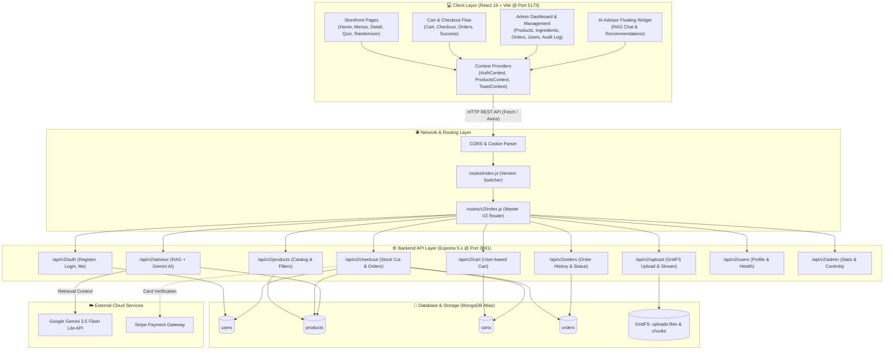

# 🌿 "ธาตุแท้" (That Tae) — Thai 4-Element Cooking Kit & Health Cuisine Platform
### JSD13 Group 4 — Full Stack Web Application (MERN + MongoDB Atlas + GridFS + RAG AI)


RAG_AI_ADVISOR.md เป็นคู่มือหลัก มีหลักการ RAG, แผนภาพลำดับการทำงาน, ตาราง role, การกันใช้งานผิด 9 ชั้น, วิธีติดตั้งและ deploy, API reference และ checklist ทดสอบ 13 ข้อ
RAG_AI_MONGODB.md เน้นฝั่ง MongoDB มี schema ของ advisorchunks, indexer, การค้น 2 โหมด, ขั้นตอนตั้ง Atlas Vector Search ที่ถูกต้อง, ตารางเทียบกับแนวทางของครู และคำสั่งตรวจใน Mongo Shell
README ทั้ง 3 ไฟล์แก้เป็น Gemini 3.5 Flash Lite และใส่ลิงก์ไปเอกสารใหม่แล้ว


> **"ธาตุแท้" (That Tae)** คือแพลตฟอร์ม E-Commerce อาหารสุขภาพและชุดวัตถุดิบพร้อมปรุง (**Cooking Kit**) สไตล์ไทยดั้งเดิมและฟิวชั่น ผสานองค์ความรู้ **ศาสตร์การแพทย์แผนไทยเรื่อง 4 ธาตุเจ้าเรือน (ดิน, น้ำ, ลม, ไฟ)** และโภชนาการรายบุคคล ช่วยให้ผู้ใช้ประเมินธาตุเจ้าเรือน เลือกเมนูอาหารที่ปรับสมดุลร่างกาย สั่งซื้อ Cooking Kit ที่ชั่งตวงวัดวัตถุดิบพอดีมื้อพร้อมปรุงได้เองที่บ้าน พร้อมระบบ **RAG AI Advisor** ช่วยให้คำปรึกษาด้านโภชนาการแบบเฉพาะเจาะจง

---

## 📌 สารบัญ (Table of Contents)
1. [จุดเด่นและฟีเจอร์หลักของระบบ (Key Features)](#-จุดเด่นและฟีเจอร์หลักของระบบ-key-features)
2. [สถาปัตยกรรมระบบภาพรวม (System Architecture)](#-สถาปัตยกรรมระบบภาพรวม-system-architecture)
3. [สมาชิกในทีมและบทบาทหน้าที่ความรับผิดชอบ (Team Roles & Responsibilities)](#-สมาชิกในทีมและบทบาทหน้าที่ความรับผิดชอบ-team-roles--responsibilities)
4. [โครงสร้างโฟลเดอร์ของโปรเจกต์ (Project Directory Structure)](#-โครงสร้างโฟลเดอร์ของโปรเจกต์-project-directory-structure)
5. [เทคโนโลยีที่เลือกใช้และเหตุผล (Tech Stack & Rationale)](#-เทคโนโลยีที่เลือกใช้และเหตุผล-tech-stack--rationale)
6. [การทำงานของระบบ V2 (MongoDB Atlas + GridFS + RAG AI)](#-การทำงานของระบบ-v2-mongodb-atlas--gridfs--rag-ai)
7. [ขั้นตอนการติดตั้งและเริ่มรันโปรเจกต์ (Installation & Quick Start)](#-ขั้นตอนการติดตั้งและเริ่มรันโปรเจกต์-installation--quick-start)
8. [เอกสารประกอบเฉพาะทาง (Specialized Documentations)](#-เอกสารประกอบเฉพาะทาง-specialized-documentations)

---

## 🌟 จุดเด่นและฟีเจอร์หลักของระบบ (Key Features)

### 1. ระบบประเมินธาตุเจ้าเรือน (Element Quiz & Health Profiling)
- แบบประเมินทางสุขภาพ 5 ข้อ อ้างอิงตามลักษณะสรีรวิทยาและอารมณ์ตามศาสตร์การแพทย์แผนไทย
- วิเคราะห์คำนวณธาตุเด่นของผู้ใช้ (**ธาตุดิน, ธาตุน้ำ, ธาตุลม, ธาตุไฟ**) พร้อมคะแนนแจกแจง
- บันทึกธาตุเจ้าเรือนลงในโปรไฟล์ผู้ใช้โดยอัตโนมัติ และเชื่อมโยงกับการกรองเมนูอาหารที่แนะนำ

### 2. แค็ตตาล็อกเมนู Cooking Kit และระบบกรองอัจฉริยะ (Smart Menu Catalog)
- รายการเมนูอาหารไทยแท้ 4 ภาค และไทยฟิวชั่น 30 เมนู (เหนือ, กลาง, อีสาน, ใต้, ฟิวชั่น, ขนมหวาน)
- กรองตาม **ธาตุเจ้าเรือน** (ดิน, น้ำ, ลม, ไฟ), **ภูมิภาค**, และ **แท็กสุขภาพ** (เช่น GERD Friendly, Keto Flex)
- หน้ารายละเอียดเมนูแสดง **ตารางวัตถุดิบ (Recipe)**, **รสยาแผนไทย**, **คุณค่าโภชนาการต่อมื้อ/ต่อ 100g**, และขั้นตอนการปรุง

### 3. ระบบสุ่มเมนูอาหารเพื่อสุขภาพ (Menu Randomizer & Bento UI)
- วงล้อสล็อตหมุนสุ่มเมนูประจำวัน แก้ปัญหา "วันนี้กินอะไรดี"
- ปรับแต่งเงื่อนไขการสุ่มได้: ล็อกธาตุประจำตัว, เลือกภูมิภาค, จำกัดงบประมาณ
- แสดงผลลัพธ์แบบ **Compact Bento Card** สวยงาม รองรับทั้งมือถือและเดสก์ท็อป

### 4. ระบบตะกร้าสินค้าและคำนวณโภชนาการ (Cart & Real-time Balance)
- ตะกร้าสินค้าแบบเชื่อมโยงกับบัญชีผู้ใช้ใน MongoDB (User-based Cart)
- คำนวณยอดรวมค่าสินค้า, สรุปพลังงานแคลอรีรวม, และสิทธิประโยชน์จัดส่งฟรี (เมื่อยอดครบ 500 บาท)

### 5. ระบบชำระเงินและตัดสต็อกสินค้า (Checkout, Payments & Stock Deduction)
- รองรับการสั่งซื้อแบบ **Single Kit** หรือแพ็กเกจสมาชิกรายสัปดาห์
- ช่องทางการชำระเงินหลากหลาย: **PromptPay QR Code**, **บัตรเครดิต/เดบิตผ่าน Stripe**, และ **เก็บเงินปลายทาง (COD)**
- ระบบหักสต็อกสินค้าทันทีเมื่อยืนยันคำสั่งซื้อ พร้อมคำนวณแต้มสะสม Loyalty Points (10 บาท = 1 แต้ม)

### 6. ระบบสตรีมมิ่งรูปภาพด้วย MongoDB GridFS (Native Database File Storage)
- อัปโหลดรูปภาพเมนูอาหารและรูปโปรไฟล์ผู้ใช้เข้าสู่ **MongoDB GridFS** โดยตรง
- ไม่ต้องพึ่งพา Local Disk หรือ Cloud Storage เสริม ลดความซับซ้อนในการ Deploy
- มี Endpoint สตรีมภาพแบบ High-performance Caching (`/api/v2/upload/image/:id`)

### 7. ปัญญาประดิษฐ์ให้คำปรึกษาโภชนาการ (Server-Side RAG AI Advisor)
- วิดเจ็ตแชท AI ลอยตัว (Floating Widget) แนะนำการทานอาหารปรับสมดุลธาตุ
- ทำงานด้วยสถาปัตยกรรม **RAG (Retrieval-Augmented Generation)**:
  - ดึงข้อมูลเมนูอาหารจริงในร้านจาก MongoDB มาเป็นความรู้ (Context)
  - ส่งต่อไปยัง **Google Gemini 3.5 Flash Lite API** เพื่อตอบคำถามอย่างถูกต้องและแม่นยำ (ค้นความรู้ด้วย `gemini-embedding-001` + MongoDB)
  - จำกัดขอบเขตตาม role: Guest / Customer (เห็นเฉพาะข้อมูลตัวเอง) / Admin (ถาม-ตอบอย่างเดียว) และกันการใช้งานผิดวัตถุประสงค์
  - ลูกค้าจัดเซตอาหารตามไซส์ สุ่มเมนู เช็กคำสั่งซื้อ และนำทางในเว็บผ่านแชทได้ — รายละเอียด: **[RAG_AI_ADVISOR.md](RAG_AI_ADVISOR.md)**

### 8. ระบบบริหารจัดการหลังบ้าน (Admin Back-Office Dashboard)
- แดชบอร์ดสรุปยอดขายรวม, จำนวนคำสั่งซื้อ, สินค้าขายดี, และสินค้าที่ใกล้หมดสต็อก (Low Stock Alert)
- ระบบจัดการสินค้า CRUD (เพิ่ม, แก้ไข, ลบเมนูอาหาร Cooking Kit)
- ระบบจัดการคำสั่งซื้อ (ปรับสถานะ: PENDING -> PAID -> PREPARING -> SHIPPED -> DELIVERED)
- ระบบจัดการสมาชิกและกำหนดบทบาท (User / Admin Role)

---

## 🏗 สถาปัตยกรรมระบบภาพรวม (System Architecture)



---

## 👥 สมาชิกในทีมและบทบาทหน้าที่ความรับผิดชอบ (Team Roles & Responsibilities)

### 👑 Nate & Nut — Admin Dashboard & Back-office Architecture
- **ขอบเขตงาน:** ระบบจัดการหลังบ้าน, สถาปัตยกรรม Database, และการเชื่อมโยงระบบ V2
- **หน้าที่และความสำเร็จ:**
  - พัฒนาหน้า **Admin Overview Dashboard** (`AdminDashboard.jsx`) สรุปยอดขายรวม, รายการออเดอร์, สินค้าขายดี และแจ้งเตือนสต็อกใกล้หมด
  - พัฒนาระบบ **Product Management CRUD** (`AdminProductList.jsx`, `ProductForm.jsx`) ให้แอดมินเพิ่ม/แก้ไขเมนู และกำหนดธาตุเจ้าเรือน
  - พัฒนาระบบ **Order Management** สำหรับแอดมินเพื่ออัปเดตสถานะการเตรียมและจัดส่งสินค้า
  - ออกแบบสถาปัตยกรรม **V2 MongoDB Atlas Integration** ย้ายระบบจาก In-memory สู่ Database จริง
  - วางระบบ **GridFS** สำหรับจัดเก็บรูปภาพใน MongoDB และระบบ **Server-Side RAG AI Advisor**

### 🎨 Delta — Storefront, Element Filter & Quiz Integration
- **ขอบเขตงาน:** หน้าบ้านส่วนแค็ตตาล็อก, แบบประเมินธาตุเจ้าเรือน, และตัวช่วยสุ่มเมนู
- **หน้าที่และความสำเร็จ:**
  - พัฒนาหน้า **Element Quiz** (`ElementQuizPage.jsx`, `QuizForm.jsx`, `QuizResult.jsx`) คำนวณผลลัพธ์ธาตุเจ้าเรือน 4 ธาตุ
  - พัฒนาระบบ **Element Filtering** ในหน้า `MenuOverview.jsx` ให้ผู้ใช้กรองอาหารตามธาตุ (ดิน, น้ำ, ลม, ไฟ) ทั้งภาษาไทยและอังกฤษ
  - พัฒนาหน้า **Menu Randomizer** (`MenuRandomizerPage.jsx`) วงล้อสุ่มเมนูอาหารสุขภาพพร้อมกรองตามงบประมาณ
  - ออกแบบและปรับปรุง Bento Grid Layout ให้แสดงผลสวยงาม กระชับ ไม่เลื่อนลอยบนมือถือและเดสก์ท็อป

### 🛒 Cream — Cart Architecture & Nutrition Integration
- **ขอบเขตงาน:** ระบบตะกร้าสินค้า โครงสร้าง Component และการเชื่อมโยงข้อมูลโภชนาการ
- **หน้าที่และความสำเร็จ:**
  - ปรับโครงสร้างโฟลเดอร์โมดูลตะกร้าสินค้า (`components/cart/Cart.jsx`, `CartItem.jsx`, `cartItems.jsx`)
  - พัฒนาระบบเพิ่ม ลด ปรับจำนวนสินค้าในตะกร้าแบบ Real-time เชื่อมต่อกับ Backend V2
  - พัฒนาส่วน **Cart Nutrition Summary** คำนวณผลรวมแคลอรี (Total kcal) และโปรตีนของอาหารทั้งหมดในตะกร้า
  - สร้างแถบคำแนะนำนำทางแบบลอยตัว (**Cart Floating Guide**) เพิ่มความสะดวกให้ผู้ใช้งาน

### 💳 Rin — Checkout, Order History, Payment & Profile
- **ขอบเขตงาน:** ขั้นตอนการสั่งซื้อ, ชำระเงิน, ประวัติออเดอร์, และโปรไฟล์ผู้ใช้
- **หน้าที่และความสำเร็จ:**
  - พัฒนาหน้า **Checkout Page** (`CheckoutPage.jsx`) พร้อมตัวเลือกที่อยู่จัดส่ง และการเลือกแพ็กเกจสมาชิก (`PlanSelector.jsx`)
  - เชื่อมต่อระบบชำระเงินครอบคลุมทั้ง **PromptPay**, **บัตรเครดิตผ่าน Stripe SDK**, และ **เก็บเงินปลายทาง (COD)**
  - พัฒนาหน้า **Orders Page** (`OrdersPage.jsx`) แสดงประวัติการสั่งซื้อ รายละเอียดเมนู และสถานะการจัดส่ง
  - พัฒนาหน้า **Profile Page** (`ProfilePage.jsx`) จัดการข้อมูลส่วนตัว ธาตุประจำตัว และแต้มสะสม Loyalty Points

---

## 📁 โครงสร้างโฟลเดอร์ของโปรเจกต์ (Project Directory Structure)

```text
PJ-G4-SP2/
├── README.md                       # 📄 เอกสารภาพรวมโปรเจกต์ฉบับสมบูรณ์ (ไฟล์นี้)
├── README_Client.md                # 📄 คู่มือเจาะลึกสถาปัตยกรรมและโค้ดฝั่ง Client
├── README_Server.md                # 📄 คู่มือเจาะลึกสถาปัตยกรรมและโค้ดฝั่ง Server
│
├── client/                         # 💻 ส่วน Frontend (React 19 + Tailwind CSS + Vite)
│   ├── src/
│   │   ├── components/             # Reusable UI Components แยกตามโมดูล
│   │   │   ├── ai/                 # วิดเจ็ต AI Advisor (AIAdvisorWidget.jsx)
│   │   │   ├── cart/               # ตะกร้าสินค้า (Cart, CartItem, CartFloatingGuide)
│   │   │   ├── checkout/           # ส่วนชำระเงิน (PlanSelector, CheckoutSummary)
│   │   │   ├── element-quiz/       # แบบประเมินธาตุ (QuizForm, QuizResult)
│   │   │   ├── home/               # Section ต่างๆ บนหน้าหลัก
│   │   │   ├── Menu/               # การ์ดและตัวกรองเมนู (MenuCard, MenuFilters)
│   │   │   ├── menu-randomizer/    # วงล้อและ Bento Card สุ่มเมนู
│   │   │   ├── Navbar.jsx          # เมนูนำทางแบบ Dynamic Role (Guest, User, Admin)
│   │   │   └── Layout.jsx          # โครงร่างหน้าเว็บหลักพร้อม Footer
│   │   ├── context/                # Context Layer (Auth, Products, Toast, App)
│   │   ├── pages/                  # หน้า Route หลักของแอปพลิเคชัน
│   │   │   ├── admin/              # แดชบอร์ดและเครื่องมือแอดมิน
│   │   │   ├── Home.jsx            # หน้าแรกของเว็บไซต์
│   │   │   ├── MenuOverview.jsx    # หน้ารวมเมนูอาหารและตัวกรอง
│   │   │   ├── MenuDetail.jsx      # หน้ารายละเอียดสูตรและโภชนาการ
│   │   │   ├── ElementQuizPage.jsx # หน้าทำแบบทดสอบธาตุเจ้าเรือน
│   │   │   ├── MenuRandomizerPage.jsx # หน้าสุ่มเมนูอาหาร
│   │   │   ├── CheckoutPage.jsx    # หน้ากรอกที่อยู่และชำระเงิน
│   │   │   ├── OrderSuccess.jsx    # หน้ายืนยันคำสั่งซื้อสำเร็จ
│   │   │   ├── OrdersPage.jsx      # หน้าประวัติการสั่งซื้อ
│   │   │   ├── ProfilePage.jsx     # หน้าโปรไฟล์ผู้ใช้
│   │   │   └── NotFoundPage.jsx    # หน้า 404 รองรับ URL ที่ไม่ถูกต้อง
│   │   └── utils/                  # เครื่องมือคำนวณ (aiAdvisorEngine, quizHelpers)
│   └── package.json
│
└── server/                         # ⚙️ ส่วน Backend (Node.js + Express 5.x + MongoDB Atlas)
    ├── src/
    │   ├── config/
    │   │   ├── db.js               # เชื่อมต่อ MongoDB Atlas พร้อม Graceful Shutdown
    │   │   └── gridfs.js           # จัดเตรียม GridFSBucket สำหรับสตรีมรูปภาพ
    │   ├── middleware/
    │   │   ├── auth.js             # ตรวจสอบสิทธิ์ (JWT, requireAuth, requireAdmin)
    │   │   └── upload.js           # Multer Storage รับรูปภาพเข้า MongoDB GridFS
    │   ├── models/                 # Mongoose Schemas & Models
    │   │   ├── User.model.js       # ข้อมูลสมาชิก, ธาตุเจ้าเรือน, ที่อยู่, แต้มสะสม
    │   │   ├── Product.model.js    # ข้อมูลเมนู Cooking Kit, ธาตุ, สารอาหาร, ราคา
    │   │   ├── Cart.js             # ตะกร้าสินค้าแยกตามรายบุคคล
    │   │   ├── Order.js            # คำสั่งซื้อ, รายการสินค้า, การชำระเงิน, สถานะจัดส่ง
    │   │   └── Review.model.js     # รีวิวสินค้าพร้อมเช็ค Verified Purchase
    │   ├── routes/
    │   │   ├── index.js            # Main Switcher (เลือกเปิดใช้งาน v1 หรือ v2)
    │   │   └── v2/                 # API Version 2 (เชื่อมต่อ MongoDB เต็มรูปแบบ)
    │   │       ├── auth.routes.js
    │   │       ├── products.routes.js
    │   │       ├── cart.routes.js
    │   │       ├── checkout.routes.js
    │   │       ├── orders.routes.js
    │   │       ├── upload.routes.js
    │   │       ├── advisor.routes.js
    │   │       ├── users.routes.js
    │   │       ├── reviews.routes.js
    │   │       └── admin.routes.js
    │   ├── scripts/
    │   │   ├── seedProducts.js     # สคริปต์โหลด 30 เมนูเข้าสู่ MongoDB Atlas อัตโนมัติ
    │   │   ├── seedIngredients.js  # seed วัตถุดิบทั้งหมดจาก data-source/nutrients.xlsx (สต็อกแยกตามภาค)
    │   │   └── buildAdvisorIndex.js # สร้าง index เวกเตอร์ของ RAG AI Advisor
    │   └── server.js               # Express Server Entry Point
    └── package.json
```

---

## 🛠 เทคโนโลยีที่เลือกใช้และเหตุผล (Tech Stack & Rationale)

| หมวดหมู่ | เทคโนโลยี | เหตุผลที่เลือกใช้ |
|---|---|---|
| **Frontend Framework** | **React 19 + Vite** | ทำงานรวดเร็ว รองรับ Component-based UI และมี Hot Module Replacement (HMR) ลื่นไหล |
| **Styling** | **Tailwind CSS v4 + Vanilla CSS** | ปรับแต่งธีม Earth Tone สีใบลาน-ช็อกโกแลตได้แม่นยำ รองรับ Responsive & Bento Design |
| **Backend Runtime** | **Node.js (Express 5.x)** | รองรับ Async/Await อย่างสมบูรณ์ มี Middleware Ecosystem ที่แข็งแกร่งและคล่องตัว |
| **Database** | **MongoDB Atlas (Mongoose 8.x)** | ฐานข้อมูล NoSQL ที่ยืดหยุ่น เหมาะกับเอกสารอาหารที่มีสูตรและสารอาหารแบบ Nesting Array |
| **File Storage** | **MongoDB GridFS** | เก็บไฟล์ภาพขนาดใหญ่ใน Database ได้โดยตรง ไม่ต้องเสียค่าบริการ S3 หรือตั้งโฟลเดอร์ในเซิร์ฟเวอร์ |
| **Authentication** | **JWT (JSON Web Token)** | ตรวจสอบตัวตนแบบ Stateless ประหยัดทรัพยากรเซิร์ฟเวอร์ และเก็บใน HttpOnly Cookie ได้ปลอดภัย |
| **AI Integration** | **Google Gemini 3.5 Flash Lite + gemini-embedding-001** | ประมวลผลคำตอบรวดเร็ว รองรับภาษาไทยได้เป็นธรรมชาติ และรองรับ Context ขนาดยาวสำหรับ RAG |
| **Payment Gateway** | **Stripe SDK + PromptPay QR** | รองรับการชำระเงินที่ปลอดภัยตามมาตรฐานสากล และตรงกับพฤติกรรมผู้บริโภคชาวไทย |

---

## 🚀 การทำงานของระบบ V2 (MongoDB Atlas + GridFS + RAG AI)

ระบบ V2 ได้รับการออกแบบให้แก้ปัญหาสำคัญ 3 ประการจาก V1:

1. **จาก In-memory สู่ Persistent Database:** ข้อมูลผู้ใช้, ตะกร้าสินค้า, และออเดอร์ จะถูกบันทึกถาวรใน MongoDB Atlas ทำให้ข้อมูลไม่สูญหายเมื่อรีสตาร์ทเซิร์ฟเวอร์
2. **Simple & Robust `async/await` Checkout:** การสั่งซื้อถูกออกแบบให้ตรวจสอบและหักสต็อกสินค้าด้วยคำสั่ง `$inc: { quantity: -qty }` ตรงไปตรงมา ทำให้ทำงานได้อย่างเสถียรบน MongoDB Atlas ทุกประเภทโดยไม่ติดข้อจำกัดของ Replica Set Transactions
3. **Database-Native Asset Management (GridFS):** รูปภาพเมนูอาหารและรูปโปรไฟล์จะถูกแปลงเป็น Chunks เก็บใน MongoDB และให้บริการผ่าน Endpoint `/api/v2/upload/image/:id` พร้อมระบบ Browser Caching สูงสุด 1 ปี

---

## ⚡ ขั้นตอนการติดตั้งและเริ่มรันโปรเจกต์ (Installation & Quick Start)

### ข้อกำหนดเบื้องต้น (Prerequisites)
- **Node.js**: เวอร์ชัน 18.x หรือ 20.x ขึ้นไป
- **MongoDB Atlas**: มี Connection String ที่พร้อมใช้งาน

### 1. โคลนโปรเจกต์และติดตั้ง Dependencies
```bash
# Clone repository
git clone https://github.com/ctrlaltnate/JSD13-Group4-Project-Sprint-2.git
cd PJ-G4-SP2

# ติดตั้ง Dependencies ฝั่ง Client
cd client
npm install

# ติดตั้ง Dependencies ฝั่ง Server
cd ../server
npm install
```

### 2. ตั้งค่าไฟล์สภาพแวดล้อม (Environment Variables)

**ฝั่ง Server (`server/.env`):**
```env
PORT=3001
MONGODB_URI=mongodb+srv://<username>:<password>@cluster0.mongodb.net/that-tae?retryWrites=true&w=majority
CLIENT_URL=http://localhost:5173
JWT_SECRET=that-tae-super-secret-key-2026
GRIDFS_BUCKET=uploads
GEMINI_API_KEY=AIzaSyYourGeminiApiKeyHere
GEMINI_GENERATION_MODEL=gemini-3.5-flash-lite
GEMINI_EMBEDDING_MODEL=gemini-embedding-001
STRIPE_SECRET_KEY=sk_test_51UHJNTBjQBqcLrb8...
```

**ฝั่ง Client (`client/.env`):**
```env
VITE_API_URL=http://localhost:3001
VITE_STRIPE_PUBLISHABLE_KEY=pk_test_51UHJNTBjQBqcLrb8...
```

### 3. โหลดข้อมูลเมนูอาหารตั้งต้นเข้า MongoDB (Database Seeding)
```bash
cd server
node src/scripts/seedProducts.js
```
*(ระบบจะนำเข้า 30 เมนูอาหาร Cooking Kit และสูตรแยกย่อยเข้าสู่คอลเลกชัน `products` ทันที)*

**Seed วัตถุดิบทั้งหมดจาก `data-source/nutrients.xlsx`** (ครบสารอาหาร รสยา ธาตุ หน่วย และสต็อกตามภาค)
```bash
cd server
npm run seed:ingredients            # dry-run: แสดงสรุป ไม่แตะฐานข้อมูล
npm run seed:ingredients -- --yes   # สำรองวัตถุดิบเดิม → ลบ → seed ใหม่ → ผูกสูตรเมนูเดิมใหม่
```
*(146 วัตถุดิบ, สต็อก 50,000 หน่วยต่อภาคที่วัตถุดิบนั้นอยู่ — ไทยฟิวชั่น/ขนมหวานใช้สต็อกภาคกลาง, ไฟล์สำรองอยู่ที่ `server/backups/`)*

**สร้าง index ของ AI Advisor** (ต้องตั้ง `GEMINI_API_KEY` ก่อน)
```bash
npm run advisor:index
```

### 4. รันโปรเจกต์พร้อมกันทั้งหน้าบ้านและหลังบ้าน
```bash
# Terminal 1: รัน Backend Server (Port 3001)
cd server
npm run dev

# Terminal 2: รัน Frontend Client (Port 5173)
cd client
npm run dev
```

เปิด Browser ไปที่: **`http://localhost:5173`** เพื่อเริ่มใช้งานเว็บไซต์ "ธาตุแท้"

---

## 🆕 อัปเดตล่าสุด (Changelog)

| หัวข้อ | รายละเอียด |
|---|---|
| **RAG AI Advisor** | Gemini 3.5 Flash Lite + `gemini-embedding-001` ตอบจากข้อมูลจริงใน MongoDB จำกัดขอบเขตตาม role (Guest / Customer / Admin) กันการใช้งานผิดวัตถุประสงค์ — ดู [RAG_AI_ADVISOR.md](RAG_AI_ADVISOR.md) |
| **Audit Log** | ทุกการสร้าง/แก้ไข/ลบ ผู้ใช้ วัตถุดิบ และเมนู บันทึก `createdBy` / `updatedBy` + เวลา และประวัติย้อนหลังใน collection `auditlogs` หน้า list แอดมินแสดง "อัปเดตล่าสุด … โดย …" |
| **เลขพัสดุ** | แอดมินต้องกรอกบริษัทขนส่ง + เลขพัสดุก่อนเปลี่ยนสถานะเป็น "จัดส่งแล้ว" (ตรวจทั้งหน้าเว็บและ server) ลูกค้าเห็นเลขพัสดุพร้อมปุ่มคัดลอกในหน้าคำสั่งซื้อ |
| **Seed วัตถุดิบ** | `npm run seed:ingredients` นำเข้า 146 วัตถุดิบจาก Excel พร้อมคำนวณธาตุจากรสยา ใส่สต็อกตามภาค |
| **ฟอร์มเมนู (แอดมิน)** | เลือกภูมิภาคอาหารก่อน (อยู่บนสุด) ช่องเลือกวัตถุดิบพิมพ์ค้นหาได้ และแสดงเฉพาะวัตถุดิบที่มีสต็อกในภาคนั้น |
| **หน้าสุ่มเมนู** | ซ่อนการ์ด "เมนูแนะนำ" ของภาคที่ยังไม่มีเมนู |
| **ถอดออก** | หน้า "ออกแบบสูตรอาหาร" (`/admin/recipe-builder`) — สร้างสูตรผ่านฟอร์มเพิ่ม/แก้ไขเมนูแทน |
| **นำเข้าจาก ZIP** | แอดมินนำเข้าวัตถุดิบ (ingredients.csv) และเมนู (products.csv + recipes.csv + images/) ทีละมาก ๆ มีไฟล์ตัวอย่าง, ตรวจทุกแถว + Preview ก่อนบันทึก, เลือก เพิ่มใหม่/อัปเดตทับ/ข้าม เมื่อชื่อซ้ำหรือใกล้เคียง, rollback ถ้าล้มกลางทาง |
| **กันชื่อซ้ำ** | เพิ่ม/แก้ไขเมนูหรือวัตถุดิบผ่านฟอร์ม ถ้ามีชื่อซ้ำหรือใกล้เคียง (เช่น "ลาบเหนือหมู" กับ "ลาบหมูเหนือ") จะถามยืนยันก่อนบันทึก |
| **ตารางแอดมิน** | กดหัวคอลัมน์เรียง น้อย→มาก / มาก→น้อย ได้ + ตัวกรองสินค้า (ค้นหา ภูมิภาค ธาตุ สถานะสต็อก) |
| **หน้าเมนู** | ชื่ออังกฤษใต้ชื่อไทย (หน้ารายละเอียด + การ์ด), ปุ่มลำโพงฟังการออกเสียงชื่อไทย/อังกฤษ (Web Speech API), กล่องขั้นตอนการปรุง |

---

## 📚 เอกสารประกอบเฉพาะทาง (Specialized Documentations)

เพื่อความเข้าใจเชิงลึกในรายละเอียดของแต่ละฝั่ง โปรดศึกษาเอกสารเฉพาะทางเพิ่มเติมได้ที่:

- 💻 **[README_Client.md](file:///e:/PJ-G4-SP2/README_Client.md)**: สถาปัตยกรรมฝั่งหน้าบ้าน, State Management, แผนผัง Navigation, การออกแบบ Bento Grid, และคู่มือ Component
- ⚙️ **[README_Server.md](file:///e:/PJ-G4-SP2/README_Server.md)**: สถาปัตยกรรมฝั่งหลังบ้าน, ตาราง API Endpoints V2, การทำงานของ GridFS Streaming, RAG AI Pipeline, และ Mongoose Data Models
- 🧠 **[RAG_AI_ADVISOR.md](RAG_AI_ADVISOR.md)**: ระบบ RAG AI Advisor โดยละเอียด — หลักการ, ลำดับการทำงาน, การจำกัดขอบเขตตาม role, การกันใช้งานผิด, วิธีติดตั้งและทดสอบ
- 🍃 **[RAG_AI_MONGODB.md](RAG_AI_MONGODB.md)**: RAG AI ฝั่ง MongoDB — collection `advisorchunks`, การซิงก์เวกเตอร์, Atlas Vector Search
