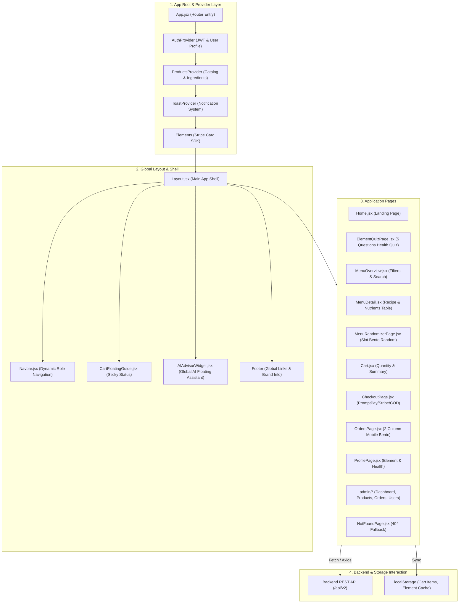
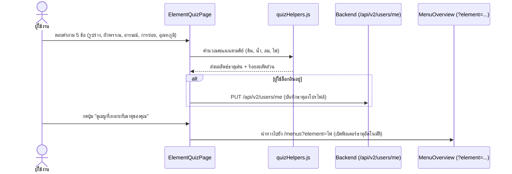
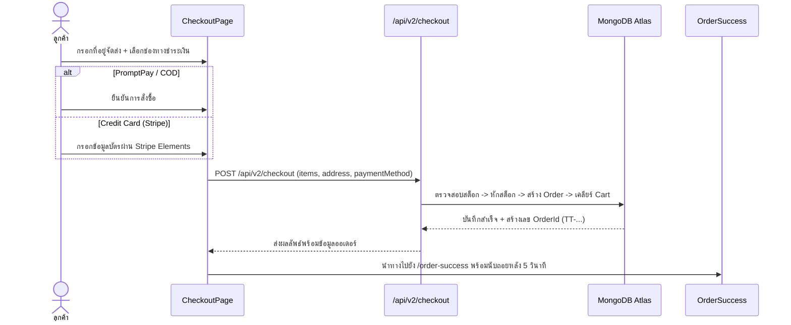

# 💻 คู่มือสถาปัตยกรรมและโครงสร้างโค้ดฝั่งหน้าบ้าน (Client Architecture Documentation)
### That Tae — Frontend Platform (React 19 + Tailwind CSS + Vite)

> เอกสารฉบับนี้อธิบายรายละเอียดสถาปัตยกรรม, การบริหารจัดการสถานะ (State Management), การไหลของข้อมูล (Data Flow), ระบบเส้นทาง (Routing), และการตัดสินใจเชิงเทคนิคในการพัฒนาส่วนติดต่อผู้ใช้งาน (UI/UX) ของแพลตฟอร์ม **"ธาตุแท้"**

---

## 📌 สารบัญ (Table of Contents)
1. [ภาพรวมสถาปัตยกรรมและผังระบบ (Client Architecture Diagram)](#-ภาพรวมสถาปัตยกรรมและผังระบบ-client-architecture-diagram)
2. [การจัดการเส้นทางและโครงสร้างหน้า (Routing & Pages Map)](#-การจัดการเส้นทางและโครงสร้างหน้า-routing--pages-map)
3. [การบริหารจัดการสถานะ (State Management Strategy)](#-การบริหารจัดการสถานะ-state-management-strategy)
4. [เจาะลึกฟังก์ชันและขั้นตอนการทำงานสำคัญ (Core Feature Workflows)](#-เจาะลึกฟังก์ชันและขั้นตอนการทำงานสำคัญ-core-feature-workflows)
   - 4.1 [แบบประเมินธาตุเจ้าเรือน (Element Quiz Flow)](#41-แบบประเมินธาตุเจ้าเรือน-element-quiz-flow)
   - 4.2 [แค็ตตาล็อกและการกรองเมนู (Menu Catalog & Element Filter)](#42-แค็ตตาล็อกและการกรองเมนู-menu-catalog--element-filter)
   - 4.3 [วงล้อสุ่มเมนูอาหาร (Menu Randomizer & Bento Layout)](#43-วงล้อสุ่มเมนูอาหาร-menu-randomizer--bento-layout)
   - 4.4 [ระบบตะกร้าและการคำนวณโภชนาการ (Cart & Nutrition Summary)](#44-ระบบตะกร้าและการคำนวณโภชนาการ-cart--nutrition-summary)
   - 4.5 [ระบบสั่งซื้อและชำระเงิน (Checkout & Payment Flow)](#45-ระบบสั่งซื้อและชำระเงิน-checkout--payment-flow)
   - 4.6 [วิดเจ็ต AI Advisor (RAG Nutrition Consultant)](#46-วิดเจ็ต-ai-advisor-rag-nutrition-consultant)
   - 4.7 [หลังบ้านแอดมิน (Admin Back-office)](#47-หลังบ้านแอดมิน-admin-back-office)
5. [ระบบการออกแบบ (Design System & Bento UI Standards)](#-ระบบการออกแบบ-design-system--bento-ui-standards)
6. [เหตุผลและเบื้องหลังการตัดสินใจเชิงเทคนิค (Architectural Decisions)](#-เหตุผลและเบื้องหลังการตัดสินใจเชิงเทคนิค-architectural-decisions)

---

## 🏗 ภาพรวมสถาปัตยกรรมและผังระบบ (Client Architecture Diagram)

แอปพลิเคชันฝั่งหน้าบ้านถูกออกแบบตามหลักการ **Layered Component Hierarchy** โดยแบ่งหน้าที่การทำงานออกเป็น 4 ชั้นหลัก:

---

## 🗺 การจัดการเส้นทางและโครงสร้างหน้า (Routing & Pages Map)

ใช้ **`react-router-dom` (v7 / Data Router via `createBrowserRouter`)** เพื่อรองรับ Nested Routing, Layout Outlet, และ URL Parameter:

| Path | คอมโพเนนต์หน้า | สิทธิ์การเข้าถึง | หน้าที่และรายละเอียด |
|---|---|:---:|---|
| `/` | `Home.jsx` | ทุกคน (Public) | หน้าแรก, แนะนำ 4 ธาตุเจ้าเรือน, แผนที่อาหาร 4 ภาค, รีวิว |
| `/element-quiz` | `ElementQuizPage.jsx` | ทุกคน (Public) | แบบประเมินสุขภาพ 5 ข้อ เพื่อหาธาตุเจ้าเรือนประจำตัว |
| `/menus` | `MenuOverview.jsx` | ทุกคน (Public) | แค็ตตาล็อกเมนู Cooking Kit ค้นหาและกรองตามธาตุ/ภาค |
| `/menus/:id` | `MenuDetail.jsx` | ทุกคน (Public) | รายละเอียดสูตรอาหาร, วัตถุดิบ, สารอาหาร 100g, ขั้นตอนปรุง |
| `/menu-randomizer` | `MenuRandomizerPage.jsx` | ทุกคน (Public) | สุ่มเมนูอาหารตามงบประมาณและธาตุเจ้าเรือน |
| `/cart` | `Cart.jsx` | สมาชิก / Guest | ตะกร้าสินค้า, ปรับจำนวน, ตรวจสอบยอดรวมและแคลอรี |
| `/checkout` | `CheckoutPage.jsx` | สมาชิก (Auth) | กรอกที่อยู่จัดส่ง, เลือกแพ็กเกจ, ชำระเงิน (PromptPay/Stripe/COD) |
| `/order-success` | `OrderSuccess.jsx` | สมาชิก (Auth) | ยืนยันคำสั่งซื้อสำเร็จ, สรุปเลข Order, นับถอยหลังไปหน้าออเดอร์ |
| `/orders` | `OrdersPage.jsx` | สมาชิก (Auth) | ประวัติคำสั่งซื้อทั้งหมด, แสดงเลขพัสดุ + ปุ่มคัดลอกเมื่อจัดส่งแล้ว |
| `/profile` | `ProfilePage.jsx` | สมาชิก (Auth) | จัดการข้อมูลส่วนตัว, ธาตุเจ้าเรือน, ที่อยู่จัดส่ง, แต้มสะสม |
| `/admin/dashboard` | `admin/AdminDashboard.jsx` | แอดมิน (Admin) | สรุปยอดขายรวม |
| `/admin/products(/new, /edit/:id)` | `admin/AdminProductList.jsx`, `admin/ProductForm.jsx` | แอดมิน (Admin) | จัดการเมนู + สร้างสูตรจากวัตถุดิบในสต็อกของภาค |
| `/admin/ingredients(/new, /edit/:id)` | `admin/AdminIngredientList.jsx`, `admin/IngredientForm.jsx` | แอดมิน (Admin) | คลังวัตถุดิบ สต็อกรายภาค |
| `/admin/orders` | `admin/AdminOrderList.jsx` | แอดมิน (Admin) | อัปเดตสถานะคำสั่งซื้อ (จัดส่งแล้วต้องใส่เลขพัสดุ) |
| `/admin/users` | `admin/AdminUserList.jsx` | แอดมิน (Admin) | จัดการผู้ใช้ |
| `*` | `NotFoundPage.jsx` | ทุกคน (Public) | หน้า 404 แจ้งเตือนเมื่อเข้า URL ที่ไม่มีในระบบ |

---

## 🔄 การบริหารจัดการสถานะ (State Management Strategy)

แอปพลิเคชันเลือกใช้ **React Context API** ร่วมกับ **LocalStorage Persistence** แทนการพึ่งพา Redux เพื่อรักษาความเรียบง่าย คล่องตัว และประหยัดขนาด Bundle Size:

### 1. `AuthContext` (`context/AuthContext.js`)
- **หน้าที่:** จัดเก็บข้อมูลผู้ใช้ที่กำลังเข้าสู่ระบบ (`currentUser`), สถานะการล็อกอิน (`isLoggedIn`), และบทบาท (`role: "user" | "admin"`)
- **Persistence:** บันทึก User Object ลงใน `localStorage.getItem("that_tae_user")` ทำให้ผู้ใช้ไม่ต้องล็อกอินใหม่เมื่อกด Refresh หน้าจอ
- **Token Handling:** รองรับทั้งการส่ง JWT ผ่าน Cookie (HttpOnly) หรือแนบ Header `Authorization: Bearer <token>`

### 2. `ProductsContext` (`context/ProductsContext.js`)
- **หน้าที่:** จัดเก็บแค็ตตาล็อกอาหาร (`products`), รายการวัตถุดิบ (`ingredients`), และฟังก์ชันค้นหา (`getProductById`)
- **Caching & Fallback:** ดึงข้อมูลจาก API `/api/v2/products` เป็นหลัก และมี Fallback สู่ `mock-data/dishes.js` หากเซิร์ฟเวอร์ยังไม่พร้อม

### 3. `Layout Outlet Context` (Cart State ใน `Layout.jsx`)
- **หน้าที่:** ส่งต่อ `cartItems`, `addToCart`, `updateQuantity`, `removeFromCart`, `clearCart` ให้กับทุก Page ลูกผ่าน `useOutletContext()`
- **Real-time Sync:** บันทึกการเปลี่ยนแปลงลง `localStorage` ทันที และซิงค์ขึ้น Database ผ่าน API `/api/v2/cart` เมื่อผู้ใช้ล็อกอิน

### 4. `ToastContext` (`context/ToastProvider.jsx`)
- **หน้าที่:** แสดงผลการแจ้งเตือนป๊อปอัพ (Toast Notifications) เช่น "เพิ่มลงตะกร้าสำเร็จ", "สั่งซื้อเรียบร้อย", หรือ "รหัสผ่านไม่ถูกต้อง"

---

## 🔍 เจาะลึกฟังก์ชันและขั้นตอนการทำงานสำคัญ (Core Feature Workflows)

### 4.1 แบบประเมินธาตุเจ้าเรือน (Element Quiz Flow)

### 4.2 แค็ตตาล็อกและการกรองเมนู (Menu Catalog & Element Filter)
- **การแมปคีย์ภาษา:** เพื่อป้องกันข้อผิดพลาดระหว่างภาษาอังกฤษและไทย ระบบรองรับทั้ง `earth/water/wind/fire` และ `ดิน/น้ำ/ลม/ไฟ` อย่างโปร่งใส
- **Interactive Modals:** เมื่อคลิกที่การ์ดเมนู ผู้ใช้สามารถดูตารางสูตรอาหารย่อย (`recipe`) ที่แจกแจงสัดส่วนกรัมของวัตถุดิบ พร้อมค่าพลังงานและรสยาแพทย์แผนไทย

### 4.3 วงล้อสุ่มเมนูอาหาร (Menu Randomizer & Bento Layout)
- **Slot Machine Effect:** อนิเมชันหมุนสุ่มรูปภาพเมนูอย่างรวดเร็วก่อนหยุดที่เมนูเป้าหมาย สร้างความตื่นเต้นและกระตุ้นการตัดสินใจซื้อ
- **Responsive Bento Cards:** เมื่อสุ่มได้เมนู ผลลัพธ์จะถูกจัดวางในการ์ดสไตล์ Bento ที่แสดงข้อมูลครบถ้วน: วัตถุดิบหลัก, แคลอรี, ธาตุเด่น, และปุ่มกดสั่งใส่ตะกร้าในคลิกเดียว

### 4.4 ระบบตะกร้าและการคำนวณโภชนาการ (Cart & Nutrition Summary)
- **Real-time Calorie Aggregator:** คำนวณผลรวมแคลอรีทั้งหมดของอาหารในตะกร้า ช่วยให้ผู้ใช้ควบคุมพลังงานในแต่ละวันได้แม่นยำ
- **Free Shipping Calculator:** แถบคำนวณยอดจัดส่งฟรีอัตโนมัติ (ยอดขาดอีกกี่บาทจะได้ส่งฟรี)

### 4.5 ระบบสั่งซื้อและชำระเงิน (Checkout & Payment Flow)

### 4.6 วิดเจ็ต AI Advisor (RAG Nutrition Consultant)
- **Floating Widget:** อยู่ที่มุมขวาล่างของทุกหน้าเว็บ ผู้ใช้สามารถเปิดแชทได้ตลอดเวลา
- **Server-side RAG:** widget ส่งแค่คำถามไปที่ `POST /api/v2/advisor/chat` (`utils/advisorApi.js`) ผ่าน token เดิม — server ตัดสินสิทธิ์ตาม role และดึงธาตุ/ข้อจำกัดอาหาร/ตะกร้า/คำสั่งซื้อจาก DB เอง (Guest ส่งได้แค่ธาตุจากผลควิซในเครื่องและ id เมนูในตะกร้า)
- **การ์ดเมนูและ Actions:** แสดงการ์ดเมนูจากคำตอบ, ปุ่ม **เพิ่มทั้งเซตลงตะกร้า + เลือกแพ็กเกจ** (`handleAddSetToCart` ใน `Layout.jsx`), ปุ่มนำทางไปหน้าต่าง ๆ
- **Admin Mode:** แอดมินเห็น widget แบบอ่านอย่างเดียว พร้อม Quick prompts เรื่องสต็อก/คำสั่งซื้อ
- **Offline Fallback:** ถ้า server/AI ไม่พร้อม ใช้ตัวตอบเดิมใน `utils/aiAdvisorEngine.js`
- รายละเอียดทั้งหมด: **[RAG_AI_ADVISOR.md](RAG_AI_ADVISOR.md)**

### 4.7 หลังบ้านแอดมิน (Admin Back-office)
- **ฟอร์มเมนู (`ProductForm.jsx`):** เลือก **ภูมิภาคอาหาร** เป็นอย่างแรก (บนสุดของฟอร์ม) เพราะเมนูจะใช้/ตัดสต็อกวัตถุดิบของภาคนั้น (ไทยฟิวชั่น → ภาคกลาง)
- **ช่องเลือกวัตถุดิบ (`components/admin/IngredientCombobox.jsx`):** พิมพ์ค้นหาได้ (ชื่อไทย/อังกฤษ/หมวด), ↑ ↓ Enter Esc, ไฮไลต์คำที่ตรง และ **แสดงเฉพาะวัตถุดิบที่มีสต็อกในภาคของเมนู** พร้อมจำนวนคงเหลือของภาคนั้น
- **อัปเดตสถานะคำสั่งซื้อ (`AdminOrderList.jsx`):** กด "จัดส่งแล้ว" → ฟอร์มเลือกบริษัทขนส่ง + เลขพัสดุ ปุ่มบันทึกกดได้เมื่อกรอกถูกต้องเท่านั้น (รายชื่อขนส่งอยู่ที่ `constants/shipping.js`)
- **Audit stamp (`components/admin/AuditStamp.jsx`):** ใต้แต่ละรายการในหน้า list เมนู / วัตถุดิบ / ผู้ใช้ แสดง "อัปเดตล่าสุด {วันเวลา} โดย แอดมิน {ชื่อ}" (hover ดูทั้งผู้สร้างและผู้แก้ไขล่าสุด)
- หน้า "ออกแบบสูตรอาหาร" ถูกถอดออกแล้ว — สร้างสูตรผ่านฟอร์มเมนูโดยตรง
- **ตารางเรียงได้ (`hooks/useTableSort.js` + `components/admin/SortHeader.jsx`):** กดหัวคอลัมน์ ▲ น้อย→มาก / ▼ มาก→น้อย / ลำดับเดิม (เรียงไทยตามพจนานุกรม) + ตัวกรองหน้าสินค้า
- **นำเข้าจาก ZIP (`components/admin/ImportZipModal.jsx`):** วิธีเตรียมไฟล์ + ดาวน์โหลดตัวอย่าง → ลากไฟล์วาง/อัปโหลด (% จริง) → แอนิเมชันตรวจข้อมูล → Preview (สรุป, แท็บกรอง, รูปจาก zip, เลือก เพิ่ม/อัปเดต/ข้าม ทีละแถว) → progress นำเข้าจริงจาก server → สรุปผล
- **กันชื่อซ้ำในฟอร์ม (`components/admin/SimilarNameDialog.jsx`):** ProductForm / IngredientForm เช็กชื่อก่อนบันทึก (เพิ่มใหม่ หรือแก้ไขแล้วเปลี่ยนชื่อ) ถ้าซ้ำ/ใกล้เคียงจะถามยืนยัน

### 4.8 ชื่อเมนูและการออกเสียง
- หน้า `MenuDetail.jsx` แสดงชื่อไทย + ชื่ออังกฤษใต้ชื่อไทย และการ์ดเมนู (`MenuCard.jsx`) แสดงชื่อภาษาอีกภาษาตัวเล็กใต้ชื่อ
- ปุ่มลำโพง (`components/common/SpeakButton.jsx`) อ่านชื่อไทย (th-TH) และชื่ออังกฤษ (en-US) ด้วย **Web Speech API** ของเบราว์เซอร์ (`utils/speech.js`) — ฟรี ไม่ต้องใช้ key; ถ้าอุปกรณ์ไม่มีเสียงภาษานั้น ปุ่มจะบอกใน tooltip

---

## 🎨 ระบบการออกแบบ (Design System & Bento UI Standards)

### 1. โทนสีธรรมชาติ (Earth-Tone Palette)
- **สีหลัก (Primary):** สีน้ำตาลเปลือกไม้ `#8B4513` และสีส้มอิฐ `#C85A17` สื่อถึงความเป็นไทยและความอบอุ่น
- **สีพื้นหลัง (Background):** สีครีมใบลาน `#FDFBF7` และสีหินอ่อน `#F5F2EB` สบายตา ไม่ทำให้ตาล้า
- **สีประจำ 4 ธาตุเจ้าเรือน:**
  - 🪨 **ธาตุดิน:** สีทองอำพัน / น้ำตาลทอง (`amber-700`)
  - 💧 **ธาตุน้ำ:** สีฟ้าน้ำทะเลลึก (`sky-600`)
  - 🍃 **ธาตุลม:** สีเขียวสมุนไพรสด (`emerald-600`)
  - 🔥 **ธาตุไฟ:** สีส้มแดงเพลิง (`rose-600`)

### 2. มาตรฐาน Bento Grid & Responsive Locking
- **เดสก์ท็อป:** ล็อกความสูงหน้าจอให้พอดีกับ Viewport (`h-screen overflow-hidden`) ในหน้าแบบสอบถามและสุ่มเมนู เพื่อป้องกันการ Scroll ที่ไม่จำเป็น และรวม Footer ไว้ในมุมมองอย่างเป็นระเบียบ
- **มือถือ:** แปลงตารางออเดอร์และการ์ดผลลัพธ์เป็น **Bento 2 คอลัมน์แบบเหลื่อมกัน (Asymmetric Bento Grid)** ทำให้ใช้งานมือเดียวได้สะดวก

---

## 💡 เหตุผลและเบื้องหลังการตัดสินใจเชิงเทคนิค (Architectural Decisions)

1. **ทำไมจึงใช้ React 19 ควบคู่กับ Vite?**
   - Vite ให้ความเร็วในการ Compile และ Hot Reload ในระดับมิลลิวินาที ทำให้ทีมงานพัฒนาฟีเจอร์ได้อย่างรวดเร็ว
2. **ทำไมจึงใช้ React Context แทน Redux?**
   - แอปพลิเคชันมี Global State สำคัญเพียง 3-4 จุด (Auth, Products, Cart, Toast) การใช้ Context API ทำให้โค้ดอ่านง่าย สมาชิกในทีมทุกคนสามารถเข้าใจและแก้ไขได้ทันทีโดยไม่ต้องเรียนรู้ Boilerplate ของ Redux
3. **ทำไมจึงใช้ SVG Inline Icons แทน Icon Library ขนาดใหญ่?**
   - ช่วยลด Bundle Size ลงกว่า 400KB และเปิดโอกาสให้ทีมปรับแต่งแอนิเมชัน สีสัน และขนาดตามเงื่อนไขของธาตุเจ้าเรือนได้อย่างอิสระ
4. **ทำไมต้องมี NotFoundPage (404 Fallback)?**
   - ป้องกันกรณีที่ผู้ใช้งานพิมพ์ URL ผิดพลาด หรือคลิกลิงก์ที่หมดอายุ ไม่ให้หน้าจอขาวหรือแสดง Uncaught Router Error
