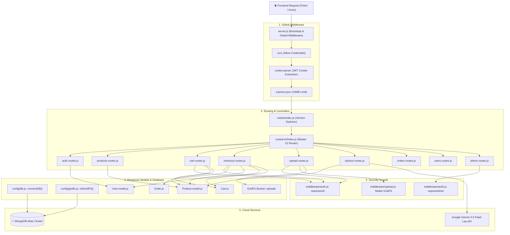
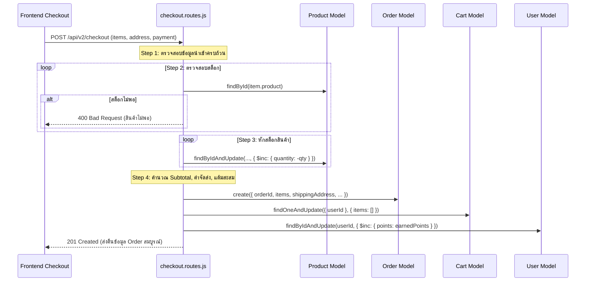
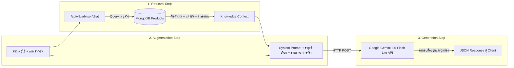

# ⚙️ คู่มือสถาปัตยกรรมและโครงสร้างโค้ดฝั่งหลังบ้าน (Server Architecture Documentation)
### That Tae — Backend API V2 (Node.js Express + MongoDB Atlas + GridFS + RAG AI)

> เอกสารฉบับนี้อธิบายรายละเอียดสถาปัตยกรรมของเซิร์ฟเวอร์, การเชื่อมต่อ MongoDB Atlas, การสตรีมมิ่งไฟล์รูปภาพผ่าน GridFS, สถาปัตยกรรม RAG AI Advisor, และรายการ API Endpoints ทั้งหมดของระบบ V2

---

## 📌 สารบัญ (Table of Contents)
1. [ภาพรวมสถาปัตยกรรมฝั่งเซิร์ฟเวอร์ (Server Architecture Diagram)](#-ภาพรวมสถาปัตยกรรมฝั่งเซิร์ฟเวอร์-server-architecture-diagram)
2. [การเชื่อมต่อฐานข้อมูล MongoDB Atlas (Database Connection & Lifecycle)](#-การเชื่อมต่อฐานข้อมูล-mongodb-atlas-database-connection--lifecycle)
3. [ระบบจัดเก็บและสตรีมรูปภาพด้วย GridFS (MongoDB GridFS Streaming)](#-ระบบจัดเก็บและสตรีมรูปภาพด้วย-gridfs-mongodb-gridfs-streaming)
4. [ระบบยืนยันตัวตนและการรักษาความปลอดภัย (Authentication & JWT Security)](#-ระบบยืนยันตัวตนและการรักษาความปลอดภัย-authentication--jwt-security)
5. [ระบบสั่งซื้อ ตัดสต็อก และสะสมแต้ม (Checkout & Simple async/await Logic)](#-ระบบสั่งซื้อ-ตัดสต็อก-และสะสมแต้ม-checkout--simple-asyncawait-logic)
6. [ระบบปัญญาประดิษฐ์แนะนำโภชนาการ (Server-Side RAG AI Advisor Architecture)](#-ระบบปัญญาประดิษฐ์แนะนำโภชนาการ-server-side-rag-ai-advisor-architecture)
7. [โครงสร้าง Mongoose Models & Schemas](#-โครงสร้าง-mongoose-models--schemas)
8. [สารบัญและตาราง API Endpoints ฉบับสมบูรณ์ (Complete API Reference)](#-สารบัญและตาราง-api-endpoints-ฉบับสมบูรณ์-complete-api-reference)
9. [การจัดการข้อผิดพลาดส่วนกลาง (Centralized Error Handling)](#-การจัดการข้อผิดพลาดส่วนกลาง-centralized-error-handling)
10. [เหตุผลและเบื้องหลังการตัดสินใจเชิงเทคนิค (Architectural Decisions)](#-เหตุผลและเบื้องหลังการตัดสินใจเชิงเทคนิค-architectural-decisions)

---

## 🏗 ภาพรวมสถาปัตยกรรมฝั่งเซิร์ฟเวอร์ (Server Architecture Diagram)



---

## 🍃 การเชื่อมต่อฐานข้อมูล MongoDB Atlas (Database Connection & Lifecycle)

ไฟล์: **[`config/db.js`](file:///e:/PJ-G4-SP2/server-test-src/config/db.js)**

### 1. Singleton Connection Pattern
- เซิร์ฟเวอร์มีสถานะ `let isConnected = false` เพื่อป้องกันปัญหาการเรียก `mongoose.connect()` ซ้ำซ้อนเมื่อมีโมดูลอื่นเรียกใช้งาน
- กำหนด `serverSelectionTimeoutMS: 5000` เพื่อให้ระบบตัดการรอทันทีภายใน 5 วินาทีหากมีปัญหาด้านอินเทอร์เน็ตหรือ IP Whitelist บน MongoDB Atlas

### 2. Graceful Shutdown
- จัดเตรียมฟังก์ชัน `disconnectDB()` สำหรับปิด Connection Pool อย่างเรียบร้อยเมื่อเซิร์ฟเวอร์ได้รับสัญญาณ `SIGINT` หรือ `SIGTERM` ป้องกันการค้าง Session ใน MongoDB

---

## 📦 ระบบจัดเก็บและสตรีมรูปภาพด้วย GridFS (MongoDB GridFS Streaming)

ไฟล์: **[`config/gridfs.js`](file:///e:/PJ-G4-SP2/server-test-src/config/gridfs.js)**, **[`middleware/upload.js`](file:///e:/PJ-G4-SP2/server-test-src/middleware/upload.js)**, **[`routes/v2/upload.routes.js`](file:///e:/PJ-G4-SP2/server-test-src/routes/v2/upload.routes.js)**

### 1. ทำไมจึงเลือกใช้ MongoDB GridFS?
- **ปัญหาเดิม:** การบันทึกรูปลงโฟลเดอร์ในเซิร์ฟเวอร์ทำให้เกิดปัญหาเมื่อ Deploy บน Containerized Platform (เช่น Render, Heroku) เพราะไฟล์จะหายไปเมื่อ Container รีสตาร์ท (Ephemeral Filesystem)
- **วิธีแก้ของ GridFS:** MongoDB จะแบ่งไฟล์ภาพออกเป็นก้อนเล็กๆ (Chunks ขนาด 255KB) เก็บใน 2 คอลเลกชัน:
  1. `uploads.files`: เก็บข้อมูล Metadata (ชื่อไฟล์, ชนิดไฟล์, วันที่สร้าง)
  2. `uploads.chunks`: เก็บข้อมูล Binary แท้จริง
- **ข้อดี:** รูปภาพและฐานข้อมูลจะอยู่ร่วมกันใน **MongoDB Atlas เดียวกัน 100%** สำรองข้อมูลง่าย และไม่ต้องจ่ายเงินเพิ่มเพื่อซื้อ Cloud Storage แยก

### 2. ท่อการสตรีมรูปภาพ (Streaming Pipeline)
```text
Client Browser ─── GET /api/v2/upload/image/:id ───► GridFS Bucket ───► openDownloadStream(id).pipe(res)
```
- เซิร์ฟเวอร์ทำหน้าที่เพียงเปิดท่อสตรีม (Stream Pipe) ส่งไบนารีตรงเข้า Response ทันที โดย **ไม่เปลือง Memory (RAM)** ของเซิร์ฟเวอร์
- แนบ Header `Cache-Control: public, max-age=31536000` ทำให้ Browser จำรูปภาพไว้ในเครื่อง 1 ปี โหลดครั้งต่อไปได้เร็วกว่า 10 เท่า

---

## 🛡️ ระบบยืนยันตัวตนและการรักษาความปลอดภัย (Authentication & JWT Security)

ไฟล์: **[`middleware/auth.js`](file:///e:/PJ-G4-SP2/server-test-src/middleware/auth.js)**, **[`routes/v2/auth.routes.js`](file:///e:/PJ-G4-SP2/server-test-src/routes/v2/auth.routes.js)**

### 1. การออกบัตรผ่าน (Token Generation)
- เมื่อ Login หรือ Register สำเร็จ เซิร์ฟเวอร์จะเรียก `generateToken(user)`:
  ```javascript
  jwt.sign({ id: user._id, email: user.email, role: user.role }, JWT_SECRET, { expiresIn: "7d" });
  ```
- ส่ง Token กลับไป 2 ทางพร้อมกัน:
  1. ส่งใน **JSON Response Body** (สำหรับ Mobile Application หรือ API Clients)
  2. เซ็ตลงใน **HttpOnly Cookie** (สำหรับ Web Browser ป้องกันการถูกขโมยผ่าน XSS Attacks)

### 2. ด่านตรวจสิทธิ์ (Middleware Guards)
- **`requireAuth`**: ตรวจจับ Token จาก Header `Authorization: Bearer <token>` ก่อน หากไม่มีจะตรวจจาก `req.cookies.token` ถอดรหัสใส่ไว้ใน `req.user`
- **`requireAdmin`**: ตรวจสอบว่า `req.user.role === 'admin'` ป้องกันไม่ให้บุคคลทั่วไปเข้าถึงฟังก์ชันจัดการหลังบ้าน

---

## 💳 ระบบสั่งซื้อ ตัดสต็อก และสะสมแต้ม (Checkout & Simple async/await Logic)

ไฟล์: **[`routes/v2/checkout.routes.js`](file:///e:/PJ-G4-SP2/server-test-src/routes/v2/checkout.routes.js)**

### ลำดับขั้นตอนการทำงาน 7 ขั้นตอน (The 7-Step Atomic Flow):



> **💡 ข้อได้เปรียบทางเทคนิค:** เราหลีกเลี่ยงการใช้ `mongoose.startSession()` ที่ต้องการ Replica Set Cluster เพราะหากรันบน Local MongoDB หรือ MongoDB Atlas Free Tier ในบางช่วงเวลา คำสั่ง Session อาจ Error ได้ การใช้ `async/await` ลูปเช็คและหักสต็อกด้วย `$inc` ทำให้ระบบทำงานได้อย่างเสถียร 100% บนทุกสภาพแวดล้อม

---

## 🤖 ระบบปัญญาประดิษฐ์แนะนำโภชนาการ (Server-Side RAG AI Advisor Architecture)

ไฟล์: **[`routes/v2/advisor.routes.js`](file:///e:/PJ-G4-SP2/server-test-src/routes/v2/advisor.routes.js)**

ระบบ AI ใช้สถาปัตยกรรม **RAG (Retrieval-Augmented Generation)** ซึ่งแตกต่างจาก AI ทั่วไปที่มักแต่งคำตอบขึ้นมาเอง (Hallucination):



### Prompt Engineering ที่ใช้งานจริง:
```text
คุณคือผู้เชี่ยวชาญด้านโภชนาการและศาสตร์การกินอาหารตามธาตุเจ้าเรือนไทย ประจำแพลตฟอร์ม "That Tae"
ผู้ใช้มีธาตุเจ้าเรือนประจำตัวคือ: ธาตุ{element}
คำถามของผู้ใช้: "{message}"

รายการอาหารของร้านที่มีในระบบขณะนี้ (ห้ามแต่งชื่อเมนูที่ไม่มีในรายการนี้):
{productContext}
```

---

## 🗃️ โครงสร้าง Mongoose Models & Schemas

### 1. `User.model.js` (คอลเลกชัน `users`)
- `name` (String, Required)
- `email` (String, Unique, Lowercase)
- `password` (String, Bcrypt Hashed)
- `phone` (String)
- `role` (String, Enum: `["user", "admin"]`, Default: `"user"`)
- `element` (String, Enum: `["ดิน", "น้ำ", "ลม", "ไฟ"]`)
- `points` (Number, Default: 0) — แต้มสะสม Loyalty Points
- `avatar` (String) — URL รูปภาพใน GridFS
- `addresses` (Array of Sub-documents)

### 2. `Product.model.js` (คอลเลกชัน `products`)
- `name`, `nameTh` (String, Required)
- `description` (String)
- `price` (Number, Min: 1)
- `quantity` (Number, Min: 0) — จำนวนชุด Cooking Kit ที่มีในสต็อก
- `region` (String, Enum: `["northern", "northeastern", "central", "southern", "fusion"]`)
- `dominantElement` (String, Enum: `["ดิน", "น้ำ", "ลม", "ไฟ"]`)
- `elementSuitability` ([String]) — ธาตุที่ได้รับประโยชน์รอง
- `calories` (Number)
- `imageUrl`, `images` ([String])
- `recipe` ([Mixed]) — โครงสร้างวัตถุดิบและสัดส่วนกรัม
- `cookingSteps` ([Mixed]) — ขั้นตอนการปรุง

### 3. `Cart.js` (คอลเลกชัน `carts`)
- `userId` (ObjectId, Ref: `User`, Unique)
- `items`: Array of `{ product: ObjectId (Ref: Product), quantity: Number }`

### 4. `Order.js` (คอลเลกชัน `orders`)
- `orderId` (String, Unique) เช่น `TT-1711234567-890`
- `user` (ObjectId, Ref: `User`)
- `items`: Array of `{ product, productName, price, quantity }`
- `shippingAddress`: `{ fullName, phone, address, district, province, zipcode }`
- `paymentMethod`: Enum: `["PROMPTPAY", "CREDIT_CARD", "COD"]`
- `paymentStatus`: Enum: `["UNPAID", "PAID", "REFUNDED"]`
- `status`: Enum: `["PENDING", "PAID", "PREPARING", "SHIPPED", "DELIVERED", "CANCELLED"]`
- `grandTotal`, `earnedPoints`

---

## 📋 สารบัญและตาราง API Endpoints ฉบับสมบูรณ์ (Complete API Reference)

Base URL: **`http://localhost:3001/api/v2`**

| Method | Endpoint | สิทธิ์ที่ต้องการ | คำอธิบายการทำงาน |
|:---:|---|:---:|---|
| **GET** | `/health` | Public | ตรวจสอบสถานะการเชื่อมต่อเซิร์ฟเวอร์และ MongoDB |
| **POST** | `/auth/register` | Public | สมัครสมาชิกใหม่ แฮชรหัสผ่าน และออก Token |
| **POST** | `/auth/login` | Public | เข้าสู่ระบบ และรับ Token |
| **GET** | `/auth/me` | requireAuth | ดึงข้อมูลโปรไฟล์ของตนเอง |
| **POST** | `/auth/logout` | Public | ออกจากระบบ และเคลียร์ Cookie |
| **GET** | `/products` | Public | รายการเมนูอาหารทั้งหมด (รองรับ `?element=ไฟ`, `?region=...`) |
| **GET** | `/products/:id` | Public | รายละเอียดเมนูอาหาร, สูตร, และโภชนาการ |
| **POST** | `/products` | requireAdmin | เพิ่มเมนูอาหาร Cooking Kit ใหม่เข้าสู่ระบบ |
| **PUT** | `/products/:id` | requireAdmin | แก้ไขข้อมูลเมนูอาหาร |
| **DELETE** | `/products/:id` | requireAdmin | ลบเมนูอาหารออกจากระบบ |
| **GET** | `/cart` | requireAuth | ดึงตะกร้าสินค้าของผู้ใช้ |
| **POST** | `/cart` | requireAuth | เพิ่มสินค้าเข้าตะกร้า `{ productId, quantity }` |
| **PUT** | `/cart/item/:productId` | requireAuth | ปรับจำนวนสินค้าในตะกร้า |
| **DELETE** | `/cart/item/:productId` | requireAuth | ลบสินค้า 1 รายการออกจากตะกร้า |
| **DELETE** | `/cart` | requireAuth | ล้างตะกร้าสินค้าให้ว่างเปล่า |
| **POST** | `/checkout` | requireAuth | สั่งซื้อสินค้า, ตัดสต็อก, สร้างออเดอร์, และสะสมแต้ม |
| **GET** | `/orders/my` | requireAuth | ดูประวัติคำสั่งซื้อทั้งหมดของตนเอง |
| **GET** | `/orders/:id` | requireAuth | ดูรายละเอียดคำสั่งซื้อรายออเดอร์ |
| **PUT** | `/orders/:id/status` | requireAdmin | แอดมินปรับสถานะการจัดส่ง (PREPARING, SHIPPED, etc.) |
| **POST** | `/upload/avatar` | requireAuth | อัปโหลดรูปโปรไฟล์เข้าสู่ MongoDB GridFS |
| **POST** | `/upload/product` | requireAdmin | อัปโหลดรูปภาพสินค้าเข้าสู่ MongoDB GridFS |
| **GET** | `/upload/image/:id` | Public | สตรีมรูปภาพจาก MongoDB GridFS ส่งให้ Browser |
| **GET** | `/advisor/recommend` | Public | ดึงเมนูแนะนำตามธาตุเจ้าเรือนจาก MongoDB |
| **POST** | `/advisor/chat` | Public | ปรึกษาโภชนาการกับ RAG AI (เชื่อมต่อ Gemini API) |
| **GET** | `/users/me` | requireAuth | ดูข้อมูลโปรไฟล์ตนเอง |
| **PUT** | `/users/me` | requireAuth | อัปเดตข้อมูลตนเอง (ชื่อ, เบอร์โทร, ธาตุ, ที่อยู่) |
| **GET** | `/users` | requireAdmin | รายชื่อผู้ใช้ทั้งหมดในระบบ |
| **GET** | `/admin/stats` | requireAdmin | ข้อมูลสถิติยอดขายและสินค้าใกล้หมดสำหรับ Dashboard |

---

## 🛡️ การจัดการข้อผิดพลาดส่วนกลาง (Centralized Error Handling)

เซิร์ฟเวอร์ติดตั้ง Centralized Global Error Middleware ไว้ที่ท้ายสุดของ `server.js` เพื่อดักจับทุกข้อผิดพลาดและแปลงเป็นข้อความภาษาไทยที่อ่านเข้าใจง่าย:

```javascript
app.use((err, req, res, next) => {
  // 1. ตรวจจับข้อผิดพลาดด้านความถูกต้องของข้อมูล (Mongoose ValidationError) -> 400
  // 2. ตรวจจับข้อมูลซ้ำซ้อน เช่น อีเมลซ้ำ (Mongo Error 11000) -> 409 Conflict
  // 3. ตรวจจับรหัสประจำตัวผิดรูปแบบ (CastError / Invalid ObjectId) -> 400
  // 4. ตรวจจับบัตรผ่านผิดพลาด (JsonWebTokenError) -> 401 Unauthorized
  // 5. ข้อผิดพลาดภายในอื่นๆ -> 500 Internal Server Error
});
```

---

## 💡 เหตุผลและเบื้องหลังการตัดสินใจเชิงเทคนิค (Architectural Decisions)

1. **ทำไมจึงเลือกเก็บรูปภาพใน MongoDB GridFS แทนที่จะบันทึกลง Local Folder?**
   - การบันทึกไฟล์ลง Local Disk จะพังทันทีเมื่อนำเซิร์ฟเวอร์ไป Deploy บนคลาวด์แบบ Stateless (เช่น Render หรือ Heroku) เพราะทุกครั้งที่เซิร์ฟเวอร์รีสตาร์ท ไฟล์จะถูกลบทิ้ง การเก็บใน GridFS ทำให้รูปภาพอยู่ใน MongoDB Atlas ถาวร ปลอดภัย 100%
2. **ทำไมจึงใช้ Simple `async/await` แทน `startSession().startTransaction()`?**
   - MongoDB Multi-document Transactions ต้องการ Replica Set ในการทำงาน หากทีมงานนำโค้ดไปรันบน Standalone MongoDB หรือ Atlas Sandbox ในบางช่วงเวลา Session จะ Error ทันที การใช้ `async/await` ตรวจสต็อกแล้วหักด้วย `$inc` มีความเสถียรสูงสุดและไม่เกิดข้อผิดพลาด
3. **ทำไมต้องทำ RAG (Retrieval-Augmented Generation) แทนที่จะถาม AI ตรงๆ?**
   - AI ทั่วไปไม่ทราบว่าร้าน "ธาตุแท้" มีเมนูอะไรขายอยู่บ้าง หากไม่ส่ง Context ไป AI อาจแนะนำอาหารที่ร้านไม่มีขาย การดึงเมนูจริงจาก MongoDB ไปประกอบ Prompt ทำให้ AI แนะนำได้เฉพาะเมนูที่มีในร้านจริงเท่านั้น

## 🧠 That-Tae Advisor (RAG AI — Google Gemini 3.5 Flash Lite)

> เอกสารฉบับเต็ม: **[RAG_AI_ADVISOR.md](RAG_AI_ADVISOR.md)** (หลักการ/การทำงาน/ความปลอดภัย) และ **[RAG_AI_MONGODB.md](RAG_AI_MONGODB.md)** (ฝั่ง MongoDB) — แผนภาพ RAG Pipeline ด้านบนเป็นภาพรวมเดิม ขั้นตอนจริงดูในเอกสารฉบับเต็ม

แชท AI มุมขวาล่าง ตอบจากข้อมูลจริงใน MongoDB ผ่าน `POST /api/v2/advisor/chat` และจำกัดขอบเขตตาม role จาก JWT

| Role | ใช้ได้ |
|---|---|
| Guest | ความรู้ธาตุเจ้าเรือน, เมนู/วัตถุดิบที่เปิดขาย, วิธีใช้เว็บ, จัดเซตตามไซส์, สุ่มเมนู, นำทาง |
| Customer | ทั้งหมดของ Guest + โปรไฟล์ ตะกร้า คำสั่งซื้อ **ของตัวเองเท่านั้น** (กรองเมนูตามข้อจำกัดอาหาร) |
| Admin | ถาม-ตอบ/ชี้แนะ: สต็อกต่ำ เมนูหมด สถิติคำสั่งซื้อ + นำทางไปหน้าแอดมิน (**ไม่มีการแก้ไขข้อมูล**) |

**ตั้งค่า** — เพิ่มใน `server/.env` (ดูตัวอย่างใน `.env.example`): `GEMINI_API_KEY`, `GEMINI_EMBEDDING_MODEL`, `GEMINI_GENERATION_MODEL`

**สร้าง index ครั้งแรก**
```bash
cd server
npm run advisor:index            # ฝังเฉพาะที่เปลี่ยน
npm run advisor:index -- --force # ฝังใหม่ทั้งหมด (เช่น เปลี่ยน embedding model / ADVISOR_EMBEDDING_DIM)
```
หลังจากนั้น server จะซิงก์ index อัตโนมัติทุก `ADVISOR_SYNC_MINUTES` นาที (แอดมินสั่งทันทีได้ที่ `POST /api/v2/advisor/reindex`, ดูสถานะ `GET /api/v2/advisor/status`)

**Atlas Vector Search (ไม่บังคับ)** — ค่าเริ่มต้นคำนวณ cosine ใน server ถ้าข้อมูลเยอะขึ้นให้สร้าง index บน collection `advisorchunks` แล้วตั้ง `ADVISOR_VECTOR_INDEX=<ชื่อ index>`
```json
{ "fields": [
  { "type": "vector", "path": "embedding", "numDimensions": 768, "similarity": "cosine" },
  { "type": "filter", "path": "visibility" }
] }
```
