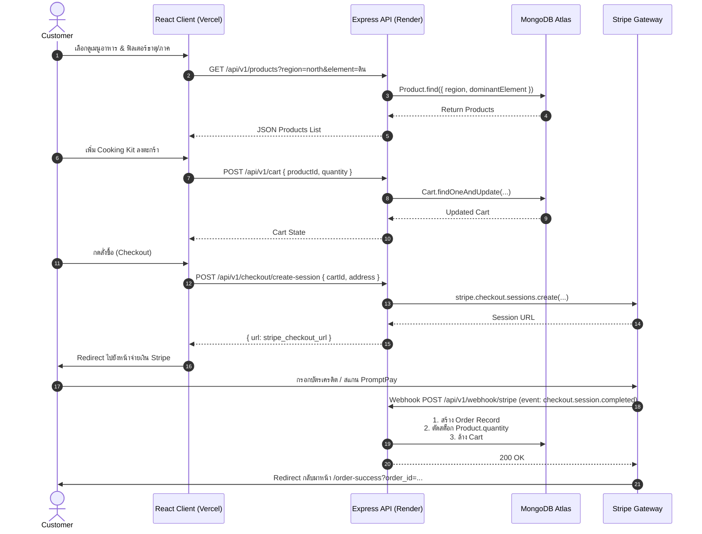

# 🚀 Sprint 3: Master Blueprint & Evaluation Guide
## That-tae (ธาตุแท้) — Thai Regional & Elemental Cooking Kit E-Commerce

---

## 📌 1. บทนำและเป้าหมายของ Sprint 3 (Executive Summary)

ใน Sprint 2 ทีมเราได้ทำ **Mock Data System (217 วัตถุดิบ, 30 เมนูอาหาร)** และเชื่อมต่อ UI Components หน้าร้านและหลังบ้านอย่างสมบูรณ์แล้ว
สำหรับ **Sprint 3** นี้ เป้าหมายสำคัญคือการยกระดับโปรเจกต์สู่ **Production-Grade MERN Stack Application** โดย:
1. **เชื่อมต่อฐานข้อมูลจริง (MongoDB Atlas + Mongoose)** แทน Local Mock Data
2. **ทำ CRUD Operations ครบทุกมิติ (Task 8 & Task 10)** ทั้งฝั่ง Product และ Cart/Order
3. **เชื่อมต่อระบบชำระเงินจริง (Stripe Payment Gateway Integration)** ในขั้นตอน Checkout
4. **Deploy ทั้ง Frontend (Vercel) และ Backend (Render/Atlas) ใช้งานได้จริงบน Public URL (Task 9)**
5. **รักษามาตรฐานโค้ด, UI/UX Light Theme สวยงาม และการสื่อสารอย่างมืออาชีพ (Behavioral Skill)**

---

## 📊 2. Assessment Criteria Mapping (ตารางตรวจสอบเกณฑ์การประเมิน)

| Rubric Task | เกณฑ์การประเมิน (Assessment Criteria) | สมาชิกผู้รับผิดชอบหลัก | รายละเอียดการตรวจรับ (Acceptance Criteria) |
| :--- | :--- | :--- | :--- |
| **Task 8: CRUD Operations** | 1. `READ` specific product information from DB<br>2. `CREATE` save new product in DB<br>3. `UPDATE` update product in DB<br>4. `DELETE` delete product from DB | **Nut (Admin)**<br>**Delta (Storefront)** | • `GET /api/v1/products/:id` ดึงข้อมูลเดี่ยวสำเร็จ<br>• `POST /api/v1/products` บันทึกสินค้าใหม่ลง MongoDB<br>• `PUT /api/v1/products/:id` แก้ไขข้อมูลสำเร็จ<br>• `DELETE /api/v1/products/:id` ลบข้อมูลออกจาก MongoDB |
| **Task 8: Cart & Order CRUD** | 5. `CREATE` save product to cart/basket/order<br>6. `UPDATE` update product in cart/basket/order<br>7. `DELETE` delete product from cart/basket/order | **Cream (Cart)**<br>**Rin (Checkout/Order)** | • `POST /api/v1/cart` เพิ่มสินค้าลงตะกร้าใน DB<br>• `PUT /api/v1/cart/:itemId` แก้ไขจำนวนชุดในตะกร้า<br>• `DELETE /api/v1/cart/:itemId` ลบสินค้าออกจากตะกร้า<br>• `POST /api/v1/orders` สร้างออเดอร์และตัดสต็อกสินค้า |
| **Task 9: Deployment & Networking** | 1. React App deployed on public URL<br>2. Express API deployed on public URL<br>3. React & Express communicate correctly via HTTPS | **Nate (Core & DevOps)**<br>*(ทุกคนร่วมทดสอบ)* | • Frontend ออนไลน์บน Vercel (e.g. `that-tae.vercel.app`)<br>• Backend ออนไลน์บน Render/Fly.io (e.g. `api.that-tae.onrender.com`)<br>• MongoDB ออนไลน์บน MongoDB Atlas พร้อม IP Whitelist |
| **Task 10: Input Types & Validations** | 1. Product fields use correct input types<br>2. Form input types prevent wrong data entry<br>3. All fields validated on submit (Name, Desc, Price, Qty, Date, Tag)<br>4. Meaningful error messages displayed<br>5. React Product & ProductList components<br>6. MongoDB CRUD with Mongoose (zero startup error)<br>7. RESTful HTTP methods (POST, GET, PUT/PATCH, DELETE) | **Nut (Form Validation)**<br>**Delta (Components)**<br>**Nate (Mongoose Setup)** | • Type controls: `type="number"`, `min="0"`, `type="date"`, etc.<br>• Client-side & Server-side Joi/Mongoose Schema validations<br>• Red inline error messages & Toast notifications<br>• Zero crash on `npm run dev` and `npm start` |
| **Payment Integration** | ระบบชำระเงินจริงและจำลองสถานะ (Stripe Checkout / Webhook) | **Rin (Checkout)** | • สร้าง Stripe Checkout Session รองรับบัตรเครดิต/PromptPay<br>• Webhook ดักจับ Event `checkout.session.completed` เพื่ออัปเดตสถานะ Order และตัดสต็อก |
| **Behavioral: Communication** | สื่อสารแนวคิดอย่างชัดเจน กระชับ มีไดอะแกรมประกอบ อธิบายเรื่องยากให้เข้าใจง่าย | **สมาชิกทุกคน (Team)** | • มีเอกสารประกอบครบถ้วน, มี ER Diagram, Sequence Diagram, และพร้อมพรีเซนต์ Demo Day |

---

## 👥 3. สรุปการแบ่งหน้าที่ 5 สมาชิก (Team Responsibility Matrix)

```
                       ┌──────────────────────────────────────────┐
                       │           NATE (Core & DevOps)           │
                       │ MongoDB Atlas, Deployment, Auth, Config  │
                       └────────────────────┬─────────────────────┘
                                            │
        ┌─────────────────────────┬─────────┴─────────┬─────────────────────────┐
        │                         │                   │                         │
┌───────▼────────┐       ┌────────▼───────┐  ┌────────▼───────┐        ┌────────▼───────┐
│   NUT (Admin)  │       │ DELTA (Catalog)│  │  CREAM (Cart)  │        │ RIN (Checkout) │
│ Product CRUD & │       │ Storefront &   │  │ Cart DB Sync & │        │ Stripe Payment │
│ Form Validation│       │ Filter Queries │  │ State Actions  │        │ & Order Stock  │
└────────────────┘       └────────────────┘  └────────────────┘        └────────────────┘
```

| สมาชิก | ไฟล์คู่มือเฉพาะบุคคล | ขอบเขตงานหลักใน Sprint 3 |
| :--- | :--- | :--- |
| **1. Nut** | [`01-nut-admin-product.md`](./01-nut-admin-product.md) | จัดการระบบ Admin Dashboard, Form Validation ครบ 6 ฟิลด์ (Name, Desc, Price, Qty, Date, Tag), Mongoose Schema ของ Product, และ API CRUD ฝั่ง Admin |
| **2. Delta** | [`02-delta-storefront-catalog.md`](./02-delta-storefront-catalog.md) | หน้าร้าน Product Catalog, MenuCard, MenuDetail, Mongoose Query กรองตามธาตุ/ภูมิภาค/แคลอรี และเชื่อมต่อ API `GET /api/v1/products` กับ MongoDB |
| **3. Cream** | [`03-cream-cart-management.md`](./03-cream-cart-management.md) | ตะกร้าสินค้า Cart Drawer/Page, Mongoose `Cart` Model, API CRUD (`POST`, `PUT`, `DELETE` `/api/v1/cart`), ปรับจำนวน Realtime, Toast Alert เมื่อถึงยอดโปรโมชัน |
| **4. Rin** | [`04-rin-checkout-payment.md`](./04-rin-checkout-payment.md) | หน้า Checkout, ระบบชำระเงินจริงด้วย **Stripe Payment Gateway** (Checkout Session + Webhook), Mongoose `Order` Model, และ Logic ตัด Stock |
| **5. Nate** | [`05-nate-core-deployment.md`](./05-nate-core-deployment.md) | วางโครงสร้าง MongoDB Atlas, Seeding 30 เมนู 217 วัตถุดิบ, **Admin คลังวัตถุดิบ & Recipe Builder คำนวณธาตุ/โภชนาการตามสัดส่วน**, และ Deploy Vercel + Render |

---

## 🏗️ 4. System Architecture & Data Flow



---

## 📅 5. Sprint 3 Timeline & Milestones (กำหนดการทำงาน)

* **Phase 1 (Day 1 - 2): Database Setup & Seeding**
  * Nate สร้าง MongoDB Atlas Cluster และอัปเดต Connection URI
  * Run Seeding Script เพื่อ Load ข้อมูลเมนูทั้ง 30 รายการและ 217 วัตถุดิบขึ้น MongoDB Atlas
  * Nut & Delta ทดสอบ Query ข้อมูลผ่าน Mongoose

* **Phase 2 (Day 3 - 5): Core CRUD & Form Validations**
  * Nut ทำ Form Validation และ Admin CRUD ให้สมบูรณ์
  * Delta ปรับปรุง Storefront ให้ดึงข้อมูลสดจาก MongoDB พร้อม Pagination / Search
  * Cream ทำระบบ Cart เชื่อมต่อ Cart Collection ใน MongoDB

* **Phase 3 (Day 6 - 8): Stripe Integration & Checkout Stock Management**
  * Rin เชื่อมต่อ Stripe SDK สร้าง Checkout Session และ Webhook Handler
  * ทำ Atomic Transaction ในการตัดสต็อกสินค้าเมื่อชำระเงินสำเร็จ

* **Phase 4 (Day 9 - 10): Deployment, End-to-End Testing & Presentation Prep**
  * Deploy Frontend บน Vercel, Backend บน Render
  * ทดสอบ Flow ทั้งหมดตั้งแต่ Register -> Browse -> Add to Cart -> Checkout with Stripe -> Admin ดูสต็อกที่ลดลง
  * เตรียม Slide และ Demo สำหรับ Presentation & Demo Day 🏆
